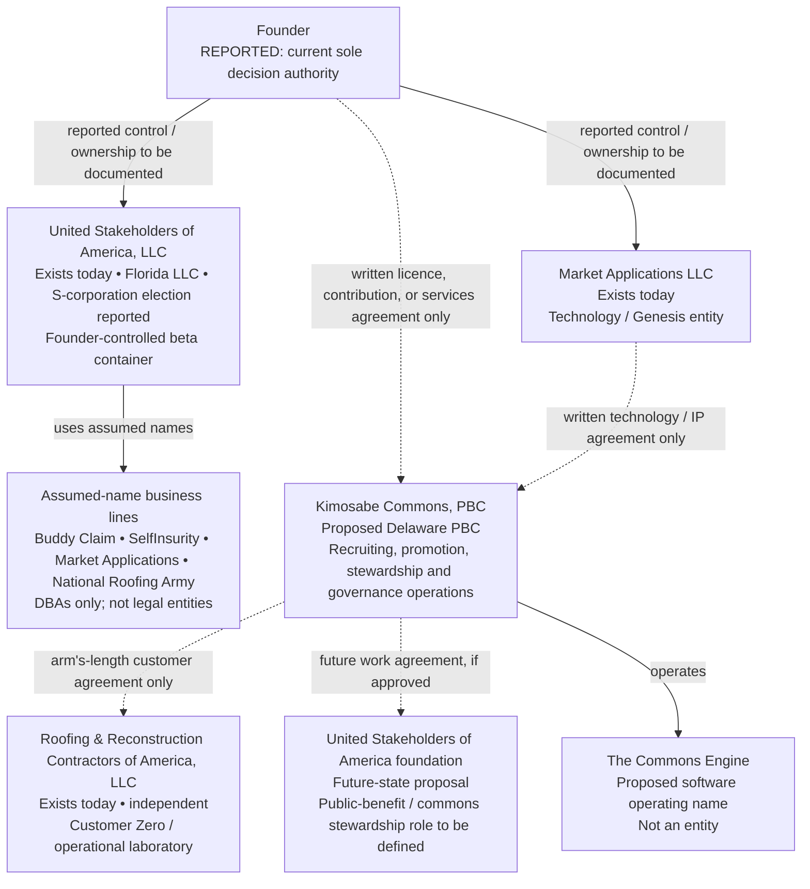

# Kimosabe Commons — Entity and Governance Architecture

## Purpose statement

**Plain-language summary.** This decision paper maps actual and proposed entities and sets authority, asset, and participation controls for a proposed Delaware public benefit corporation.

Kimosabe Commons, PBC is proposed as the marketing, recruiting, promotion, community-management, and governance-operations company for the Kimosabe App and the Human Blockchain. It does not exist yet; nothing here forms an entity, transfers an asset, binds the founder, or authorizes regulated activity. **REPORTED:** the intended public benefit, operating function, entity reality, and seasonal model are supplied in the Shared Engagement Brief. [SRC — ENGAGEMENT-BRIEF.md]

> **Decision posture.** Form one operating company only after counsel confirms the charter, tax, conflict, employment, privacy, and commercial-service posture. Keep existing businesses and founder assets separate until written agreements say otherwise.

## 1. Entity architecture

The operating design must begin with the actual legal map, not the brand map. Two entities exist today. RRCA is independently owned and outside the platform. The PBC and the foundation are proposals, not current affiliates. A business line operating under an assumed name is only a name used by a legal entity; it is not a separate legal person, owner, or liability shield. [SRC — ENGAGEMENT-BRIEF.md]

| Entity or line | Jurisdiction | Role | Ownership / relationship | Status |
|---|---|---|---|---|
| **Market Applications LLC** | Not supplied; **REPORTED** LLC | Technology / Genesis | **REPORTED:** founder-controlled; exact record/jurisdiction to confirm | **Exists today** |
| **United Stakeholders of America, LLC (USA LLC)** | Florida | Founder-controlled beta container; reported S-corporation election | **REPORTED:** sole owner; records need review | **Exists today** |
| **Buddy Claim** | USA LLC jurisdiction/tax identity | Assumed-name line | **REPORTED:** USA LLC DBA; no separate owner | **Exists as DBA** |
| **SelfInsurity** | USA LLC jurisdiction/tax identity | Assumed-name line | **REPORTED:** USA LLC DBA; no separate owner | **Exists as DBA** |
| **Market Applications** (assumed name) | USA LLC jurisdiction/tax identity | Assumed-name line, distinct from the LLC | **REPORTED:** USA LLC DBA; no separate owner | **Exists as DBA** |
| **National Roofing Army** | USA LLC jurisdiction/tax identity | Assumed-name line | **REPORTED:** USA LLC DBA; no separate owner | **Exists as DBA** |
| **Roofing & Reconstruction Contractors of America, LLC (RRCA)** | Not supplied | Independent operator; Customer Zero/workflow laboratory | **REPORTED:** outside platform; keeps its revenue, licences, assets, liabilities, and goodwill | **Exists / independent** |
| **Kimosabe Commons, PBC** | Proposed Delaware | Recruiting, promotion, stewardship, verification-process, and governance operations | Formation, directors, and founder relationship require records | **Proposed** |
| **United Stakeholders of America foundation** | Not selected | Proposed commons/public-benefit steward | Proposed work agreement with technology entity only | **Future-state** |
| **The Commons Engine** | Not applicable | Proposed software operating name | Not a legal person; rights require agreement | **Proposed name** |

**Control rule.** No dotted line creates control, asset ownership, liability sharing, or obligation; every relied-on relationship requires a written agreement. [SRC — ENGAGEMENT-BRIEF.md]

## 2. Why a public benefit corporation

A Delaware PBC is the recommended *proposed* operating form because the intended company will recruit, produce campaigns, manage rosters and territories, operate training and stewardship services, and publish measured public-benefit performance. Those are continuing operating functions with customers, suppliers, personnel, contracts, and service obligations. The charter can require the company to pursue the stated public benefit while running a durable commercial operation.

The comparison below is **ASSUMED — for counsel validation.** It is an operating-fit comparison, not a tax, legal, or filing opinion. The public-benefit purpose used here is the charter wording supplied by the brief, not a claim about legal sufficiency.

| Form | Best fit when | Fit for the proposed operating company | Principal trade-off / counsel question |
|---|---|---|---|
| **Delaware PBC** | A mission-locked company must sell services, employ staff, contract with institutions, and report a specific public benefit | **Recommended.** It matches a recruiting-and-services company whose public benefit can be measured by verified stakeholder activations, evidenced completions, and retained participation per territory per Season. | **ASSUMED:** Delaware formation and PBC reporting/duty rules require counsel confirmation. The board must be able to balance the named benefit, affected stakeholders, and the corporation's long-term interests rather than treat any one constituency as automatic priority. |
| **501(c)(3)** | Charitable, educational, or public-purpose work is primary and activities can stay within applicable exempt-purpose and private-benefit limits | Useful only if the operating work is narrowed into a qualifying charitable or educational program, perhaps in a future foundation. It is a poor default for an operating company selling recurring recruiting, campaign, and stewardship services. | **ASSUMED:** tax-exemption eligibility, private-benefit constraints, lobbying limits, donor restrictions, and related-party rules require specialized counsel. |
| **501(c)(6) trade association** | A membership body principally advances a shared business interest | Could support an industry association, standards forum, or member education function. It is not the cleanest principal home for a multi-sided service company across contractors, civic partners, sponsors, and builders. | **ASSUMED:** member-benefit, dues, lobbying, and tax-treatment boundaries need tax counsel. It can also exclude non-industry stakeholders from the governance model. |
| **Cooperative** | Member-users should own and democratically govern the enterprise directly | A later cooperative subsidiary or partner might suit a narrow crew or producer network. It is not recommended at formation because member classes, patronage, territory rights, and governance eligibility remain untested. | Requires a durable member class, capital/operating structure, and state-specific cooperative analysis; it may slow the first bounded pilot. |
| **L3C** | A jurisdiction recognizes a low-profit LLC form and mission signaling is useful | Not recommended as the primary form. Its label does not itself establish a funding, tax, governance, or reporting solution for the proposed operation. | Availability and consequences are state-specific; its practical benefit must be verified before selection. |
| **Plain LLC** | A closely held operating business needs simplicity and contractual flexibility | It could perform the work, but it gives less durable public-purpose signaling and fewer built-in expectations for benefit reporting and balancing. | The mission can be changed more easily; mission accountability would rely almost entirely on private agreements. |

### Recommendation and decision triggers

**Recommendation: form Kimosabe Commons as a Delaware PBC only after counsel completes a formation memorandum, then keep a future United Stakeholders of America foundation structurally separate.** The PBC should contract for services and publish its benefit record. The foundation, if later approved, should not be used as a marketing label for work that is actually commercial, nor should it silently take over the PBC's contracts or data.

The adjacent lesson is structural, not a copy: **OBSERVED** Open Collective separates community activity and a legally responsible Fiscal Host; Decidim distinguishes visitor, registered, and verified participation with accountability; and Loomio uses consent-based role mandates and accountable coordinators. [SRC — research/06-06-public-benefit-adjacent.md] Separate service delivery from custody/settlement, graduate and review participation rights, and preserve decisions with mandates and reasons. A PBC suits paid, defined operating work tied to a measured benefit; use a charity only if counsel limits the work to qualifying exempt purposes or places revenue-bearing operations elsewhere.

**Change the recommendation if any of these facts are established:**

1. Counsel concludes the work is predominantly charitable/educational and can be conducted without material private benefit; evaluate a separate exempt organization and operating affiliate.
2. A tested member class can support a cooperative statute, operating agreement, and accounting system.
3. The work becomes only software licensing, or the pilot cannot identify a lawful service customer and contract; reconsider or pause rather than disguise an unresolved model.

## 3. Charter language — **draft for counsel redline**

The following is drafting material for Delaware counsel. It intentionally does not purport to be complete certificate language.

> **Specific public benefit purpose.** The specific public benefit purpose of the Corporation is: **Increasing the number of verified, address-anchored, lawfully organized participants who can convert a documented community Need into a documented, evidenced Done — measured as verified stakeholder activations, evidenced completions, and retained participation per territory per season.** In pursuing this purpose, the Corporation may provide recruiting, promotion, campaign-production, roster, territory-stewardship, training, process-attestation, community-management, data, and governance-operations services, subject to applicable law and written policies.

> **Benefit-reporting obligation.** No later than the time and in the manner required by applicable law, and additionally on an annual cadence adopted by the Board, the Corporation shall prepare a public benefit report. The report shall describe: (a) the objectives and standards used to pursue the specific public benefit; (b) the activities and outcomes reasonably believed to advance that benefit; (c) the methods, limitations, corrections, and verification status applicable to each material measure; (d) the interests of those materially affected by the Corporation's conduct; and (e) the process by which the Board reviewed the report. The report shall not disclose personal data, confidential commercial information, or information whose disclosure would create a safety, legal, or privacy risk.

> **Fiduciary balancing obligation.** In discharging their duties, directors and officers shall consider, in good faith and in a manner consistent with applicable law, the foreseeable effects of corporate conduct on: (a) the Corporation's ability to fulfill its specific public benefit purpose; (b) persons materially affected by the Corporation's conduct, including verified participants, workers, customers, contractors, and community partners; and (c) the long-term interests of the Corporation. No participant poll, sponsor request, founder direction, or internal designation shall be treated as overriding this duty unless law and the Corporation's governing documents clearly make it binding.

> **No automatic private right.** Nothing in this clause is intended to create a direct contractual claim by a participant, applicant, customer, sponsor, or public visitor except to the extent required by applicable law or expressly stated in a written agreement.

Counsel should decide placement, statutory references, report audience, enforcement, and benefit standard. [ASSUMED — Delaware PBC counsel review required]

## 4. Board and governance

### Initial and target composition

| Stage | Composition | Appointment and independence rule | Purpose |
|---|---|---|---|
| **Initial board — proposed** | 3 directors: Founder-director; independent public-benefit/operations director; independent finance, compliance, or data-governance director | At least two directors should have no current employment, officer role, material services contract, or controlling interest in RRCA, Market Applications LLC, USA LLC, or a founder-controlled DBA. **ASSUMED:** counsel will set independence tests. | Move from founder-only decision making to documented oversight without making a small pilot ungovernable. |
| **Target board — after one measured Season** | 5–7 directors: founder seat; independent chair or lead director; public-benefit/community director; operations/workforce director; finance/compliance director; optional technology/data-governance director; optional verified stakeholder director | A majority should meet the board's written independence standard. Stakeholder nomination and election rules must be set before a seat is filled. | Add practical representation while retaining a board able to satisfy legal duties and supervise the company. |

Directors owe the company—not the nominating constituency—independent judgment within applicable law. They must review the record, weigh benefit and durable capacity, disclose conflicts, and require traceable material actions. A stakeholder director provides perspective, not a command channel for a Territory, Group, sponsor, or employer.

### Conflict-of-interest and recusal rule

The board shall adopt a written conflict policy before material contracts: annual/event-driven disclosure, a conflict register, independent review of related transactions, alternatives where practical, recorded rationale, and periodic compliance audit.

**Mandatory recusal.** A director or officer must disclose and leave the deliberation and vote on any decision that directly concerns Market Applications LLC, USA LLC, any USA LLC DBA, the founder's domains, brands, scheduled founder IP, a founder personal transaction, RRCA, or a company in which that person has a material financial, employment, family, or control relationship. The disinterested directors determine whether the person may answer factual questions before leaving. The minutes must name the conflict, the scope of information supplied, the recusal, the approving body, and the written agreement relied on. RRCA may be Customer Zero, but that label neither gives it special governance rights nor converts its assets, licences, revenue, liabilities, or goodwill into platform property. [SRC — ENGAGEMENT-BRIEF.md]

### Delegation matrix

| Decision class | CEO may act alone | Board approval required | Stakeholder consent or vote required | Control |
|---|---|---|---|---|
| Ordinary operations within approved budget, contract form, policy, and delegated limit | Yes | No, unless exception applies | No | Logged monthly; expenditure and privacy thresholds set by board policy |
| Hire, supervise, and end non-officer personnel within approved plan | Yes | No | No | Documented authority and employment-law review |
| Campaign content, outreach, and roster operations | Yes, within policy | Only if material reputational, legal, privacy, or budget exception | No; affected stakeholders receive notice where policy requires | Content/version record; consent and accessibility controls |
| Territory allocation or Designation appointment under published seasonal rules | Yes, through delegated committee | Appeal, exception, or change to published rules | Verified affected stakeholder consent only where the rulebook expressly makes the decision binding | Eligibility record, appeal route, expiry date |
| Material contract, related-party agreement, new data processor, debt, settlement, or unbudgeted commitment | No | Yes | No | Counsel/finance review; disinterested vote for conflicts |
| Change to chartered benefit, bylaws, board structure, conflict policy, benefit-report standard, or reserved-matter list | No | Yes | Stakeholder input is required; binding consent only if governing documents expressly provide it | Notice, decision record, and documented legal review |
| Public representation of a stakeholder mandate, county position, or verified group | No | Board policy or delegated standards body must authorize | Verified affected mandate holders must consent when the rulebook says the mandate is representational | Scope, term, revocation, and appeal record |
| Movement of funds or settlement instructions | Never solely under a poll or one executive | Board-approved policy and dual authorized approval | No automatic stakeholder vote-to-payment path | Independent ledger, receipt, dual control, reconciliation |

This matrix implements **separation of signal from binding authority**: a survey, comment, recommendation, or poll can inform a decision but does not execute a contract, alter a right, change data, or trigger payment merely because it has support. It also implements **least-privilege execution**: each person receives only the authority, data access, amount, geography, time period, and action necessary for a defined mandate. These are adapted patterns from Snapshot/Aragon and Open Collective, not a claim that those products are being adopted. [SRC — research/00-dao-platform-landscape.md]

### Reserved matters

The following may not be delegated to a single officer or converted into an automatic result of a stakeholder signal: formation amendments; dissolution, merger, or material asset transfer; admission of any owner; issuance or transfer of governance rights; changes to the public-benefit purpose; selection or removal of directors and officers; related-party transactions; material borrowing; adoption of annual plan and budget; entry into a fiscal-host, custody, payment, or settlement arrangement; material privacy, retention, or data-export change; use of personal data for a new purpose; approval of benefit reports; material litigation settlement; creation of a new subsidiary; and any capital pathway. The exact legal list belongs in bylaws and board policy after counsel review.

## 5. The sponsored-versus-securities boundary

The company may sell **sponsored participation** only as a defined research, implementation, measurement, support, and recognition package. It is a contract for described work and access, not a promise about a financial outcome, a transferable governance right, or a claim on company value. The scope must state deliverables, timeframe, responsible owner, price, payment terms, privacy treatment, recognition terms, cancellation/refund policy where applicable, and what the sponsor does *not* receive.

**Required language controls.** Approved language includes: “sponsored research and implementation package,” “seasonal participation,” “measurement report,” “recognition subject to policy,” and “no governance right except a separately documented stakeholder mandate.” Do not promise a financial outcome, ownership interest, resale opportunity, liquid market, or automatic decision power. Do not call a sponsor a backer, holder, or participant in a capital program. Do not use community-credit records as consideration, a payment substitute, or an automatic authority credential. [SRC — research/06-06-public-benefit-adjacent.md]

Before accepting sponsor money, the account owner must record answers to these screening questions:

1. What exact work, report, access, or recognition will be delivered, and by when?
2. Is the payer buying a service for itself, underwriting a defined public-benefit activity, or both? If both, are the scopes and reports separated?
3. Does any message imply a financial outcome, ownership, transferability, resale, or an expectation based on the work of others? If yes, stop.
4. Is the payer asking for a board seat, a vote, a territory right, special treatment, data access, public endorsement, or a claim on funds? If yes, route to the board and counsel.
5. Does the arrangement touch regulated funds, insurance, claims, employment, political activity, public procurement, personal data, or a restricted grant? If yes, route to the relevant specialist.
6. Is the recognition factually supportable, consented, and clearly distinct from endorsement?

**Escalation.** The CEO must suspend acceptance, preserve the draft communication, and notify the board-designated compliance lead when any answer raises a boundary issue. The lead may clear a standard service agreement, require amendments, or route the matter to outside counsel. **Any capital pathway requires securities counsel and appropriate disclosures before any solicitation, acceptance, communication, or rights document.** No exception may be created by a campaign deadline or founder instruction.

## 6. The IP boundary

Founder intellectual property, domains, brands, works of authorship, narrative corpus, scheduled founder IP, data models, and other assets remain with their current owner unless a written instrument identifies the asset, the owner, the receiving entity, the consideration if any, and the operative rights. They are not silently absorbed because a brand appears in a PBC presentation, a staff member uses a domain, or the company pays a related vendor. [SRC — ENGAGEMENT-BRIEF.md]

A written founder-company agreement must cover asset schedule/title; licence, assignment, option, contribution, or service form; scope/term/termination; brand and derivative-work rules; domains/credentials; data ownership/return; confidentiality and third-party materials; fees/tax; publicity; claims; records; disputes; and transition. Counsel must also test the related-party approval and recusal process.

**DBA rule.** An assumed name is not a separate legal entity and creates no separate ownership, liability protection, tax identity, or enterprise value. A DBA cannot receive a board seat, hold IP, sign a contract except through its underlying legal entity, or be used to blur which entity owns a relationship. [SRC — ENGAGEMENT-BRIEF.md]

## 7. Public-benefit reporting

Publish a seasonal report within 90 days of Reset and an annual board-approved report on counsel's required cadence. Both state definition, period, Territory, source, verifier, limitations, corrections, and disclosed baseline.

| Control | Proposed rule |
|---|---|
| **Cadence** | Seasonal report after closeout and Reset; annual board-approved report; correction notices promptly after a material error is confirmed. |
| **Verifier** | An independent verifier selected by the board who has no campaign-production role, no ownership/control tie to RRCA or founder entities, and no compensation tied to reported outcome volume. For the first Season, a qualified external reviewer may verify process samples rather than every record. **ASSUMED — capacity and budget to be validated.** |
| **Measures** | Use the charter measures only: verified stakeholder activations, evidenced completions, and retained participation per Territory per Season. Define each denominator and exclusion. [SRC — ENGAGEMENT-BRIEF.md] |
| **Unverified figures** | Label them “unverified,” identify source and date, exclude them from headline benefit totals, and replace or correct after review. Never turn an estimate into a verified result by repetition. |
| **Public challenge** | Publish a challenge form and mailing address, reference ID, evidence standard, response timeline, escalation owner, and correction log. A challenge may request correction, context, privacy redaction, or review; it does not expose a claimant's personal data. |

The company should publish aggregates and method notes, not individual addresses, applicant histories, or sensitive work records. **INFERRED:** this carries forward Open Collective's transparency lesson while avoiding the privacy risk identified in the civic-platform research. [SRC — research/06-06-public-benefit-adjacent.md]

## 8. Stakeholder seat architecture

Groups are structural categories with their own management system, Primary Admin, ledger accounts, and rules. Designations are functional roles inside Groups and can be Territory-restricted and time-limited. The PBC's governance should mirror that distinction rather than make every user account a voting unit. [SRC — ENGAGEMENT-BRIEF.md]

| Seat / right | Eligible holder | Authority | Term and Reset treatment |
|---|---|---|---|
| **Board voting seat** | Director elected or appointed under the bylaws, including any future verified stakeholder director | Legal board vote and duties; no constituency instruction right | Board term continues only under bylaws; renewal/election process is recorded at Reset where applicable |
| **Verified Group mandate** | Verified Primary Admin or delegate for an active Group | Binding only for the narrow matters expressly delegated in the rulebook; otherwise advisory | Expires or renews at Reset; historical mandate and decisions remain preserved |
| **Designation mandate** | A verified individual in a time-limited functional role | Operational authority within documented scope; no inherent board or ownership right | Automatically expires at Season boundary unless renewed; history, evidence, and appeals persist |
| **Notice right** | Verified affected Group, Designation holder, sponsor, or Civic Partner | Notice, access to the decision record, comment, and appeal rights; no vote | Continues only while affected status is active; archive preserves record |
| **Public participation right** | Visitor or registered applicant | Discovery, application, public comment where permitted; no authority over private data, funds, or corporate action | Ends or changes under privacy/retention policy; public records remain aggregated |

A Group or Designation does not receive a vote because it is loud, because it pays for services, because it holds a domain, or because it claims history. Voting authority requires an eligibility rule, verified mandate, published scope, term, and appeal process. Seasonal Reset returns every address to Need for the next loop; it renews the claim to act, not the historical record. The prior Season's evidence, decision record, conflicts, verification status, and appeal outcomes remain retained under policy. This avoids permanent, transferable authority while preserving accountability. [SRC — ENGAGEMENT-BRIEF.md; SRC — research/00-dao-platform-landscape.md]

## 9. Prohibited governance patterns

| Design the company will not adopt | Reason | Source |
|---|---|---|
| Token-weighted representation | A balance or wallet does not demonstrate real-world eligibility, consent, Territory mandate, or civic legitimacy. | [SRC — research/00-dao-platform-landscape.md] |
| Transferable governance rights sold for cash | Representation must be verified, mandate-based, capped, reviewable, and non-transferable—not purchasable. | [SRC — ENGAGEMENT-BRIEF.md; SRC — research/00-dao-platform-landscape.md] |
| Ragequit-style pool draining | A unilateral exit right can destabilize shared-purpose funds and is a poor default for public-benefit stewardship. | [SRC — research/00-dao-platform-landscape.md] |
| Insider-controlled upgrade authority | Unreviewed administrator or upgrader power defeats accountable authority; changes require bounded roles, review, notice, audit, and emergency controls. | [SRC — research/00-dao-platform-landscape.md] |
| Off-chain signalling treated as automatic binding authority | A signal lacks the identity, scope, legal authority, approval, and ledger controls needed for a binding company action. | [SRC — research/00-dao-platform-landscape.md] |
| A public poll that automatically moves funds, changes eligibility, or revokes a role | High-consequence actions require role checks, dual control, human review, records, and appeal. | [SRC — research/06-06-public-benefit-adjacent.md] |
| A founder-related contract approved by the interested person | It defeats the independent review and recusal needed to preserve public-benefit trust. | [SRC — ENGAGEMENT-BRIEF.md; INFERRED from research/06-06-public-benefit-adjacent.md] |
| A public-chain or public-record default for sensitive operational data | Participant, campaign, and identity data need minimization, access control, and privacy-respecting aggregate reporting. | [SRC — research/00-dao-platform-landscape.md] |

## 10. Closing note

This document is a proposed control system for a founder decision. It is **not legal, tax, accounting, insurance, privacy, employment, or securities advice**. Formation, charter language, exempt-organization design, contracts, licences, conflicts, reporting, and every capital pathway require qualified counsel and written approvals.

## 11. Open Questions

### Questions for counsel

1. Is Delaware the appropriate formation state and is the draft benefit language suitable for the intended PBC certificate and reporting duties?
2. What independence standard, board size, stockholder approval path, indemnification, and enforcement terms should govern the PBC?
3. What federal/state tax, employment, consumer-protection, privacy, advertising, charitable-solicitation, public-procurement, and sector-specific rules apply to the proposed services?
4. Can a future USA foundation lawfully contract with the PBC, and what conflict, grant, and cost-allocation controls are required?
5. What language and review process are required for sponsored participation, recognition, grants, restricted funds, and any capital pathway?
6. What IP transfer, licence, option, valuation, and related-party approvals are needed for founder assets and the Market Applications relationship?

### Questions for the founder

1. Which legal entity will employ early staff, hold software contracts, and sign the first pilot customer agreement before PBC formation?
2. Which of the retained names—Kimosabe Commons, United Stakeholders Growth, The Stakeholder Guild, Addressable Commons, or Human Blockchain Growth Foundation—remains acceptable after clearance?
3. What is the bounded first Territory set, first Season, service catalogue, and maximum authority to delegate before the target board is seated?
4. Is RRCA willing to be Customer Zero under a written, arm's-length agreement with no implied platform ownership or endorsement?
5. Which founder IP is available for a limited pilot licence, and which is expressly excluded?

### Basis labels

- **Founder intention / REPORTED:** the entity roles, current entity reality, chartered public benefit, four programs, seasonal clock, Group/Designation taxonomy, and Customer Zero framing are supplied in `ENGAGEMENT-BRIEF.md`.
- **Model output / proposed controls:** the board composition, delegation thresholds, report cadence, seat architecture, and drafting clauses are recommendations for decision and counsel redline.
- **Verified fact:** platform facts and transferable governance patterns are cited to `research/00-dao-platform-landscape.md` and `research/06-06-public-benefit-adjacent.md`; they do not verify the proposed company's legal status or performance.
