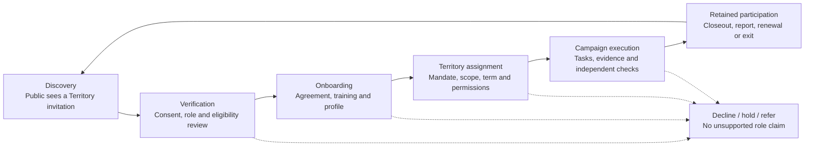

# Kimosabe Commons — Go-to-Market and Channel Plan

## Purpose

**Plain-language summary.** This plan sets out a controlled path to recruit and retain verified participants in bounded Territories during one full Season: discover, consent, verify, onboard, assign, document work, close out, and affirmatively renew or exit.

Kimosabe Commons is **proposed**, not operating today. Targets and budget are **model output**, not results; no customer, county, partner, endorsement, conversion rate, operating result, or public funding is claimed. The company is not a token issuer, insurer, adjuster, escrow agent, money transmitter, bank, law firm, or fiduciary. [SRC — ENGAGEMENT-BRIEF.md]

> **Operating rule:** build one complete, measured recruiting-and-stewardship loop in a bounded group of counties before expanding channels, claims, authority, or technical complexity.

## 1. Positioning

### One-line position

**Kimosabe Commons is the recruiting and stewardship layer for a verified map of people and addresses.**

The category is not a marketplace, agency, civic forum, or software vendor. It is a **recruiting and stewardship layer for a verified map** that locates, onboards, verifies, assigns, supports, and retains people helping move a documented Need to an evidenced Done in a defined Territory and Season. **REPORTED:** the system uses People and Addresses as primitives, Group/Designation roles, and Need → Done. [SRC — ENGAGEMENT-BRIEF.md]

### Three messages by audience

| Audience | Primary message | Proof required before publication | Appropriate call to action |
|---|---|---|---|
| **Contractors and crews** | “Declare your Territory. Earn your Season.” The Commons offers a verified roster, clear role scope, campaign support, and a documented contribution record—not a promise of work. | Published eligibility, consent, verification, Territory, training, evidence, and dispute rules. | Apply for a role or attend a local orientation. |
| **Sponsors and institutions** | “Fund the network that proves its own work.” A sponsored package buys defined research, implementation, measurement, support, and recognition. | Written scope, budget, procurement/counsel review where needed, methodology, and a report that labels unverified figures. | Request a scope discussion and qualification review. |
| **Civic and county partners** | “A verified roster for every address on your map.” The proposed company can organize an opt-in roster and transparent seasonal process; it does not speak for a county or replace public authority. | Written authorization before using a partner name, defined data/notice boundaries, and an approved public process. | Review a Territory discovery brief. |

A fourth audience—engineers and agent builders—receives a technical version: “The recruiting layer for a ledger that resets every year.” The message must explain that the platform produces ledger candidates and reconciliation queues; it does not move money or represent legally complete accounting. [SRC — ENGAGEMENT-BRIEF.md]

### Anti-positioning

Kimosabe Commons is **not** an insurance service, claims handler, staffing guarantee, lead seller, political organization, government replacement, credentialing authority, payment processor, general social network, public people/property database, or capital program. It does not sell access to authority, promise jobs or financial outcomes, certify licences or legal compliance, or imply external approval. It may attest only to its own process. [SRC — ENGAGEMENT-BRIEF.md]

**INFERRED:** this boundary follows the research finding that no evaluated civic or DAO platform provides the complete recruiting CRM, verified real-world identity/Territory graph, privacy-safe attribution, seasonal administration, and General Ledger required here. The opportunity is an independently governed operating layer, not a claim to have solved every underlying market function. [SRC — research/00-dao-platform-landscape.md]

## 2. The funnel

The funnel is a controlled path from public discovery to renewed, documented participation. A click, expression of support, or roster appearance does not advance a record; each stage has an owner, artefact, evidence gate, and failure response.

| Stage | Objective | Channels | Artefact produced | Accountable owner | Success measure | Failure mode and response |
|---|---|---|---|---|---|---|
| **Discovery** | Make a truthful invitation visible to relevant people in a bounded Territory. | Website, direct outreach, civic introductions, story material, domain pages, referrals. | Source-tagged inquiry or consented lead record; campaign brief. | Campaign Producer with Territory Steward review. | Number of consented, source-attributed inquiries that meet stated minimum criteria. **TARGET:** set per County after baseline. | Broad traffic but unsuitable inquiries. Narrow message, show role prerequisites, suppress channels that generate non-consented contacts. |
| **Verification** | Confirm only the attributes required for the requested role and route incomplete cases. | Secure application, document request, reference process, human follow-up. | Verification checklist; consent record; decision with reason; appeal/referral route. | Verifier independent from the recruiter where practical. | Share of applicants with a complete, timely, reviewable decision. **TARGET:** pilot baseline first. | Missing, expired, inconsistent, or excessive data. Hold or decline; never publish documents or make a compliance claim. |
| **Onboarding** | Give accepted participants a shared record of scope, training, conduct, privacy, and escalation rules. | Orientation, role guide, accessible training, signed acknowledgement. | Role agreement; training completion; communication preference; accessibility accommodation request if needed. | Onboarding Lead. | Completion of the defined onboarding sequence before any privileged access. | Participant does not understand scope or cannot access training. Provide accessible support, pause activation, or offboard without penalty. |
| **Territory assignment** | Give a qualified Group or Designation a precise, time-bounded mandate. | Territory register, manager review, Group notice, decision record. | Territory assignment; role permission; start/end date; conflict disclosure; appeal notice. | Territory Steward. | Assignments with a named actor, entity, Group, role, agreement, evidence rule, and reviewer. | Overlap, conflict, unclear boundary, or unverified mandate. Hold assignment; no “first to click” allocation. |
| **Campaign execution** | Perform defined recruiting, promotion, stewardship, or verification work and capture evidence. | Local landing page, direct communication, events, content, task workspace, partner-approved notices. | Campaign record; content approval; task evidence; process attestation; incident/dispute log. | Campaign Producer; Verifier checks designated records. | Documented actions and evidence completed under the approved campaign plan. **TARGET:** first measurement baseline. | Activity without consent, documentation, safety control, or role authority. Stop activity, preserve record, investigate, correct. |
| **Retained participation** | Close the Season fairly and invite qualified renewal based on a complete record. | Closeout meeting, benefit report, renewal notice, exit survey, individual support. | Seasonal contribution record; renewal/expiry decision; challenge or appeal case; aggregate report. | Territory Steward with independent report reviewer. | Retained verified participants who consciously renew after receiving closeout information. **TARGET:** first-season baseline. | Automatic renewal, loss of history, or unresolved dispute. Expire authority at Reset, preserve history, offer appeal and reapplication. |

**Control principle.** The funnel separates recruitment signal from binding action. A referral may create an inquiry; it cannot create a role, Territory mandate, payment instruction, or governance right. The research recommends this separation of signal from binding authority and least-privilege execution, particularly when participant input may later influence higher-consequence actions. [SRC — research/00-dao-platform-landscape.md]

## 3. Channel map

All first-90-day work is **PROPOSED**. Cost posture remains qualitative until actual quotes, staff capacity, and procurement rules exist. No channel may use a logo, name, list, property data, or endorsement without consent and written basis.

| Channel | Audience | Format | Cadence | Cost posture | Measure | First 90 days of work |
|---|---|---|---|---|---|---|
| **A. Website and recruiting funnel** | Public Visitors, Applicants, Contractors, Civic Partners, Sponsors | Territory/role pages, application, accessibility and methodology | Always available; weekly review | **ASSUMED:** owned media; modest testing only after controls work | Consented inquiries by source; applications; accessibility defects; reply time | Publish pilot home and three role pages; test synthetic application and source tags; review accessibility. |
| **B. Direct outreach to licensed contractors and crews** | Licensed Contractors, crews, admins, representatives | Consent-first email/phone, orientation, one-page brief | Weekly lists; biweekly orientation | **ASSUMED:** labor-led; no unreviewed bought data | Qualified conversations; verification; onboarding; opt-outs | Set eligibility and contact-source register; run two cohorts per County; independently sample review. |
| **C. County and civic partnership** | Civic Partners, county staff, local organizations | Discovery brief, listening session, approved memorandum | Monthly outreach; quarterly review | **ASSUMED:** relationship/meeting cost; no paid endorsement | Consented meetings; permissions; referrals; feedback themes | Map organizations without calling them partners; publish limits; seek scope only after review. |
| **D. Sponsor and institutional engagement** | Institutions, associations, philanthropy, employers, service buyers | Defined scope, measurement plan, working session, report | Monthly qualification; quarterly review | **ASSUMED:** senior time and scoped materials | Scope discussions; service agreements; delivery acceptance | Publish package boundaries; screen requests; prepare synthetic sample report; create review gate. |
| **E. Narrative and culture layer** | Applicants, creators, community members, builders | Books, songs, games, story material, explanatory essays | Monthly release; seasonal anchor | **ASSUMED:** rights-cleared original/commissioned content | Consented referrals/applications tagged to work; comprehension; permission | Inventory assets; obtain licence; produce story-to-rule series with role links and consented attribution. |
| **F. Domain and content network** | People seeking a specific need, role, Territory, or concept | Specialized landing pages, explainers, referral links | Monthly audit; quarterly domain review | **ASSUMED:** domain maintenance and original content | Qualified sessions; source-to-application link; corrections | Register assets and permitted use; assign one purpose and one consented funnel per site. |
| **G. Referral and attribution through existing operating companies** | Existing contacts and collaborators; RRCA as Customer Zero | Written referral protocol, introduction record, separate agreement | Weekly review; monthly audit | **ASSUMED:** relationship-led; no unapproved compensation | Consented introductions; qualified progress; workflow evidence | Obtain arm's-length RRCA agreement; separate data/brand use; prohibit automatic roles and unapproved endorsement. |

**Narrative, domains, and Customer Zero are channels** because stories and specialized sites may be a person's first entry to the taxonomy and roles. They require rights, consent, and attribution; domains cannot be portrayed as separate companies or collect data repeatedly without a clear boundary. **REPORTED:** founder domains/brands/IP remain with the founder until agreement, and DBAs are not entities. RRCA is independently owned; its revenue, licences, assets, liabilities, and goodwill remain outside the platform. Every RRCA referral, service, data, and brand use needs a separate written agreement. [SRC — ENGAGEMENT-BRIEF.md]

## 4. Seasonal campaign calendar

The calendar uses the shared five-phase clock: Pre-Season (January–February), Season (March–November), Cool-Down (December 1), Dispute Resolution (December–February), and Reset. **REPORTED:** new work stops at Cool-Down; roles/seats/baselines renew at Reset while history is preserved. [SRC — ENGAGEMENT-BRIEF.md]

| Month | Phase | Campaign | Primary audience | Lead channel | Monthly deliverable |
|---|---|---|---|---|---|
| **January** | Pre-Season / Dispute Resolution | Territory Readiness | Founder team, Civic Partners, Contractors | Website; civic listening | Bounded Territory register, role demand map, prior-record correction window, and season rules draft. |
| **February** | Pre-Season / Dispute Resolution | Verified Roster Call | Contractors, crews, Company Admins, builders | Direct outreach; website | Consent-first application cohort, orientation schedule, verification plan, and approved campaign brief. |
| **March** | Season | Season Opening: “Every Address Is a Stakeholder” | Public Visitors and Applicants | Website; narrative layer | Season opening notice, accessible role pages, source-attribution map, and first public methodology note. |
| **April** | Season | Contractor and Crew Orientation | Licensed Contractors, Crew Members, Independent Sales Representatives | Direct outreach; events | Completed orientation sessions, role acknowledgements, and active/hold/decline roster record. |
| **May** | Season | Territory Stewardship Month | Territory Stewards, Captains, Civic Partners | Civic partnership; website | Territory assignments with terms, conflict disclosures, and appeal route. |
| **June** | Season | Campaign Production Sprint | Campaign Producers, Sponsors, local participants | Website; sponsor engagement | Approved campaign plans, content versions, consent logs, and task/evidence templates. |
| **July** | Season | Evidence and Attestation Checkpoint | Active role holders, Verifiers, Customer Zero team | Referral/attribution; direct support | Mid-season process-attestation sample, correction queue, and aggregate progress note. |
| **August** | Season | Narrative-to-Roster Drive | Applicants, creators, public Visitors | Narrative layer; domain network | Rights-cleared story-to-role content, specialized landing pages, and comprehension findings. |
| **September** | Season | Civic Process Review | Civic Partners, verified stakeholder Groups | Civic partnership; website | Listening-session record, response matrix, and rule-change proposals marked advisory or board-reserved. |
| **October** | Season | Retention and Renewal Preparation | Active participants, Sponsors, Company Admins | Direct outreach; sponsor engagement | Closeout checklist, renewal criteria, support/recognition schedule, and unresolved-issue register. |
| **November** | Season | Evidence Close | All active holders | Website; referral channel | Final task-evidence deadline, verifier sample plan, and no-new-work notice for December 1. |
| **December** | Cool-Down / Reset | Close, Challenge, Renew | Participants, public reviewers, board | Website; public report | Closeout, seasonal benefit report draft, challenge form, dispute docket, expiration/renewal notices, and Reset archive. |

January and February of the next calendar year complete dispute resolution and start the next Pre-Season. The calendar does not imply that a physical project must be finished on a specific day; “Due Today” means acknowledge, act, document a dependency, or set the next committed step. [SRC — ENGAGEMENT-BRIEF.md]

## 5. Founding-seat programme

### Defined package

A proposed **Founding Participation Package** is a time-bounded service agreement for a defined Territory or operating cohort. It includes only what the written scope identifies:

1. **Research participation** — interviews, assumptions, and Territory readiness brief.
2. **Implementation and integration** — agreed workflow, approved interfaces, and training.
3. **Executive working group** — scheduled sessions with representatives and decision record.
4. **Measurement and support** — methodology, source register, report, correction process, and stated support.
5. **Recognition** — factually accurate, consent-based acknowledgement under policy.

### Pricing and disclosure

The following is **ASSUMED — model output, not a market quote or result.** Replace it with board-approved service pricing after scope, staffing, data obligations, and counsel review are known.

| Package | Proposed scope | Model-output fee | Required disclosure |
|---|---|---:|---|
| **Research Participation** | Discovery, readiness brief, role map, measurement plan; no Territory mandate or system build | $7,500–$15,000 | State deliverables, research limitations, data handling, and that no role or governance right is included. |
| **Implementation Cohort** | Research package plus pilot workflow setup, training, and one seasonal measurement cycle | $25,000–$60,000 | State permitted users, support hours, acceptance criteria, change control, and the customer entity signing the agreement. |
| **Integration and Executive Working Group** | Implementation cohort plus approved workflow integration and recurring senior sessions | $60,000–$120,000 | State integration boundary, third-party dependencies, security review, meeting cadence, and that a working-group invitation is not a board seat. |

Fees are paid for services described in a contract, not for a transferable right, ownership claim, resale opportunity, financial outcome, or automatic governance authority. A sponsor may receive the recognition that the written policy allows, but cannot purchase public endorsement, access to personal data, an unreviewed Territory assignment, or a vote outside a separately documented mandate. If a customer seeks any capital pathway, the work pauses and is routed to securities counsel with appropriate disclosures. [SRC — ENGAGEMENT-BRIEF.md]

### Qualification questions

1. What Need, Territory, Season, contracting entity, and authorized signer define the package?
2. Which staff will participate, and what necessary data or records would the company see?
3. What public statement, recognition, logo use, or report is expected, and is it supportable and authorized?
4. Can the intended outcome be stated without promises of work, financial outcome, regulatory treatment, or endorsement?
5. Do procurement, grant, privacy, labor, sector-specific, or conflict constraints require review?

### Disqualification list

Do not accept a package seeking guaranteed work/outcome, regulated service, money custody, unnecessary data, external endorsement, automatic representation, transferable governance, competitor rosters, unreviewed political activity, undocumented related-party work, or automatic poll-based action. Pause where scope, authority, source of funds, data rights, or legal status is undocumented.

## 6. Message architecture

### Approved claims and evidence requirement

| Claim area | Approved claim form | Evidence required before release |
|---|---|---|
| Proposed status | “Kimosabe Commons, PBC is proposed.” | Formation status check; remove or update after formation. |
| Function | “We are building the recruiting and stewardship layer for a verified map.” | Current approved description and a statement that it is proposed. |
| Public benefit | Quote the chartered purpose as a proposed charter purpose. | Exact brief wording; counsel review before filing claims. |
| Process verification | “We attest to the process we performed.” | Dated process record, responsible Verifier, method, and limitation. |
| Participant status | “Verified for [defined role/attribute] under the published process.” | Consent, minimum necessary evidence, expiry date, human decision, and appeal route. |
| Territory status | “Assigned to [Territory] for [term] under [rule].” | Assignment record, eligibility, conflict check, scope, and expiry date. |
| Evidence of Done | “Documented, evidenced Done under the stated acceptance rule.” | Linked evidence, independent check where required, correction mechanism. |
| Benefit report | “This figure is verified / unverified / model output.” | Metric definition, period, source, verifier status, and correction route. |
| Customer Zero | “RRCA is an independent Customer Zero under a documented agreement,” only after agreement. | Written authorization, arm's-length agreement, and approved wording. |
| Sponsor recognition | “Recognized for sponsoring [defined package],” only with permission. | Executed scope, consented recognition language, and no implied endorsement. |

### Prohibited-claims wall

| The company will never say | Reason |
|---|---|
| 1. “We are approved, endorsed, or partnered by [regulator, insurer, bank, university, county, or institution].” | No such claim without written authorization; implied authority can mislead. [SRC — ENGAGEMENT-BRIEF.md] |
| 2. “We guarantee jobs, work, revenue, or a financial outcome.” | Participation is not a promise of work or a guaranteed outcome. [SRC — ENGAGEMENT-BRIEF.md] |
| 3. “We provide coverage, underwriting, adjusting, or claims handling.” | The company is not an insurer or adjuster. [SRC — ENGAGEMENT-BRIEF.md] |
| 4. “Our roster certifies licence, insurance, or legal compliance.” | The company attests only to its own process; participants need appropriate professional credentials and advice. [SRC — ENGAGEMENT-BRIEF.md] |
| 5. “A payment buys a Territory, board seat, vote, or authority.” | Governance and mandates are rule-bound, verified, time-limited, and non-transferable. [SRC — research/00-dao-platform-landscape.md] |
| 6. “A public poll automatically binds the company.” | Signals are not contracts, data changes, or payment instructions. [SRC — research/00-dao-platform-landscape.md] |
| 7. “A community credit is cash or a stored balance.” | The research rejects treating a community credit or claim as cash, donation, or hosted balance by default. [SRC — research/06-06-public-benefit-adjacent.md] |
| 8. “Our system replaces accounting, legal, insurance, or professional advice.” | The platform produces ledger candidates and reconciliation queues, not legally complete accounting or professional advice. [SRC — ENGAGEMENT-BRIEF.md] |
| 9. “This number proves our success” when it is unverified or modeled. | A reasonable reader needs the measurement status, limitations, and correction path. [SRC — ENGAGEMENT-BRIEF.md] |
| 10. “We serve everyone in this County” without a verified, current roster and authorization. | A Territory is not evidence of universal representation; the company must avoid false civic mandate claims. [INFERRED from research/00-dao-platform-landscape.md] |

## 7. Content production roadmap

Every recurring piece needs a source, owner, review path, reader, accessibility check, retention rule, and correction mechanism. Public summaries use aggregate data and do not identify real stakeholder, property-owner, or claimant information.

| Recurring artefact | Purpose | Producer | Required review | Cadence |
|---|---|---|---|---|
| **Territory report** | State a bounded Territory's need, roster gap, roles, rules, and limits | Territory Steward with Research Lead | Privacy, factual, conflict, counsel review as needed | Before each Season; material update |
| **Seasonal benefit report** | State verified activations, evidenced completions, retention, method, limits, corrections | Measurement Lead | Independent Verifier, board committee, privacy review | After Cool-Down and Reset |
| **Case study** | Explain a completed process without promising general results | Campaign Producer with participant consent | Evidence reviewer, Customer/partner approval if named, legal/brand review | One per completed and approved pilot cycle |
| **Roster story** | Explain a role, training path, and documented contribution using consented or synthetic information | Narrative Editor | Participant consent, accessibility, fact check | Monthly during Season |
| **Research note** | Publish a question, source set, hypothesis, and decision status | Research Lead | Source and limitation review | Monthly; additional notes for material decisions |
| **Decision and correction log** | Make rule changes, challenges, resolutions, and report corrections discoverable | Governance Secretary | Board/policy owner and privacy review | Continuous; monthly public update |

**OBSERVED:** Decidim connects participatory processes, results, and accountability; Loomio keeps context, input, proposal, outcome, and reasoning together; Open Collective provides a visible budget/reporting model through a Fiscal Host arrangement. [SRC — research/06-06-public-benefit-adjacent.md] The roadmap adapts the durable-record and accountability ideas, while keeping the PBC's content, privacy, and service design independent.

## 8. Measures of success

The first Season is a learning period. Targets are **ASSUMED / model output**, not expected performance; the board sets thresholds after reviewing Territory count, eligibility, baseline, capacity, and protocol.

| Measure group | Measure | First-season target — model output | Guardrail |
|---|---|---:|---|
| **Funnel** | Consented inquiry-to-complete-application rate | Establish baseline; no percentage target before the first two cohorts | Do not raise volume by weakening consent or eligibility. |
| **Funnel** | Complete-verification decision time | 90% of complete applications decided within 10 business days | Measure separately for holds caused by applicant delay, third parties, and internal queue. |
| **Funnel** | Onboarding completion before privileged access | 100% | No waiver for a referrer, payer, employer, or founder relationship. |
| **Seasonal** | Bounded Territories with an approved roster and ruleset | 3 Counties | A County is counted only after board-approved scope, consented participants, and named steward exist. |
| **Seasonal** | Active verified role holders across pilot scope | 30–60 | Count people once per active role record; report attrition and role mix. |
| **Seasonal** | Evidence completion for sampled campaign tasks | At least 90% of sampled tasks have required evidence or documented exception | Missing evidence is a result, not something to hide. |
| **Seasonal** | Challenge acknowledgement | 100% within 5 business days | Acknowledgement is not resolution; publish resolution timing separately. |
| **Public benefit** | Verified stakeholder activations | Publish actual count and definition; no preset public target | Include Territory, Season, verifier status, and exclusions. |
| **Public benefit** | Evidenced completions | Publish actual count and method; no preset public target | Do not treat a self-report as verified completion without the stated evidence rule. |
| **Public benefit** | Retained participation | Publish actual count and denominator after Reset | Renewal must be affirmative; expired roles are not silently counted. |
| **Public benefit** | Material-report corrections | 100% logged and corrected or explained | Preserve original figure, correction date, and reason. |

## 9. First-season budget sketch

**Model output only.** This is an illustrative cash-operating sketch for one Season across **three bounded Counties**. It assumes a lean core team, original materials, no acquisition of founder IP, no payment custody, no legal opinion, and no use of personal property or claim data in marketing. Amounts are planning placeholders, not quotes, commitments, or validated costs.

| Cost area | Assumption | First-season model output |
|---|---|---:|
| Territory stewardship and roster operations | Part-time Steward/Coordinator capacity across three Counties | $72,000 |
| Campaign production and content | Original role pages, local campaign materials, events, accessibility review | $45,000 |
| Verification and measurement | Independent sample review, evidence workflow, benefit-report preparation | $36,000 |
| Web, CRM, security, and data operations | Basic tools, hosting, consent records, access management, backups | $30,000 |
| Training and participant support | Orientation materials, accessible sessions, support hours | $24,000 |
| Counsel, accounting, insurance, and policy review | Formation/service-contract/privacy/compliance work; scope to be set | $50,000 |
| Travel and local meetings | Bounded County meetings and field coordination | $18,000 |
| Contingency | 10% of operating subtotal, held for approved exceptions | $27,500 |
| **Total first-season model** | Subject to board approval and contract scope | **$302,500** |

The model assumes no grant, sponsor, public contract, customer, or founder contribution. Before launch, management needs a sources-and-uses schedule, restricted-fund controls where applicable, dual approvals, receipt retention, and General Ledger reconciliation. **INFERRED:** Open Collective's Fiscal Host separation cautions that community input cannot substitute for accountable finance operations. [SRC — research/06-06-public-benefit-adjacent.md]

## 10. Open Questions

### Operating and channel questions

1. Which three Counties are suitable for the first bounded pilot, and what verified roster gaps exist in each?
2. Which roles are actually needed for the first Season, which attributes are necessary to verify, and which should never be collected?
3. What written agreement, data boundary, brand permission, and workflow scope will govern RRCA as Customer Zero?
4. Which founder domains, books, songs, games, and story material are available for a first-season licence, and who owns each asset?
5. Which direct-outreach contact sources have a lawful, consent-respecting basis, and what suppression/opt-out process is required?
6. What sponsor package is commercially useful without creating authority, endorsement, privacy, procurement, or regulated-activity risk?
7. Who will perform independent verification, how will the verifier be selected, and what sample size is adequate for the pilot?
8. What accessibility, language, device, and offline participation accommodations are necessary before recruiting begins?

### Governance and evidence questions

1. Which funnel actions are merely advisory, which are delegated operations, and which are reserved to the board under the final bylaws?
2. What public-benefit standard, evidence protocol, report format, and challenge process will counsel and the board approve?
3. What system will serve as the canonical consent, identity, Territory, decision, and evidence record, and what data may flow to external tools?
4. What acceptance criteria convert a model-output price, target, or budget into a board-approved operating decision?
5. Which messages require customer, partner, or institution authorization before publication?

### Basis labels

- **Founder intention / REPORTED:** the proposed PBC's function, chartered public benefit, seasonal clock, Group/Designation model, current-entity boundaries, Customer Zero framing, and prohibition register are supplied in `ENGAGEMENT-BRIEF.md`.
- **Model output / proposed controls:** the packages, fee ranges, three-County scope, targets, budget, calendar deliverables, channel cadence, and governance gates are proposals awaiting founder, board, and counsel approval.
- **Verified fact:** comparative facts about Open Collective, Loomio, Decidim, and the DAO-platform landscape are cited to `research/06-06-public-benefit-adjacent.md` and `research/00-dao-platform-landscape.md`; none verifies Kimosabe Commons performance, customers, or legal status.
