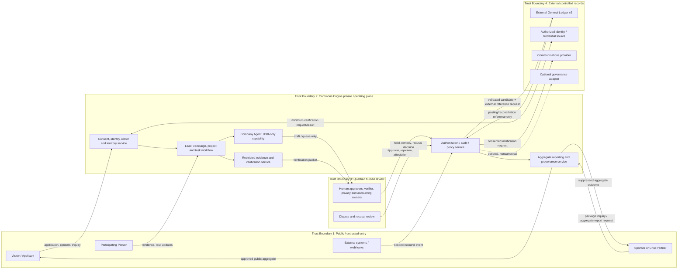

# Adversarial Review & Risk Register

## Plain-language purpose and independence statement

This review asks where the proposed Kimosabe Commons, PBC and its proposed Commons Engine could fail, mislead, harm participants, or become unbuildable—not whether the vision is attractive. The company is proposed, not formed. Its intended chartered benefit is to increase verified, address-anchored, lawfully organized participants who convert documented Need into documented, evidenced Done, measured by verified activations, evidenced completions, and retained participation per territory per season. [SRC — ENGAGEMENT-BRIEF.md]

**Independence statement.** This review was written **without the SRS and PRD**, which were being written concurrently. It does not assume either document resolves a risk. A risk closes only on the acceptance evidence named here, reviewed by the accountable owner. This review also does not decide legal, accounting, insurance, securities, employment, or privacy-law questions; it identifies matters that require qualified review.

The operational framing has unusually close adjacency to recruiting, territory, contribution recognition, governance, sponsorship, and an external General Ledger. That makes exact boundaries essential. Kimosabe Commons must not be described or operated as a token issuer, investment vehicle, insurer, adjuster, claims handler, escrow agent, money transmitter, bank, law firm, or fiduciary. [SRC — ENGAGEMENT-BRIEF.md]

## 1. Review method

### 1.1 Six lenses

| Lens | What was tested | Evidence used |
|---|---|---|
| **Strategic fit** | Whether a public-benefit recruiting and stewardship operator can execute the stated mission without drifting into crypto speculation, regulated services, or founder middleware. | Engagement brief; DAO landscape synthesis. |
| **Evidence quality** | Whether outcome, qualification, sponsorship, and public-benefit claims can be supported by traceable records rather than aspiration or opaque metrics. | Engagement brief; research gap analysis. |
| **Independent design** | Whether patterns are applied without copying a reference platform or inheriting its token, wallet, or custody assumptions. | Per-platform ADOPT/ADAPT/REJECT/DEFER conclusions. |
| **Security and privacy** | Whether authority, execution, data access, identity, external integrations, and Agent actions are constrained and reviewable. | Aragon, DAOhaus, Colony, Snapshot/Tally/Cactus, and civic-platform reports. |
| **Accessibility and usability** | Whether a county-scale, contractor-facing system remains usable without wallets, specialist vocabulary, high digital literacy, or inaccessible timing. | Engagement constraints; research observations on wallet-first and participation-tool gaps. |
| **Delivery feasibility** | Whether a first operating Season can be delivered with owned, maintained, exportable capabilities and enough independent human capacity. | Season clock; maintenance/licensing/continuity research. |

### 1.2 Scoring

Likelihood (**L**) and impact (**I**) use a five-point ordinal scale: 1 rare/minor, 2 unlikely/limited, 3 plausible/material, 4 likely/major, 5 expected or already structurally present/severe. Severity is `L × I`: **1–4 Low**, **5–9 Moderate**, **10–14 High**, **15–25 Critical**. Scores are prioritization aids, not probabilities or legal conclusions. “Evidence status” distinguishes internal context from verified external research: `OBSERVED`/`REPORTED`/`INFERRED`/`ASSUMED` follow the engagement evidence convention.

A “pre-season” answer means the risk must have a tested control and named owner before any Season 1 operation starts. It does not mean a policy document alone closes it.

## 2. Findings

| ID | Lens | Finding and evidence status | L / I / severity | Owner | Mitigation | Acceptance evidence that closes the finding | Resolve before first operating Season? |
|---|---|---|---|---|---|---|---|
| **RISK-001** | Strategic fit / delivery | **Founder concentration and key-person dependency.** The founder is currently the sole decision authority, while the model’s stated purpose is to stop the founder acting as human middleware. That is a structural contradiction until authority, escalation, and recusal are operationalized. **OBSERVED internal context.** [SRC — ENGAGEMENT-BRIEF.md] | 4 / 5 / **Critical** | Founder; proposed board/governance owner | Name deputies for operations, finance liaison, privacy, verification, and incident response; document decision rights, absence cover, and a founder-conflict route. | Tabletop exercise: founder unavailable for 10 business days; deputies complete a territory dispute, a privacy request, and a candidate escalation with complete audit trail. | **Yes** |
| **RISK-002** | Strategic fit / evidence | **Crypto framing can create reputational and legal adjacency to a public-benefit recruiting business.** DAO language, “Human Blockchain,” ledger, credits, and governance may cause audiences to infer speculative, token, or pay-to-participate activity despite the intended operating model. **INFERRED** from the brief and research rejection of transferable/token-weighted defaults. [SRC — ENGAGEMENT-BRIEF.md] [SRC — research/00-dao-platform-landscape.md] | 3 / 5 / **Critical** | Founder; communications/compliance owner | Plain-language positioning; prohibited-claims release gate; no token/wallet requirement; counsel review of high-risk terms; train every recruiter. | Public copy inventory passes independent compliance redline; user comprehension test distinguishes service, sponsorship, and non-financial contribution record from investment/token/cash. | **Yes** |
| **RISK-003** | Strategic fit / evidence | **Sponsors may confuse sponsorship with investment, ownership, return, or endorsement.** The engagement forbids those implications, but a sponsor package and reports could still be presented or heard as a financial instrument. **INFERRED.** [SRC — ENGAGEMENT-BRIEF.md] | 3 / 5 / **Critical** | Sponsor-program owner; counsel | Define package deliverables as research, implementation, measurement, and recognition; use standard disclosures; prohibit yield/return/equity language and unapproved logos/endorsements. | Signed package template, disclosure acknowledgement, sales enablement review, and sample sponsor report show no financial-return or endorsement implication. | **Yes** |
| **RISK-004** | Delivery feasibility | **Seasonality can create a Cool-Down funding gap.** New work stops December 1 while receivables are collected, disputes remain open, evidence must be reconciled, and Reset preparation begins. No evidence establishes a reserve, receivables policy, or closeout financing plan. **ASSUMED risk from the specified clock.** [SRC — ENGAGEMENT-BRIEF.md] | 4 / 4 / **Critical** | Finance/accounting owner; founder | Model cash needs and receivable timing; set funding/commitment gates; no unauthorized funds movement; obtain qualified accounting review. | Approved Season 1 closeout plan, cash scenario model labelled model output, receivables owner list, and tested stop-work/escalation procedure. | **Yes** |
| **RISK-005** | Security / evidence | **The verification role may lack independent authority in practice.** A ClaimBuddy/Verifier who is selected, paid, directed, or reviewed by the work performer cannot provide credible independent verification. Colony’s manager-worker-evaluator separation is a useful pattern, but it does not make independence automatic. **INFERRED.** [SRC — research/03-03-colony.md] | 4 / 5 / **Critical** | Attestation & Verification owner | Enforce conflict graph, assignment separation, method/version controls, random second review, reversal/dispute path, and protected escalation outside the production group. | Test fixtures prove performer, manager, Company Admin, related Entity, and financial approver cannot verify/attest the same work; first verifier training and appeal drill complete. | **Yes** |
| **RISK-006** | Evidence quality | **The chartered benefit is not yet operationally measurable.** The charter text names activations, evidenced completions, retained participation, territory, and season but does not yet establish definitions, denominators, thresholds, audit sampling, or correction rules. **OBSERVED gap in supplied context; INFERRED consequence.** [SRC — ENGAGEMENT-BRIEF.md] | 4 / 4 / **Critical** | Benefit-report owner; data owner | Publish a metric dictionary, data lineage, inclusion/exclusion rules, small-cell safeguards, baseline and restatement policy. | Metric specification signed by accountable owner; synthetic-data report traces each published metric to source events; independent reviewer reproduces results. | **Yes** |
| **RISK-007** | Evidence quality / safety | **Recruited participants may not actually be qualified for the assigned role.** A Lead, marketing response, or self-report is not licensure, training, insurance, eligibility, or capability. The PBC must not claim to certify professional status. **INFERRED.** [SRC — ENGAGEMENT-BRIEF.md] [SRC — research/00-dao-platform-landscape.md] | 4 / 5 / **Critical** | Recruiting & Roster owner; verification owner | Role-specific eligibility checklist; source/expiry record; exception path; scope-limited role assignment; clear statement that platform process attestation is not professional certification. | Role matrix rejects expired/missing required verification; sample records evidence source and expiry; user-facing disclaimer tested in onboarding. | **Yes** |
| **RISK-008** | Strategic fit / security | **Territory allocation can produce scarcity, capture, and disputes.** Nested territories, overlays, Seats, and renewal can collide; a permanent-right interpretation would conflict with the Reset. Wallet/address delegation tools do not solve territorial legitimacy or concentration. **INFERRED.** [SRC — ENGAGEMENT-BRIEF.md] [SRC — research/05-05-snapshot-tally.md] | 4 / 4 / **Critical** | Territory Stewardship owner | Publish allocation criteria, term, notice, conflict/recusal, appeal, caps, and Reset behavior; separate allocation from verification and ledger approval. | At least three simulated competing-allocation cases—including overlay collision and founder-related Entity—are resolved within stated service target and audited. | **Yes** |
| **RISK-009** | Delivery feasibility / independent design | **Adopted governance tooling may reach end-of-life or lack continuity.** DAOstack has multiyear core inactivity and is classified dormant; DAOhaus shows current admin activity but a dormant Baal core and selective maintenance; Tally wound down and Cactus continuity, API terms, export, and SLA remain unverified. **OBSERVED/REPORTED in research.** [SRC — research/04-04-daostack.md] [SRC — research/02-02-daohaus.md] [SRC — research/05-05-snapshot-tally.md] | 4 / 4 / **Critical** | Technical owner | Treat these as pattern sources, not systems of record; pin dependencies; own exports/backups/read path; require vendor diligence and exit plan for any hosted component. | Dependency register has owner, license, maintenance signal, export format, restore test, and replacement path; no Season 1 critical workflow depends on DAOstack, Baal, or undocumented Cactus endpoints. | **Yes** |
| **RISK-010** | Independent design / delivery | **Copyleft and source-license exposure can derail build or distribution.** Aragon OSx, Loomio, and Decidim are AGPL-3.0; Colony, Baal, and DAOstack are GPL-3.0; license position is unverified for several visible front ends and hosted services. **OBSERVED in research.** [SRC — research/00-dao-platform-landscape.md] | 3 / 4 / **High** | Technical owner; qualified open-source counsel | Maintain software bill of materials; ban unreviewed code copying; use independently authored implementation or reviewed interfaces; secure written license assessment before modification/hosting/distribution. | License scan and counsel-reviewed reuse decision for every shipped dependency; engineering attests no copied interface/copy/source expression from reference platforms. | **Yes** |
| **RISK-011** | Accessibility / usability | **Older contractors and low-digital-literacy participants may be excluded or make consequential mistakes.** The desired audience includes contractors/crews; wallet-first and crypto-specialist onboarding are expressly rejected, yet the operational journeys are still complex. No usability evidence for this audience exists. **ASSUMED audience; INFERRED risk.** [SRC — ENGAGEMENT-BRIEF.md] [SRC — research/02-02-daohaus.md] | 4 / 4 / **Critical** | Product/accessibility owner | Provide plain-language, phone/email/assisted lawful paths, mobile-first forms, recovery support, accessible deadlines, training, WCAG 2.2 AA tests, and no wallet prerequisite. | Moderated usability tests with representative low-digital-literacy users complete application, consent, task evidence, and dispute flows; WCAG audit and keyboard/screen-reader evidence pass. | **Yes** |
| **RISK-012** | Privacy / evidence | **Data minimization conflicts with public-benefit reporting and sponsor attribution.** Address-level attribution, verification, referral, evidence, and public transparency can enable re-identification, especially in a sparse Territory. Public-ledger defaults are a poor fit for sensitive operational records. **INFERRED.** [SRC — research/00-dao-platform-landscape.md] [SRC — research/06-06-public-benefit-adjacent.md] | 4 / 5 / **Critical** | Privacy/data owner | Purpose limitation, field inventory, consent and retention controls, small-cell suppression, aggregate report review, restricted evidence store, export logging, deletion process. | Data-protection review of every data category; sparse-territory re-identification test passes; sponsor report provenance works without raw-person data; deletion/withdrawal drill succeeds. | **Yes** |
| **RISK-013** | Strategic fit / safety | **The platform may be mistaken for an insurer, adjuster, or claims handler.** “ClaimBuddy,” contractors, addresses, and verification could be interpreted as insurance or claims activity. The brief expressly prohibits that characterization. **OBSERVED prohibition; INFERRED misunderstanding risk.** [SRC — ENGAGEMENT-BRIEF.md] | 3 / 5 / **Critical** | Founder; communications/compliance owner | Rename or tightly define sensitive terminology in public contexts; include scope statements; prohibit policyholder/claim data; route regulated questions to appropriate licensed parties. | Copy/UX review finds no coverage, underwriting, adjusting, or claims-handling implication; intake blocks policyholder/claim information; staff scenario test routes questions correctly. | **Yes** |
| **RISK-014** | Security / delivery | **AI Agent authority could exceed the tested limit.** Machine credentials, broad integrations, generated communications, and ledger/territory recommendations can create unauthorized action or human overreliance. Decidim warns machine credentials are highly sensitive; DAOhaus and Aragon illustrate how privileged execution and broad permissions can bypass normal review. **OBSERVED/INFERRED.** [SRC — research/06-06-public-benefit-adjacent.md] [SRC — research/02-02-daohaus.md] [SRC — research/01-01-aragon.md] | 4 / 5 / **Critical** | Technical owner; AI-control owner | Default draft-only; capability allowlists, short-lived credentials, human approval, output labels, prompt-injection tests, rate limits, no payment/attestation/role/export power, and kill switch. | Red-team suite demonstrates agent refuses prohibited actions; audit logs identify sponsor and scope; emergency disable test completes; human review samples meet defined error threshold. | **Yes** |
| **RISK-015** | Security / financial boundary | **A ledger candidate may be mistaken for accounting approval, an obligation, or a payment instruction.** The General Ledger is external and qualified professionals own the books, but task-to-candidate automation can create false finality. **OBSERVED internal boundary; INFERRED risk.** [SRC — ENGAGEMENT-BRIEF.md] | 3 / 5 / **Critical** | Finance/accounting owner; platform owner | Explicit state labels; no transfer APIs; dual human validation; external posting reference; reconciliation/variance process; accounting-owner training. | Architecture test finds no payment/custody function; accounting owner can reject/reverse test candidates; UI comprehension test distinguishes candidate, external posting, and payment. | **Yes** |
| **RISK-016** | Security / privacy | **Restricted data can leak through evidence uploads, exports, integrations, or operational screenshots.** The platform may receive sensitive free text even if prohibited categories are formally banned. External GraphQL/OAuth/webhook patterns demonstrate broad integration surfaces, not automatic privacy safety. **INFERRED.** [SRC — research/06-06-public-benefit-adjacent.md] [SRC — research/05-05-snapshot-tally.md] | 3 / 5 / **Critical** | Security/privacy owner | Classification-aware upload, warnings, malware/DLP quarantine, least-privilege tokens, scoped integration contracts, export review, logging, incident response. | Upload tests block/quarantine seeded prohibited content; access-control and penetration tests pass; incident runbook/tabletop and vendor data-processing review complete. | **Yes** |
| **RISK-017** | Strategic fit / governance | **Delegation and representation may concentrate authority or misstate legitimacy.** Address-based delegation and token-weighted governance do not prove county residency, stakeholder mandate, or equal access; research identifies concentration and external-score trust boundaries. **OBSERVED/INFERRED.** [SRC — research/05-05-snapshot-tally.md] [SRC — research/01-01-aragon.md] | 3 / 4 / **High** | Governance/Territory owner | Define advisory versus binding decisions; verified eligibility; territory/topic/term caps; disclosures, recall, participation reporting, accessible alternatives, and appeal. | Delegation policy approved; synthetic concentration analysis shows caps/recall work; all public decision records show authority type and mandate. | **Yes** for any delegation; otherwise defer |
| **RISK-018** | Security / independent design | **Privileged execution or pool-draining patterns can be imported accidentally.** Broad Aragon plugin authority, DAOhaus Shaman/arbitrary multicall power, Safe-based execution, and ragequit-style treasury drain are unsuitable defaults. **OBSERVED in research.** [SRC — research/01-01-aragon.md] [SRC — research/02-02-daohaus.md] | 2 / 5 / **High** | Technical/finance owner | No on-chain funds custody in Season 1; prohibit arbitrary calls/multicalls; function-scoped approvals, simulations, limits, independent ledger, and emergency revocation for any future adapter. | Threat model shows no privileged production route can move funds; code review confirms allowlists and dual control; finance owner signs off on reconciliation boundary. | **Yes** if any execution adapter exists; otherwise architectural prohibition documented |

### 2.1 Interpretation of severity

The five Critical findings at the top are not an attempt to manufacture a quota. They reflect the combination of a sole current decision authority, a proposed public-benefit claim, a territory/verification model, a seasonal stop-work boundary, and sensitive regulatory adjacency. Several can be closed by defining and testing a narrow initial pilot, not by attempting national-scale governance.

The risk register does not assume a token, wallet, public chain, external DAO framework, fiscal host, financial custodian, or agentic integration will be used. If any is introduced later, the associated deferred risk reopens and needs a new review.

## 3. Data flow and trust boundaries

### Boundary-specific abuse cases

| Boundary | Entry / crossing abuse | Required control |
|---|---|---|
| **1. Public entry → private plane** | Applicant submits prohibited policyholder/claim/health/financial material; bot floods a territory claim queue; impersonator submits a Sponsor request. | Rate limits, consent capture, input classification/quarantine, accessible assisted pathway, verification before consequential authority, provenance/audit IDs. |
| **2. Private workflow → restricted evidence/authorization** | Crew member alters evidence; Company Admin queries another Entity; a prompt injection attempts to make Agent export or approve. | Object/version checks, ABAC/RBAC tuple, restricted evidence store, no self-verification, Agent capability isolation, audit and anomaly alerts. |
| **3. Private plane → human review** | Reviewer rubber-stamps a related party, pressures verifier, or silently overrides a policy. | Conflict disclosure/recusal, dual approval, independent verifier assignment, reasoned decision, appeal, random QA and immutable Audit Event. |
| **4. Private plane → external ledger/integration** | Candidate is treated as payment instruction; webhook credential is abused; an optional governance adapter executes a privileged transaction. | Candidate-state boundary, no money APIs, scoped short-lived credentials, signature validation, idempotency, allowlist, human authorization, reconciliation and kill switch. |
| **5. Private plane → public/sponsor reporting** | Sparse report reveals identity, a metric is inflated, or a sponsor receives competitor/member data. | Minimum cohort threshold, aggregate-only report scope, provenance manifest, independent report review, data-class filtering, correction/version process. |

The major trust-boundary lesson from the research is that permissions and integrations are not self-proving controls. Aragon’s granular permissions, Snapshot’s custom strategy/API boundaries, Decidim’s sensitive machine credentials, DAOhaus Shaman/multicall authority, and Colony’s task-role separation are patterns that require independent policy, test, and human accountability. [SRC — research/01-01-aragon.md] [SRC — research/02-02-daohaus.md] [SRC — research/03-03-colony.md] [SRC — research/05-05-snapshot-tally.md] [SRC — research/06-06-public-benefit-adjacent.md]

## 4. What is deliberately not a finding

This review did **not** manufacture critical findings to meet a quota. The following were checked and are acceptable as **design direction**, subject to implementation evidence:

1. **No direct production dependency is required on a reviewed DAO platform.** The landscape properly treats the platforms as pattern sources or optional, bounded adapters—not a mandate to copy code, UI, governance, wallets, or custody. That is a sound starting position. [SRC — research/00-dao-platform-landscape.md]
2. **The stated financial boundary is appropriately cautious.** The brief says the platform produces candidates/reconciliation queues and never moves money or claims to be legally complete accounting. The risk is implementation drift, not that the proposed boundary is inherently wrong. [SRC — ENGAGEMENT-BRIEF.md]
3. **Seasonality is not inherently a defect.** A seasonal cadence can support transparent renewal and prevent permanent entitlement if closeout, disputes, retention, and funding are actually resourced.
4. **Use of an external General Ledger is not a failure of the product.** It is a sensible separation of operational event capture from qualified accounting ownership, provided reconciliation is real and not merely a dashboard label.
5. **No finding alleges a security defect in a specific upstream codebase.** The research reported maintenance, authority, licensing, and continuity signals; it did not execute a code audit or prove a vulnerability. This review therefore does not claim one.
6. **No finding alleges that an existing Entity has committed misconduct.** Market Applications LLC, USA LLC, and RRCA are included only because entity boundaries and founder recusal are relevant to system design. RRCA’s independent ownership is a stated constraint. [SRC — ENGAGEMENT-BRIEF.md]

## 5. Residual-risk statement

Even after the stated mitigations, the proposed platform retains material residual risk: human reviewers can collude or err; local territorial legitimacy can be contested; external providers and source data can fail; small populations are difficult to report without re-identification; cash timing and qualified staffing may constrain closeout; and users may misunderstand an unfamiliar public-benefit/ledger model despite careful copy.

The founder must accept the residual strategic and reputation risk for the initial operating model. A future board or equivalent governing body must accept entity/benefit-report risks. The qualified accounting owner must accept the reconciliation/control boundary for externally posted records. The privacy/security owner must accept residual data-processing risk. No Company Agent, Contractor, Sponsor, Territory Steward, or platform Administrator may silently absorb those acceptance decisions. Acceptance must be dated, named, scoped to a Season and pilot Territory, and recorded as an Audit Event.

## 6. Pre-season gate list

The following findings must be closed before the first operating Season begins. A checked box requires the named acceptance evidence, not a plan.

- [ ] **RISK-001:** Deputy/absence, escalation, and founder-recusal tabletop completed.
- [ ] **RISK-002:** Crypto/DAO framing and prohibited-claims review passes comprehension and compliance review.
- [ ] **RISK-003:** Sponsor package/disclosure and sponsor-report samples are approved.
- [ ] **RISK-004:** Season cash/receivables/cool-down plan is reviewed by qualified accounting personnel.
- [ ] **RISK-005:** Independent verification, conflict, reversal, and appeal controls pass automated and tabletop tests.
- [ ] **RISK-006:** Chartered-benefit metric dictionary, baselines, provenance, and correction policy are approved and reproducible.
- [ ] **RISK-007:** Role qualification evidence and expiry workflow are implemented without certification claims.
- [ ] **RISK-008:** Territory allocation/appeal/Reset simulations are completed, including founder-related recusal.
- [ ] **RISK-009:** Dependency inventory, export/restore test, and no-critical-dormant-tool decision are complete.
- [ ] **RISK-010:** Software bill of materials and license/reuse review are complete.
- [ ] **RISK-011:** Accessibility and low-digital-literacy usability testing passes core flows.
- [ ] **RISK-012:** Data inventory, minimization, suppression, deletion, and report privacy tests pass.
- [ ] **RISK-013:** Public terms, intake, and staff scripts prevent insurer/claims-handler confusion.
- [ ] **RISK-014:** Agent capability, red-team, audit, and emergency-disable tests pass.
- [ ] **RISK-015:** No-money-movement architecture and external-ledger reconciliation workflow are accepted by accounting owner.
- [ ] **RISK-016:** Restricted-upload, integration, export, and incident controls are tested.
- [ ] **RISK-017:** If delegation is enabled, mandate/caps/recall/disclosure test is complete; otherwise it remains deferred.
- [ ] **RISK-018:** If any execution adapter exists, privileged-route threat model and dual-control evidence pass; otherwise prohibition is codified.

## 7. Open Questions and evidence boundary

### Open Questions

1. Who will independently own verification, financial reconciliation, privacy, and dispute review in the first Season when the founder is presently sole decision authority?
2. What bounded pilot Territory, participant cohort, and explicit stop conditions will make the first Season a test rather than an implied national rollout?
3. What exact legal/commercial agreements govern data sharing and work boundaries among the proposed PBC, Market Applications LLC, USA LLC, RRCA, Sponsors, Civic Partners, and future foundation if any?
4. What regulated-services counsel review is required before the terms “ClaimBuddy,” “attestation,” “sponsor,” “credit,” “ledger,” or “territory” are used publicly?
5. What accounting professional and external ledger workflow will validate candidate account mapping, posting reference, reversal, and retention policy?
6. Which identity/credential verification sources may be used without collecting disallowed data, and what false-positive/appeal service level is acceptable?
7. Which Company Agent model, integrations, monitoring, data-use limits, and human-review error thresholds will be approved for Season 1?
8. What quantitative gate defines that a public benefit report is sufficiently reproducible, privacy-safe, and understandable to publish?

### Evidence boundary at close

- **Founder intention / internal context:** the proposed PBC, its public-benefit charter wording, entity reality, role/territory concepts, seasonal clock, and hard constraints originate in the engagement brief. [SRC — ENGAGEMENT-BRIEF.md]
- **Model output / review judgment:** risk scores, mitigation design, acceptance evidence, gates, and residual-risk allocation are independent review proposals and must be adopted by accountable human owners before they bind anyone.
- **Verified research fact:** the cited reports substantiate patterns and maintenance/licensing/authority concerns: DAOstack dormancy; DAOhaus core maintenance and broad execution risk; Colony’s scoped task/evaluator pattern and low-maintenance caution; Snapshot/Tally/Cactus continuity uncertainty; Aragon permissions/configuration risk; and civic-platform credential/integration boundaries. [SRC — research/00-dao-platform-landscape.md] [SRC — research/01-01-aragon.md] [SRC — research/02-02-daohaus.md] [SRC — research/03-03-colony.md] [SRC — research/04-04-daostack.md] [SRC — research/05-05-snapshot-tally.md] [SRC — research/06-06-public-benefit-adjacent.md]

Nothing in this review is legal, accounting, insurance, securities, privacy-law, employment, or professional licensing advice.
