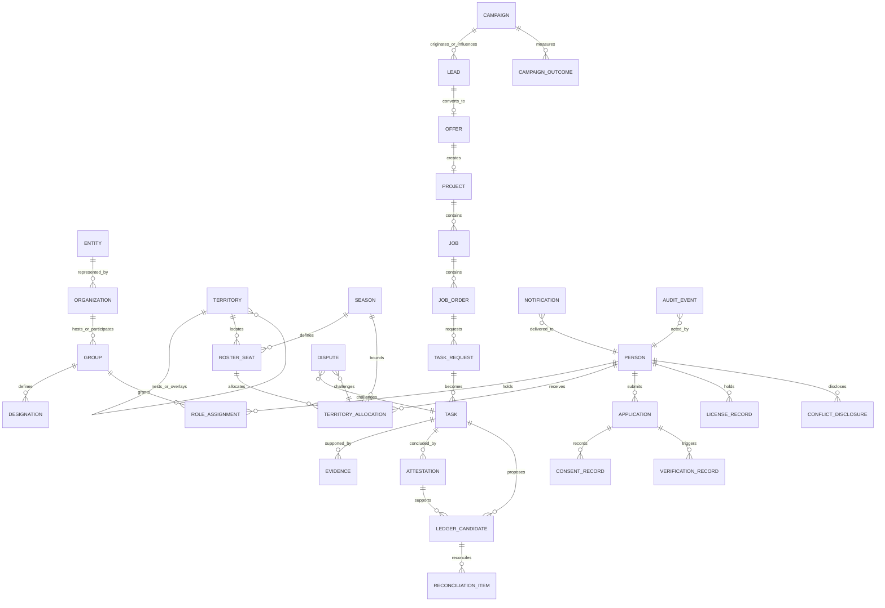

# Data & Ledger Model

## Plain-language purpose

The Commons Engine is proposed as a private operating record for people, addresses, territories, work, evidence, attribution, and seasonal stewardship. This model traces documented **Need** to evidenced **Done** without becoming a bank, accounting system, insurer, claims handler, public-chain identity registry, or permanent-entitlement system.

The platform creates **ledger candidates** and reconciliation queues for an external General Ledger v2; it never holds, transmits, or moves funds, and qualified accounting professionals own the books. [SRC — ENGAGEMENT-BRIEF.md]

> **Design summary:** retain minimum private evidence, publish only approved aggregates, and preserve history without carrying forward personal or territorial entitlement.

The model independently adapts scoped work/independent evaluation, decision events, and fiscal separation; it does not adopt a reference platform as a system of record. [SRC — research/00-dao-platform-landscape.md] [SRC — research/03-03-colony.md] [SRC — research/06-06-public-benefit-adjacent.md]

## 1. Data design principles and decisions

1. **People and Addresses are distinct primitives.** A Person can be related to an Address only through a specific purpose, consent basis, and time window. A physical address is not evidence of residency, ownership, eligibility, licensure, or authority by itself.
2. **Identity, authority, work, evidence, and financial reconciliation are separate records.** No single score, wallet, or database field stands in for all five. This rejects wallet-first membership and a universal transferable governance token. [SRC — research/00-dao-platform-landscape.md]
3. **The system of record is private and exportable.** Public reports are derived read models, not the source of truth. No personally identifiable operational record is placed on a public chain.
4. **Events are append-only; mutable objects are versioned.** A correction does not erase the prior decision trail. A valid legal deletion request removes or irreversibly de-identifies permitted data while retaining a non-identifying deletion audit marker.
5. **A ledger candidate is not money.** It is a proposed, evidenced classification or reconciliation reference. An approved candidate may be posted by qualified accounting personnel to an external ledger, but neither approval nor posting instructs a payment.
6. **Seasonal access and recognition expire; history does not.** Reset reopens the address state to Need and revokes active scope. It does not manufacture a permanent punishment or a permanent territorial right.

**ADR-041 — Event provenance is canonical.** Every consequential mutation must emit an Audit Event and, where relevant, a domain event using the envelope in Section 5. This is the authoritative trace for workflow, notification, candidate, and metric derivation.

**ADR-042 — Restricted evidence is separately stored and reference-addressed.** Evidence metadata may be used in workflow; binary/object content and sensitive fields have a separate restricted store and are exposed only through time-limited, audited access.

## 2. Domain entities

Identifiers are stable, opaque primary keys internally. The human-readable reference is a display/reference layer, not a security control. Classifications mean: **Public** may be published after review; **Internal** is routine operating data; **Confidential** is limited to need-to-know operational staff; **Restricted** is sensitive identity, consent, credential, conflict, evidence, or security data.

| Entity | Key attributes | Identifier / owner | Lifecycle states | Data class |
|---|---|---|---|---|
| **Person** | display name, contact channel, account status, verified attributes pointer, preferences | `PER-…`; Person with platform stewardship | invited, registered, verified, suspended, archived | Restricted |
| **Organization** | name, type, legal-entity link, contacts, agreement scope | `ORG-…`; Organization / designated admin | prospect, active, suspended, archived | Confidential |
| **Entity (legal entity)** | legal name, jurisdiction, formation/status evidence, relationship type | `ENT-…`; legal Entity | proposed, verified-existing, inactive, archived | Confidential |
| **Group** | class, primary admin, ruleset version, ledger mapping, parent Group | `GRP-…`; accountable Entity/Organization | proposed, active, suspended, retired | Internal |
| **Designation** | role definition, required evidence/training, grantable permissions | `DSG-…`; owning Group | draft, active, deprecated, retired | Internal |
| **Role Assignment** | subject, Group/Designation, permission scope, effective dates, conflict status | `RAS-…`; owning Group | proposed, active, suspended, expired, revoked, archived | Restricted |
| **Territory** | type, code, parent/overlay relations, geometry/reference source | `TER-…`; Territory Stewardship | proposed, active, retired | Public / Internal geometry rules |
| **Territory Allocation** | Territory, Seat, assignee, season, decision, limits, appeal link | `TAL-…`; Territory Stewardship | requested, allocated, disputed, suspended, expired, closed | Confidential |
| **Season** | key, phases, start/end, ruleset, baseline version | `SEA-…`; proposed PBC | planned, pre-season, active, cool-down, dispute-resolution, reset, closed | Public |
| **Roster Seat** | Group, Territory, designation capacity, holder, term, allocation rules | `SEA-…-RST-…`; owning Group | vacant, reserved, held, disputed, expired, retired | Confidential |
| **Application** | applicant, answers, consent, role/territory preference, review outcome | `APP-…`; Recruiting & Roster Operations | started, submitted, screening, verified, accepted, declined, withdrawn, expired | Restricted |
| **Verification Record** | subject/object, method, verifier, checks, outcome, expiry, evidence references | `VFY-…`; Attestation & Verification | pending, in-review, verified, failed, expired, superseded | Restricted |
| **License Record** | credential type, issuing source/reference, holder, expiry, validation result | `LIC-…`; subject Person/Organization | unverified, pending, verified, expired, rejected, superseded | Restricted |
| **Consent Record** | data purpose, communication channel, version, captured time, withdrawal | `CNS-…`; Person | granted, withdrawn, expired, superseded | Restricted |
| **Conflict Disclosure** | affected Person/Entity/object, relationship, recusal and resolution | `CFD-…`; disclosing Person with governance review | declared, under-review, mitigated, recused, closed | Restricted |
| **Lead** | source, attribution, consent state, territory interest, owner, stage | `LED-…`; Recruiting or originating Group | new, qualified, nurturing, converted, disqualified, withdrawn, archived | Confidential |
| **Offer** | target, parent Lead, terms version, expiry, acknowledgements | `OFR-…`; issuing Group | drafted, issued, accepted, declined, expired, withdrawn, superseded | Confidential |
| **Project** | objective, territory, parties, approved scope, season, status | `PRJ-…`; accountable Group | pending, active, on-hold, completed, cancelled, archived | Confidential |
| **Job** | Project link, operational purpose, owner, schedule, required roles | `JOB-…`; Project owner Group | drafted, active, blocked, complete, cancelled | Confidential |
| **Job Order** | Job link, requested service, order/version, approval/fulfillment status | `JBO-…`; accountable Group | drafted, submitted, accepted, fulfilled, cancelled, disputed | Confidential |
| **Task Request** | Job Order link, task brief, requester, acceptance criteria, due/next step | `TRQ-…`; requesting Group | drafted, open, assigned, withdrawn, expired | Internal |
| **Task** | assignee, manager, verifier requirement, dependencies, evidence requirements | `TSK-…`; accountable Group | assigned, accepted, in-progress, blocked, submitted, verified-done, rejected, cancelled | Internal |
| **Evidence** | type, provenance, content hash, classification, retention, subject links | `EVD-…`; submitter subject to Group custody | pending-scan, accepted, challenged, superseded, retained, deleted/de-identified | Restricted |
| **Attestation** | process/method, verifier, conclusion, evidence set, expiry, reversal link | `ATT-…`; Attestation & Verification | drafted, issued, challenged, superseded, revoked, archived | Confidential |
| **Campaign** | objective, audience consent basis, territory, channels, budget envelope, approval | `CMP-…`; Promotion & Campaign Production | drafted, approved, active, paused, completed, cancelled, archived | Internal |
| **Campaign Outcome** | campaign, measure definition, period, aggregate value, provenance query | `OUT-…`; campaign owner Group | provisional, verified, published, corrected, retired | Public / Internal |
| **Ledger Candidate** | source events, account proposal, amount/reference if supplied externally, currency, evidence, approvals | `LGC-…`; Finance/reconciliation owner | proposed, validated, posted-externally, rejected, disputed, reversed | Confidential |
| **Reconciliation Item** | external ledger reference, candidate links, variance, reviewer, close evidence | `RCN-…`; qualified accounting owner | open, matched, variance, resolved, closed | Confidential |
| **Dispute** | object, parties, ground, evidence, deadline, decision and appeal | `DSP-…`; designated dispute owner | filed, triaged, in-review, upheld, denied, settled, closed | Restricted |
| **Notification** | recipient, purpose, channel, consent link, template/version, delivery status | `NTF-…`; originating Group | queued, sent, delivered, failed, suppressed, expired | Confidential |
| **Audit Event** | actor, authority tuple, action, target, outcome, correlation, timestamp | `AUD-…`; platform stewardship | immutable; redacted view where required | Restricted |

**Owner** means accountable program/Group steward, not a legal ownership or privacy-law determination.

## 3. Relationships



### Cardinality and integrity notes

A Person can hold many non-conflicting assignments; each assignment references one Group and Designation. An Entity can have many Organization records and an Organization many Groups, but no silent merging follows shared contacts. Territories have an acyclic base hierarchy and explicit overlays; allocations require a Seat. A Lead has at most one accepted conversion Offer, and an Offer at most one Project. A Task has many Evidence records but only one current method/version attestation. Candidates may link multiple source events and reconciliation items but are never external ledger entries. Disputes may challenge any consequential record while preserving an authorized, state-labelled trail.

## 4. Identifier and reference scheme

### 4.1 General reference codes

The platform assigns opaque UUID/ULID primary keys. Human references use the following stable form:

```text
KC-<object-code>-<season-key>-<territory-code>-<sequence>
Examples:
KC-LED-S27-FL-12086-33101-CR042-000184
KC-TSK-S27-FL-12086-33101-CR042-004821
KC-LGC-S27-FL-12086-33101-CR042-000073
```

`KC` means the proposed product namespace, not an assertion that an Entity currently exists. Object codes follow the entity table (`LED`, `OFR`, `PRJ`, `TSK`, `EVD`, `LGC`, and so on). A reference can be shown to users, but authorization always uses the opaque primary key and scope tuple.

### 4.2 Territory and Season codes

The canonical base route is:

```text
<State>-<CountyFIPS>-<ZIP5>-<CarrierRoute>
FL-12086-33101-CR042
```

- State uses U.S. postal code.
- County uses the five-digit FIPS representation **only after source and update process are adopted**; it is a data code, not a representation or jurisdiction claim.
- ZIP is stored as five characters and is not assumed to fit perfectly inside one County.
- Carrier Route uses its formal string where a lawful, maintained source is available. Missing detail is `ZZZZZ` / `UNK`; it is never fabricated.
- An overlay adds a suffix, such as `@SD-014` for a school-district overlay. The overlay source/version is stored separately.

The Season key is `S<two-digit-year>` for the Season that begins in that calendar year, e.g., `S27`. A more specific official key is `S27-R1` if the founder approves a re-run/revised ruleset; a revision does not erase `S27` history. Seasons are not fiscal years unless accounting policy explicitly maps them.

### 4.3 Event and correlation references

Every event has `event_id` (`EV-<ULID>` display form) and every causal chain has `correlation_id` (`COR-<ULID>`). A retry carries the same idempotency key but receives its own attempt audit event. A human or integration cannot select a correlation ID already linked to another chain.

**FR-DATA-01 (P0).** Every consequential mutation shall attach an event ID, correlation ID, authenticated actor/service identity, effective Role Assignment ID, object reference, object version, timestamp, and result. **Acceptance:** a trace from a published Campaign Outcome to its Lead/Task/Evidence sources is possible without exposing restricted fields to the report viewer.

## 5. Event catalogue

### 5.1 Standard event envelope

```json
{
  "event_id": "EV-01J…",
  "event_name": "task.completion_submitted.v1",
  "occurred_at": "2027-07-14T16:31:22Z",
  "correlation_id": "COR-01J…",
  "causation_id": "EV-01J…",
  "actor": {"subject_type": "person", "id": "PER-…", "role_assignment_id": "RAS-…"},
  "scope": {"entity_id": "ENT-…", "group_id": "GRP-…", "territory_ids": ["TER-…"], "season_id": "SEA-S27"},
  "subject": {"type": "task", "id": "TSK-…", "version": 7},
  "classification": "confidential",
  "payload": {"schema_version": 1, "minimum_fields": "…"},
  "evidence_refs": ["EVD-…"],
  "integrity": {"idempotency_key": "…", "hash": "…"}
}
```

The payload contains only data needed by consumers; consumer-specific restricted fields are retrieved through a scoped query, not copied into a broad event stream.

| Event name | Trigger | Minimum payload | Consumers | Resulting task / notification / candidate / metric |
|---|---|---|---|---|
| `application.submitted.v1` | Applicant submits | application, consent, territory preference | recruiting, verification | screening Task; receipt Notification; application-volume metric |
| `consent.granted.v1` | Person grants purpose/channel consent | consent, purpose, version, expiry | communications, privacy | consent audit; eligible-audience update |
| `consent.withdrawn.v1` | Person withdraws | consent, scope, effective time | communications, privacy | suppression Notification/event; deletion-review Task |
| `verification.requested.v1` | screening requires check | subject, method, expiry | verification | verifier Task |
| `verification.completed.v1` | Verifier decides | record, result, evidence, conflict result | recruiting, role service | decision Notification; qualification metric |
| `license.expiry_detected.v1` | scheduled check reaches threshold | license, expiry, subject | recruiting, role service | renewal Task; scoped-access suspension if expired |
| `role.assigned.v1` | two-step role grant completes | assignment, scope, dates | authorization, roster | onboarding Notification; active-roster metric |
| `role.revoked.v1` | revocation/suspension | assignment, reason class, time | authorization, security | token invalidation; affected-owner Notification |
| `territory.allocation_requested.v1` | seat claim submitted | seat, applicant, territory, Season | stewardship | allocation-review Task |
| `territory.allocated.v1` | allocation approval completes | allocation, seat, term, approvers | roster, reporting | holder Notification; allocated-seat metric |
| `territory.disputed.v1` | qualified objection | allocation, ground, deadline | disputes, stewardship | Dispute; access hold Notification |
| `lead.created.v1` | consented Lead created | lead, source, campaign, territory | recruiting, attribution | owner queue; source metric |
| `offer.issued.v1` | Offer sent | offer, lead, expiry, terms version | recruiting | recipient Notification; funnel metric |
| `offer.accepted.v1` | recipient accepts | offer, acknowledgements | projects, roster | Project-setup Task; conversion metric |
| `project.created.v1` | accepted offer/admin action | project, territory, scope, Season | operations | job-planning Task |
| `task.assigned.v1` | Task assigned | task, assignee, acceptance criteria | assignee, operations | assignment Notification; workload metric |
| `task.completion_submitted.v1` | assignee submits evidence | task, evidence refs, declaration | verification | independent-review Task |
| `evidence.accepted.v1` | scanner/reviewer accepts metadata/content | evidence, classification, provenance | verification, retention | evidence-completeness metric |
| `attestation.issued.v1` | qualified independent verifier attests process | attestation, method, evidence | ledger candidate, reporting | candidate-validation Task; evidenced-Done metric |
| `ledger_candidate.proposed.v1` | rules identify qualifying work event | candidate, source refs, proposed account class | finance/reconciliation | candidate queue entry |
| `ledger_candidate.validated.v1` | non-self validator passes rules | candidate, validator, validation checks | finance | human approval Task |
| `ledger_candidate.posted_externally.v1` | accounting owner supplies external reference | candidate, external ref, date | reconciliation, reporting | Reconciliation Item; close metric |
| `ledger_candidate.rejected.v1` | validation/approval fails | candidate, reason code | originator, disputes | correction Notification; rejection-rate metric |
| `campaign.published.v1` | approved campaign posts | campaign, approved content version, audience basis | communications, metrics | audience Notification; publication metric |
| `campaign.outcome.measured.v1` | approved aggregation runs | outcome, definition, provenance query | reporting, sponsors | review Task; outcome metric |
| `season.cooldown_started.v1` | calendar boundary | Season, policy version | all programs | stop-new-work Notices; closeout queue |
| `season.reset_executed.v1` | reset controls complete | prior/new Season, revocations, baselines | authorization, reporting | renewal invitations; retained-participation baseline |
| `dispute.closed.v1` | decision/appeal deadline passes | dispute, decision, remedy | original owners, reporting | final notification; dispute-cycle metric |

## 6. Ledger candidate and reconciliation model

### 6.1 Candidate creation

A candidate requires a versioned rule and qualifying event, such as an external invoice reference, verified milestone, campaign-cost reference, or memorandum item. It may propose a General Ledger v2 class—1000 Assets through 9000 Memorandum—but never creates the accounting entry.

Candidate payload: source-event IDs; proposed account/class; entity/program/territory/Season dimensions; amount/currency **only if supplied by an authorized external record**; counterparty reference token; external-document reference; evidence references; rule version; preparer; data classification; conflict result; and reverses/supersedes links. Names, bank details, policyholder data, claim records, and regulated financial data are prohibited from the candidate payload.

### 6.2 Validation before human queue

Before a human sees an approvable candidate, a server-side validator checks:

1. source events are final enough for the rule and belong to the declared Entity/Group/Season;
2. referenced evidence is accepted, non-expired where applicable, and classification-compatible;
3. no duplicate candidate has the same source/rule/version/external-reference tuple;
4. actor/validator separation and conflicts are clean;
5. account mapping is active and not a prohibited automatic cash instruction;
6. currency, amount, and counterparty tokens—if present—are internally consistent with the attached authorized external reference;
7. the candidate is not derived from an unresolved Dispute or a revoked Attestation;
8. required retention/consent restrictions permit processing; and
9. rule version, rationale, and exception path are recorded.

A failed validation becomes `rejected` with a reason code; it is never silently dropped. A passed validation becomes `validated` and enters a human queue. The queue supports accounting review and reconciliation, not automated payment.

### 6.3 State machine and external boundary

| State | Meaning | Permitted transition |
|---|---|---|
| **proposed** | Rule or authorized human prepared a candidate; no accounting conclusion. | validate, reject, dispute |
| **validated** | System checks and independent validation passed; awaiting qualified human accounting action. | post externally, reject, dispute |
| **posted externally** | A qualified accounting professional recorded an external ledger reference and posting date. | dispute, reverse |
| **rejected** | Candidate is invalid, incomplete, duplicate, outside policy, or not accepted by accounting. | proposed (new corrected candidate only), dispute |
| **disputed** | Under qualified review; no further automatic posting or reporting effect. | validated, rejected, reversed, closed per decision |
| **reversed** | A posted candidate’s external effect has an external reversal/correction reference; original record remains. | closed; replacement candidate may be proposed |

**FR-LEDGER-01 (P0).** The system shall not contain a payment initiation, wallet transfer, custody balance, automated payout, or bank-routing feature in the ledger-candidate workflow. **Acceptance:** architecture review finds no payment credential, transfer API, or execution endpoint in the platform service boundary.

**FR-LEDGER-02 (P0).** A candidate cannot be validated, approved, posted, or reversed by its preparer, source Task performer, or sole verifier. **Acceptance:** automated tests reject all self-approval and related-conflict test fixtures.

Open Collective’s fiscal-host separation is a useful control pattern, but it is not a finding that the proposed PBC is a fiscal host or should become one. [SRC — research/06-06-public-benefit-adjacent.md]

## 7. Seasonal reset model

| At Reset | Renewed / re-evaluated | Expires / loses operative access | Archived and never silently deleted | Comparative baseline preserved |
|---|---|---|---|---|
| People and memberships | new consent/interest confirmations; new applications as needed | time-limited Role Assignments and communication scopes | prior applications, consents, verification decisions, withdrawal/deletion audit records | retained participation cohort and prior active status, subject to privacy rules |
| Territories and Seats | allocation decision, seat capacity, ruleset, dispute windows | current Seat holder authority and temporary Designation scope | allocations, appeals, decision rationale, Territory versions | occupancy, dispute, renewal and vacancy metrics by same normalized territory version |
| Work and evidence | new Need baseline and new Project/Task scope | open operational work at Cool-Down unless approved closeout exception | projects, jobs, tasks, evidence, attestations, decisions | Need→Done counts with denominator/definition version |
| Campaigns and reporting | new campaign plan, audience consents, measurement definitions | campaign send authority and budget envelope | content approvals, outcomes, provenance, notices | cohort/source/channel trends with changed definitions labelled |
| Ledger candidates | new period mapping/rules after accounting review | unposted stale candidates after defined closeout, except disputes | candidates, validation, external references, reversals, reconciliation | posted/rejected/disputed closeout and variance by Season |

Reset is implemented as a controlled batch of explicit events, never as a destructive “reset database” job. It must: close or suspend eligible states; revoke tokens/capabilities; snapshot a ruleset and metric definition; open a renewal queue; mark historical records as prior-season; create the new Need baseline; and issue notices with accessible appeal links. An expired designation is not a negative performance label. A participant’s accessible historical record supports fair comparison, correction, and re-entry without importing prior authority into the new Season.

## 8. Data classification, privacy, retention, and publication

### 8.1 Prohibited data and minimization

The Commons Engine must not solicit, store, ingest, or expose **policyholder data, insurance claim details, regulated financial data, health data, bank credentials, payment card data, government identity document images unless separately approved under a documented verified provider design, or legal-advice materials**. Do not use free-text uploads as a loophole: evidence intake must warn users, classify content, virus-scan, and quarantine/reject prohibited material. The proposed PBC neither underwrites, adjusts, handles claims, nor substitutes for professional advice. [SRC — ENGAGEMENT-BRIEF.md]

Minimize collection to the purpose: an Applicant needs contact preference, consent, role/territory interest, and only the verification data required for an approved designation; a Sponsor report needs aggregate package results, not member dossiers; a verifier needs task evidence, not unrelated CRM history. Use pseudonymous internal references in cross-program reporting where possible.

### 8.2 Retention schedule (proposed; counsel validation required)

| Record class | Proposed retention | Deletion / de-identification rule |
|---|---|---|
| Public approved report, aggregate Campaign Outcome, public decision | retain while published plus 7 years after supersession | correct by versioned republication; remove only if required, keeping non-personal correction notice |
| Audit Event and authorization change | 7 years after event or longer validated legal hold | redact/de-identify personal display fields where allowed; preserve integrity metadata |
| Role Assignment, Territory Allocation, Attestation, Dispute decision | 7 years after close | restrict at expiry; de-identify/delete personal fields after term unless hold/obligation applies |
| Application, Lead, recruitment communications | 24 months after withdrawal/decline/inactivity unless renewed consent or contract need | delete/de-identify on validated request, subject to legal hold; suppress contact immediately on withdrawal |
| Consent Record | duration of consent plus 7 years after withdrawal | retain minimum proof of consent/withdrawal without marketing profile where lawful |
| License/credential verification result | active role term plus 24 months | delete source artifacts earlier if no longer needed; retain minimal outcome/reference per policy |
| Restricted Evidence | shortest period compatible with task, dispute, safety, and accounting need; default 24 months after close | cryptographically erase content; retain non-sensitive evidence manifest and deletion Audit Event |
| Ledger Candidate/Reconciliation metadata | 7 years after external close, subject to accounting professional policy | never retain prohibited payment/regulated data; preserve reversal chain |
| Security logs / Agent prompts containing operational data | 90 days active, 1 year restricted archive | redact payloads; delete raw material at end of period unless incident hold |

These periods are **ASSUMED proposed operating defaults**, not legal advice or a statement of statutory compliance. The retention owner must validate jurisdiction, agreements, and legal holds before first production use.

### 8.3 Public-benefit reporting boundary

The chartered benefit calls for measured verified stakeholder activations, evidenced completions, and retained participation per territory per season. The public report therefore may publish, after review: metric definition/version; Season; normalized Territory; aggregate counts/rates with small-cell suppression; campaign/program status; public decisions; attestation method summary; and accounting-approved aggregate program categories where lawful. [SRC — ENGAGEMENT-BRIEF.md]

It must never publish names, contact details, home addresses, exact small-route participation, Applicant status, credentials, evidence files, Consent/Conflict records, user-level work history, external ledger documents, sponsor commercial terms, or any prohibited data. “Transparent” means traceable aggregate methodology and accountable decision records—not indiscriminate disclosure. This follows the research distinction between accountability reporting and public operational exposure. [SRC — research/06-06-public-benefit-adjacent.md]

## 9. Attribution and provenance

Every originated Lead receives an immutable `attribution_root` at creation: `source_type` (for example, consented referral, campaign, event, direct inquiry, partner introduction); source reference; originating Group/Person where permitted; Campaign/content version; Territory at capture; consent reference; capture time; and confidence/override reason. Subsequent edits create attribution touch records rather than overwriting the root. Referral credit is not compensation, payment, ownership, governance power, or a guarantee of attribution; it is a reviewable operational fact.

A sponsor report traces a published number through a **provenance manifest**:

1. report metric and definition/version;
2. Season, territory-normalization version, reporting window, filters, and aggregation threshold;
3. source Campaign Outcome IDs and event IDs;
4. aggregate count of qualifying Leads, applications, verified activations, Tasks, attestations, or candidate states;
5. exclusion and suppression rules;
6. query/model version, generation time, reviewer, approval, and correction lineage.

The sponsor sees the manifest, aggregate sources, and method—not raw Person, Application, Consent, Conflict, Evidence, or Ledger Candidate data. Authorized auditors can traverse the same IDs to the restricted records under a purpose-bound access grant. This design preserves both source attribution and privacy-safe accountability.

**NFR-PRIVACY-01 (P0).** Public or sponsor-facing metric services shall enforce minimum cohort thresholds and suppress/aggregate outputs where a person, household, or small operational team could reasonably be inferred. **Verification:** privacy test suite using sparse Territory and source fixtures; reviewer sign-off before publication.

## 10. Open Questions and evidence boundary

### Open Questions

1. Which authoritative sources and update cadence will govern County, ZIP, Carrier Route, and overlay definitions, particularly where postal and county boundaries do not align?
2. What exact externally maintained General Ledger product/process will receive posted references, and what reconciliation export contract will accounting professionals require?
3. Which evidence types are acceptable for each verification method, and which must be unavailable to the platform because they risk prohibited policyholder, claim, financial, or health data?
4. What threshold and exception process will prevent re-identification in sparse Territory or Sponsor reports?
5. What lawful identity/credential-verification provider or manual method, if any, will be selected, and what artifacts may be retained?
6. Who owns and validates the precise definitions/denominators for “verified stakeholder activation,” “evidenced completion,” and “retained participation” before public reporting?
7. What dispute and legal-hold rules can pause deletion without creating indefinite routine retention?
8. Should any Season 1 financial reference include amount/currency at all, or should candidates be reference-only until an accounting integration and policy are approved?

### Evidence boundary at close

- **Founder intention / internal context:** the proposed PBC, chartered benefit, four programs, Season clock, state trip, commercial chain, and General Ledger v2 account families come from the engagement brief. [SRC — ENGAGEMENT-BRIEF.md]
- **Model output / proposed control design:** entity schema, identifiers, lifecycle states, event names, retention defaults, candidate validation, and Reset mechanics are proposed implementation specifications awaiting founder, accounting, privacy, and counsel validation.
- **Verified research fact:** the reviewed platforms do not provide the complete recruiting CRM, territory/identity, seasonal credit, attribution, or General Ledger system required here; scoped task verification, participation lifecycle, decision records, and fiscal separation are reusable patterns rather than direct dependencies. [SRC — research/00-dao-platform-landscape.md]

Nothing in this document is legal, accounting, insurance, securities, privacy-law, or professional licensing advice.
