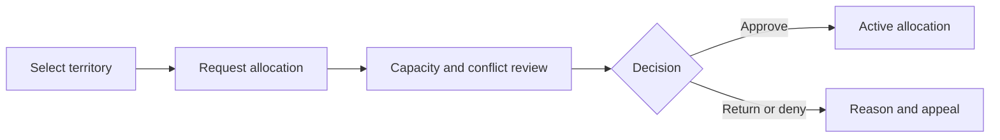
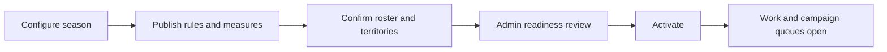
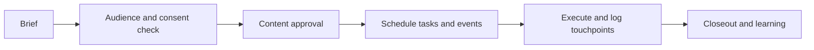
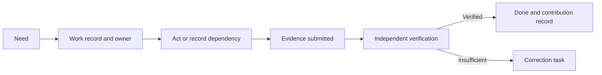

# The Commons Engine — Product Requirements Document

> **Plain-language summary.** This PRD describes the proposed product experience for running one real operating season: find and prepare people, put them in a responsible roster and territory, run campaign work, turn documented Need into evidenced Done, resolve disputes, reconcile operational value, and publish a careful benefit record. The companion **SRS** specifies how the system must behave; this PRD specifies who it must serve and how the operating loop must feel.

## 1. Purpose and scope

### 1.1 Product purpose
The Commons Engine is a proposed operating product for Kimosabe Commons, PBC. It makes a county-scale network legible without treating people as wallet addresses, leads as commodities, or evidence as a marketing claim. It serves recruiting and roster operations, campaign production, territory stewardship, and attestation/verification, measured by verified activations, evidenced completions, and retained participation per territory per season.

Release 1 is one bounded season in which people can see their authority, required evidence, reviewer, challenge route, and reset outcome. A complete loop matters more than breadth.

### 1.2 Relationship to the SRS
This PRD is the **product view**: audiences, journeys, screens, releases, acceptance behavior, and benefit measurement. `SRS.md` is the **system view**: requirements, data/events, interfaces, permissions, failures, ADRs, and traceability. The SRS governs conflicts and hard boundaries; cited IDs remain SRS identifiers.

### 1.3 Product principles
1. **People and Addresses before abstractions.** Work begins with a person, an address-anchored Need, and a real authority context.
2. **Consent before contact; verification before sensitive authority.** A visit, lead, applicant, and verified roster seat are different states.
3. **Make the next accountable step obvious.** “Due Today” asks for action, a documented dependency, or a committed next step.
4. **Evidence before assertion.** Done is a documented, reviewable result; an attestation describes process scope and limitations.
5. **Seasonality is a feature.** The interface changes appropriately across Pre-Season, Season, Cool-Down, Dispute Resolution, and Reset.
6. **Recognition is not currency.** Contribution records are seasonal, non-transferable, explainable, and appealable.
7. **Human authority stays visible.** The product labels advisory, delegated, administrative, and binding decisions; the Company Agent cannot blur that line.
8. **Public accountability without public exposure.** Publish approved aggregates and process progress, not personal operational data.

### 1.4 Scope and exclusions
Scope includes consented recruiting, roster/territory operations, campaigns, Need-to-Done work, evidence, process attestation, seasonal controls, reporting, tasks, and ledger candidates. It excludes tokens, wallet-first onboarding, money movement, insurance functions, professional certification, policyholder/claim files, public-chain operational data, and General Ledger operation. It is a proposal, not an institutional approval claim.

## 2. Definitions and glossary delta

| Product term | Experience meaning |
|---|---|
| **Roster seat** | A time-bounded placement of a person into a Designation, Territory, and Season after required gates. |
| **Territory claim** | A request to allocate responsibility; it is not an insurance claim or proprietary ownership of land. |
| **Work record** | The visible path from current Need through work, dependency, evidence, verification, and Done. |
| **Evidence packet** | References and structured facts submitted to support a work result; access is restricted by role. |
| **Process attestation** | A limited statement that defined process steps and evidence were reviewed. |
| **Cool-Down** | Phase beginning December 1 in which new work stops and closeout, collection, review, reconciliation, and disputes remain available. |
| **Reset** | New-season baseline in which every address returns to Need while historical records remain preserved. |
| **Company Agent** | A bounded AI assistant that drafts and surfaces permitted information; it never becomes the authority of record. |

The product uses “seasonal contribution record,” not token, points balance, yield, return, or investment. “ClaimBuddy” means an independent verification Designation only. Public labels must not imply professional licence verification, insurance coverage, legal compliance, or a regulated service.

## 3. Actors, groups, and designations

### Licensed Contractor
**Who they are.** A licensed professional participating in a territory roster.

**Trying to get done.** They want a clear path from verification to assigned work and a record that their role is current.

**What they fear.** They fear being misrepresented, asked to provide irrelevant sensitive material, or losing a territory to an opaque decision.

**Evidence they need.** They need their roster seat, territory term, approved status, work evidence, and decision history.

**Abandonment trigger.** They leave if the product implies it certifies their licence or exposes their information without control.

### Crew Member
**Who they are.** A field participant who helps carry out work under an assigned role and supervisor.

**Trying to get done.** They want simple mobile tasks, a way to document progress, and certainty about who can answer a blocker.

**What they fear.** They fear a confusing bureaucracy, unavailable support, and being blamed for missing evidence they could not upload.

**Evidence they need.** They need current assignments, safe evidence prompts, blocked-state choices, and proof their contribution was received.

**Abandonment trigger.** They leave if the mobile experience fails in the field or makes them use a wallet to participate.

### Independent Sales Representative
**Who they are.** A representative who develops permitted local relationships and follows approved campaign work.

**Trying to get done.** They want to know the right audience, approved material, their territory scope, and whether outreach became qualified participation.

**What they fear.** They fear raw-enrollment pressure, unapproved copy, and being responsible for consent failures.

**Evidence they need.** They need campaign approval, contact-basis indicators, referral attribution, and a transparent performance record.

**Abandonment trigger.** They leave if the product rewards volume over verified, retained, consented participation.

### Recruiter
**Who they are.** A designated operator responsible for bringing eligible people through a fair onboarding pipeline.

**Trying to get done.** They want a clear queue, screening gates, templates, follow-up reminders, and a reliable handoff to roster placement.

**What they fear.** They fear duplicate records, hidden policy changes, and needing to chase every approval by hand.

**Evidence they need.** They need source, consent, stage, checklist, training, decision owner, and next-step evidence.

**Abandonment trigger.** They leave if they cannot see what blocks a candidate or if compliance work becomes invisible busywork.

### Territory Steward
**Who they are.** A designated steward who protects the integrity of allocations and capacity for a defined geography.

**Trying to get done.** They want to evaluate requests consistently, see conflicts and capacity, and renew or close assignments on time.

**What they fear.** They fear favoritism claims, unclear boundaries, and being asked to decide outside their mandate.

**Evidence they need.** They need boundary version, capacity, request evidence, conflict disclosure, policy rule, term, and dispute history.

**Abandonment trigger.** They leave if the product does not give them a defensible, appealable decision record.

### Verifier / ClaimBuddy
**Who they are.** An independent reviewer who assesses a defined evidence packet and issues a limited process outcome.

**Trying to get done.** They want a focused queue, clear rubric, conflict warning, ability to ask for more information, and a way to state limitations.

**What they fear.** They fear pressure to bless incomplete work or appear to certify professional, legal, insurance, or technical facts.

**Evidence they need.** They need work scope, evidence references, rubric version, submitter statement, prior decision, and deadline.

**Abandonment trigger.** They leave if their independent judgment can be overridden without a documented process.

### Company Admin
**Who they are.** An authorized operating administrator for policies, season setup, access, integrations, and incident controls.

**Trying to get done.** They want configuration that is explicit, reversible, auditable, and safe to delegate.

**What they fear.** They fear an accidental change affecting a whole season or an agent/integration silently changing records.

**Evidence they need.** They need policy versions, audit logs, scoped mandates, integration health, pause controls, and review tasks.

**Abandonment trigger.** They leave if privileged actions are not recoverable or do not leave a usable audit trail.

### Sponsor
**Who they are.** A person or institution receiving a defined research, implementation, measurement, and recognition package.

**Trying to get done.** They want credible approved reports and permitted process attestations without taking on a hidden operational role.

**What they fear.** They fear unsupported marketing claims, exposure to personal data, and confusing a sponsorship with an investment.

**Evidence they need.** They need package scope, aggregate benefit measures, approved attestation, limitation statement, and delivery receipt.

**Abandonment trigger.** They leave if the product implies financial returns, custody, endorsement, or access to restricted participant data.

### Civic Partner
**Who they are.** A local institution or community organization participating in an approved, clearly scoped relationship.

**Trying to get done.** They want a legible local roster process, accessible public progress, and a route to flag local context or concern.

**What they fear.** They fear that data collection becomes surveillance or that a generic dashboard ignores their territory.

**Evidence they need.** They need published scope, contact route, accessible aggregate reporting, decision classification, and escalation path.

**Abandonment trigger.** They leave if there is no human appeal path or if the product overstates the relationship.

### Kimosabe Commons Administrator
**Who they are.** The accountable administrator of the proposed Commons operating model; the founder remains current sole decision authority until recorded governance changes that fact.

**Trying to get done.** They want one system that closes the loop without hidden spreadsheets or unbounded automation.

**What they fear.** They fear authority drift, a failure to measure the chartered benefit, and accidental regulated activity.

**Evidence they need.** They need cross-program dashboards, policy controls, incident visibility, benefit metrics, reconciliation status, and audit search.

**Abandonment trigger.** They leave if the system cannot explain who authorized a consequential action and under which rule.

### Company Agent
**Who they are.** A bounded AI assistant operating under a named user, data scope, and tool permission.

**Trying to get done.** It is intended to help users find work, summarize records, prepare drafts, and surface overdue dependencies.

**What they fear.** It must not create the appearance that a machine made a binding decision, verified a person, or approved an attestation.

**Evidence they need.** It needs explicit context, source citations, confidence/limitation display, and human review checkpoints.

**Abandonment trigger.** It is disabled for an action if it can bypass a human approval, restricted-data control, or audit event.

**Groups and Designations.** The product must never collapse a structural Group into a functional Designation. A Group carries its own management system, Primary Admin, ledger accounts, and rules. A Designation carries a specific function, scope, term, and permissions. An active screen always shows the user’s current Group and Designation context before a consequential action.

## 4. Functional requirements

This product section expresses the first-season experience against the SRS requirements rather than duplicating system requirements. The following journey contracts are functional product requirements: each step must be possible for the named persona, produce the stated artefact, surface the exception, and finish only at the stated completion condition.

### 4.1 Recruit to onboarded roster seat

**Trigger and steps.** An applicant or Recruiter starts after consented interest in a territory. The Recruiter records source and contact preference, advances the candidate through screening, requests only role-relevant documents, assigns training, and submits a roster-seat request. The Territory Steward reviews capacity, conflict disclosures, and required gates; the applicant sees a clear pending, approved, denied, or returned status.

**Artefacts.** Consent receipt; recruit record; checklist; training acknowledgment; verification result; seat request; placement decision; mandate.

**Exception paths.** Duplicate signals go to human review. Missing documents produce a correction task. Failed verification, capacity conflict, or expired agreement stops placement with a reason and appeal route.

**Completion condition.** An active roster seat has a Designation, Territory, Season, term, authority scope, and next responsibility.

**SRS trace.** FR-IDENT-01–06; FR-RECRUIT-01–07; FR-TERRITORY-03–05; FR-ADMIN-03.

### 4.2 Territory claim and allocation

**Trigger and steps.** A Recruiter, Group representative, or eligible Designation starts with a visible territory map and boundary version. They request allocation with purpose, term, season, and conflict disclosure. The Steward sees nesting, exclusivity, seat capacity, existing allocations, and policy rule. The decision screen separates draft, conditional, approved, denied, and disputed states.

**Artefacts.** Territory record and boundary source; allocation request; conflict disclosure; capacity check; decision and conditions.

**Exception paths.** Overlapping exclusive allocations block submission. A conflict requires recusal. A boundary update marks affected allocations for review. A denied request remains challengeable within the published period.

**Completion condition.** An approved allocation exists within a valid term and visibly links the accountable Group/Designation, conditions, and renewal date.

**SRS trace.** FR-TERRITORY-01–07; FR-ADMIN-04; FR-NOTIFY-01–04.

### 4.3 Season activation

**Trigger and steps.** The Kimosabe Commons Administrator starts Pre-Season by naming dates, scope, rulebook, benefit measures, territory capacity, and deadline calendar. The product presents activation gates rather than a single unchecked launch button. Once activated, people see the phase banner and only phase-permitted actions.

**Artefacts.** Season configuration; rulebook version; eligibility snapshot; readiness checklist; activation decision; generated work queues.

**Exception paths.** Missing roster, territory, policy, measurement, or approval requirements block activation. An emergency pause may stop named mutations but cannot rewrite the activation record.

**Completion condition.** The season is active, rules are visible, the appropriate queues are open, and the activation is auditable.

**SRS trace.** FR-SEASON-01–03; FR-ADMIN-01–02,06; FR-REPORT-01–02.

### 4.4 Campaign execution

**Trigger and steps.** A Campaign Producer starts with an objective, territory, season, owner, audience rule, channels, budget envelope, and success measure. They attach versioned content for review, generate field and event tasks, and use only consented audiences. The experience shows the difference between planned activity, approved activity, delivered activity, and measured outcome.

**Artefacts.** Campaign brief; content versions; audience rule and exclusions; task checklist; event record; approved touchpoints; closeout lesson.

**Exception paths.** Suppression rules block delivery. Unapproved content cannot schedule. A failed calendar or delivery adapter becomes a recoverable task, not an assumed send. A campaign can close with an explicit data-limitation note.

**Completion condition.** Campaign work is closed with actual outcomes, evidence of delivery, lessons, and a decision about approved aggregate reporting.

**SRS trace.** FR-CAMPAIGN-01–07; FR-NOTIFY-01–06; FR-INTEGRATE-01–02,06.

### 4.5 Work Need to Done with evidence and independent verification

**Trigger and steps.** A rostered operator sees an address-anchored Need and creates or receives a work record with scope, dependencies, owner, and due state. They either act, document why progress is blocked, or set a next committed step. When evidence is submitted, the product routes it to an eligible independent Verifier where policy requires. The verifier sees a limited rubric, conflict warning, evidence references, and outcome choices.

**Artefacts.** Need baseline; work record; task status; evidence packet; verifier assignment; decision; contribution record; audit event.

**Exception paths.** Missing or contradictory material produces insufficient status and correction task. Self-verification is blocked. Evidence cannot be silently replaced. A reviewer can record a policy-authorized exception with limitations, not claim a professional certification.

**Completion condition.** The record reaches Done only after configured evidence and verification gates are met or a transparent exception is authorized.

**SRS trace.** FR-ATTEST-01–04; FR-SEASON-04–05; FR-NOTIFY-02–04; NFR-AUDIT-01.

### 4.6 Attestation issuance and sponsor delivery

**Trigger and steps.** A Verifier or authorized Administrator starts from a verified process outcome. The product generates a limited attestation that identifies the reviewed process, scope, evidence references at the permitted level, reviewer, issue date, and limitations. The Sponsor receives only the approved version through an access-controlled delivery link; they can see its status and limitations without browsing participant files.

**Artefacts.** Attestation version; issue authority; limitation statement; approved redaction; delivery recipient; view/download event.

**Exception paths.** If facts later change, correction, supersession, or revocation is visible to every recorded recipient. Delivery fails safely and creates an admin task. No screen uses language of coverage, adjustment, licensure, or legal compliance.

**Completion condition.** Sponsor delivery has a recorded recipient, permitted scope, active status, and receipt; any later revocation changes the active delivery state.

**SRS trace.** FR-ATTEST-05–07; FR-INTEGRATE-03; FR-NOTIFY-02,05.

### 4.7 Cool-down and dispute resolution

**Trigger and steps.** The season banner changes at cool-down. Users can close work, submit missing evidence, reconcile candidates, and open a timely dispute; they cannot start new work. A dispute form makes the object, basis, requested remedy, evidence, deadline, and conflict disclosure explicit. The product preserves the contested state while assigning an eligible independent reviewer and sending notices.

**Artefacts.** Phase-change event; contested object; dispute record; evidence; recusal; reviewer decision; automatic-close event.

**Exception paths.** Late filings explain the published deadline and may only proceed through an authorized exception. Missing evidence remains insufficient. A reviewer conflict requires reassignment. At deadline, open matters automatically close with an auditable result; they never disappear.

**Completion condition.** Each dispute is decided, closed-unresolved, or properly extended before reset, and its record remains accessible under policy.

**SRS trace.** FR-SEASON-03; FR-ATTEST-02–04; FR-ADMIN-04–06; FR-NOTIFY-02–04.

### 4.8 Reset and renewal

**Trigger and steps.** The Administrator enters reset only after closeout gates. The system preserves prior-season history and makes it clearly historical. Each address gets a new current Need baseline. People renew consent, terms, designations, roster seats, and territory allocations instead of inheriting authority. Users are guided through what ends, what remains visible, and what must be renewed.

**Artefacts.** Season-close record; historical metrics; address baseline; renewal tasks; renewed mandate/allocation; new eligibility snapshot.

**Exception paths.** Pending dispute records persist across reset but do not grant prior-season authority. Expired roles cannot be used for next-season actions. A report selects a season explicitly to avoid mixing baselines.

**Completion condition.** The new season has clean Need baselines, renewed permissions, and preserved prior evidence, outcomes, and audit trail.

**SRS trace.** FR-SEASON-05–07; FR-TERRITORY-07; FR-RECRUIT-08; FR-REPORT-01–02.

## 5. Non-functional requirements

Product quality is a behavior, not a back-office checklist. The SRS owns formal NFRs; this PRD defines what users notice when those NFRs succeed.

| Product promise | System requirement(s) | Observable experience |
|---|---|---|
| Accessible without special workaround | NFR-A11Y-01 | Keyboard navigation, headings, labels, focus, error messages, contrast, and reduced motion work across recruiting, territory, task, evidence, and dispute flows. |
| Fast enough to use in the field | NFR-PERF-01, NFR-PERF-02, NFR-LOWBW-01 | Public pages load quickly on mobile; roster/task data arrives progressively; interrupted evidence upload resumes with clear state. |
| Authority never feels magical | NFR-AUTH-01, NFR-AUTH-02, NFR-AUDIT-01 | Every consequential screen shows authority context and either allows the action or says why it is denied. |
| Privacy is visible | NFR-PRIV-01, NFR-PRIV-02 | Recipients see restricted-data cues, consent choices, published-versus-private boundaries, and data-use limitation messages. |
| A bad day is recoverable | NFR-REL-01 | Users see outage status, saved drafts, retry state, escalation path, and no irreversible automatic outcome. |
| Ready to grow carefully | NFR-I18N-01, NFR-DRES-01, NFR-COMP-01 | Copy can localize; data region and providers are documented; prohibited payment, insurance, and securities experiences are absent. |

## 6. Data, events, and ledger effects

### 6.1 Product artefacts and visibility
| Artefact | Creator | Primary viewers | Visibility rule |
|---|---|---|---|
| Consent receipt | Applicant/system | person, authorized recruiter, auditor | Restricted; no public view |
| Roster seat / mandate | Steward or authorized admin | holder, scoped operator, auditor | Internal; public view only if expressly approved |
| Territory allocation | Steward | requester, scoped Group, auditor | Internal with permitted status summary |
| Campaign brief and content approval | Campaign Producer/reviewer | assigned operators | Internal; approved public content separates from drafts |
| Work record/evidence | operator/verifier | assigned owner and reviewer | Confidential/Restricted by evidence type |
| Attestation | verifier/admin | authorized sponsor/recipient | Redacted, scoped, access-controlled |
| Seasonal contribution record | system/reviewer | holder, authorized administrator | Internal; no transfer or wallet display |
| Ledger candidate | operational workflow/finance reviewer | finance and auditor | Confidential; external ledger controls final accounting |
| Benefit metric | reporting service | public or authorized viewers | Aggregate, thresholded, provenance-labelled |

### 6.2 Experience events
The product must make these event consequences visible to the affected person: verification decision, roster placement, allocation decision, campaign activation, evidence request, verification decision, phase change, dispute status, attestation issuance/revocation, and ledger reconciliation exception. Each screen links the event to a timestamp, actor/authority where permitted, object, state change, and correlation ID. The raw event envelope is specified in SRS §6.4.

### 6.3 Ledger language in the product
The product labels a ledger item **candidate**, **under review**, **exported**, **matched**, **exception**, **reversed**, or **closed**. It never calls a candidate a payment, balance, asset held for a participant, cash value, or audited account. Finance views point users to the external General Ledger reference and explain that this product does not move money.

## 7. Interfaces and integrations

### 7.1 Experience-facing integrations
Email/notification, e-signature, identity verification, CRM, calendar, external General Ledger export, and hosted payment-reference providers appear as limited moments in the journey—not as destinations that own the member relationship. Each must be replaceable. The product displays provider outages and consent implications, avoids provider jargon where possible, and returns the user to the Commons Engine record after a completed exchange.

### 7.2 Screen inventory
**State legend:** every screen specifies an **E**mpty state with next action, **L**oading state with progress or skeleton, and **X** error/permission/unavailable state with a safe recovery route.

| Screen | Purpose | Primary actor | Key data | Primary action | E / L / X behavior |
|---|---|---|---|---|---|

| Public home / program overview | Explain proposed offer and boundaries | Visitor | four programs; limitations; season | Choose a path | E: program unavailable; L: accessible skeleton; X: contact route |

| Territory availability | Show public approved territory status | Visitor | territory; season; availability | Select territory | E: no territory; L: map/list skeleton; X: source limitation |

| Applicant sign-up | Capture consented initial interest | Applicant | email/phone; consent; territory interest | Create application | E: plain-language start; L: saved progress; X: accessible error |

| Privacy and communications preferences | Set permitted channels/purposes | Applicant | notice versions; choices | Save preferences | E: default explanation; L: saving; X: prior choice retained |

| Application progress | Explain current recruiting step | Applicant | stage; owner; tasks | Complete next step | E: no application; L: progress skeleton; X: support route |

| Assisted onboarding request | Request non-self-service help | Applicant | accessibility/support need | Request assistance | E: examples; L: confirmation; X: alternate contact |

| Account recovery | Restore lawful account access | Applicant | verified contact; recovery status | Start recovery | E: instructions; L: verification; X: human review |

| Recruiter inbox | Work consented candidates | Recruiter | owned leads; next step; risk | Open candidate | E: explain queue; L: filters load; X: assignment issue |

| Recruit record | Manage one applicant responsibly | Recruiter | source; consent; stage; checklist | Advance or assign task | E: missing context prompt; L: audit-aware save; X: field validation |

| Screening checklist | Complete role gates | Recruiter | items; exceptions; reviewer | Record completion | E: checklist version prompt; L: item save; X: blocked reason |

| Reference request | Track consented reference check | Recruiter | consent; contact; response | Send/request review | E: no consent notice; L: send state; X: no unauthorized retry |

| Training center | Complete required learning | Applicant / field role | modules; acknowledgement; accommodations | Complete module | E: no assigned training; L: resume state; X: accommodation route |

| Roster seat request | Ask for placement | Recruiter | person; role; territory; season | Submit request | E: eligibility explanation; L: validation; X: capacity/term conflict |

| Roster directory | Operate the active roster | Recruiter / Steward | seat; role; territory; term; status | Open roster record | E: no seats; L: scoped list; X: access boundary |

| Roster seat detail | See placement and renewal | Field role / Steward | mandate; training; status | Renew or view work | E: expired explanation; L: activity feed; X: scope denied |

| Territory register | Browse nested territories | Visitor / Steward | hierarchy; boundary; status | Open territory | E: search suggestion; L: map/list; X: source caveat |

| Territory detail | Review capacity and allocations | Steward | boundary version; seat capacity; allocations | Request or decide allocation | E: no current allocation; L: allocation history; X: restricted fields hidden |

| Allocation request | Submit scope and disclosure | Requester | purpose; term; conflict; evidence | Submit | E: instructions; L: conflict scan; X: overlap block |

| Allocation review | Make defensible decision | Territory Steward | request; policy; capacity; conflicts | Approve/deny/return | E: nothing pending; L: evidence retrieval; X: recusal required |

| Boundary review | Manage changed territory source | Admin / Steward | version; affected allocations | Approve version | E: no change; L: impact scan; X: source mismatch |

| Campaign workspace | Plan and run campaign | Campaign Producer | objective; owner; status; measures | Create or open brief | E: starter guidance; L: dashboard; X: season inactive |

| Campaign brief editor | Define executable campaign | Campaign Producer | territory; audience; budget envelope | Submit for approval | E: template; L: autosave; X: required fields |

| Audience builder | Construct consented audience | Campaign Producer | allowed segments; suppression | Preview audience | E: zero qualified people; L: count estimate; X: consent block |

| Content library | Control approved campaign materials | Producer / reviewer | versions; rights; channels | Submit/approve version | E: no content; L: preview; X: approval restriction |

| Event planner | Schedule local outreach event | Campaign Producer | time; location; accessibility; host | Publish event | E: no available dates; L: calendar check; X: connector failure |

| Campaign task board | Own execution work | Producer / Recruiter | tasks; dependencies; due state | Update next step | E: no tasks; L: incremental list; X: conflict warning |

| Work inbox | See Need-to-Done assignments | Field role | address; Need; next step; due state | Open work | E: no assigned work; L: offline-aware load; X: scope change |

| Work record | Advance a defined Need | Field role | scope; dependencies; owner; status | Act or record blocker | E: no details; L: state save; X: phase lock |

| Evidence upload | Submit supporting references | Field role | checklist; files/links; metadata | Submit evidence | E: examples; L: resumable upload; X: retain draft and retry |

| Verifier queue | Review independent work | Verifier | assigned evidence; deadline; conflicts | Open review | E: no cases; L: priority order; X: recusal route |

| Verification review | Issue process outcome | Verifier | rubric; evidence; limitations | Verify/return/reject | E: no evidence notice; L: signature preparation; X: self-review block |

| Attestation studio | Create a limited process attestation | Verifier / Admin | scope; limitation; redaction | Issue version | E: unmet verification gate; L: generation; X: authority denied |

| Sponsor delivery portal | Receive approved material | Sponsor | attestation; aggregate report; expiry | View/download | E: no package; L: secure token check; X: expired/revoked notice |

| Season control center | Configure seasonal cycle | Administrator | dates; rulebook; readiness | Activate phase | E: new-season guide; L: readiness checks; X: missing gates |

| Cool-down dashboard | Close season safely | Administrator / operator | open work; disputes; reconciliation | Work closeout queue | E: no exceptions; L: countdown; X: phase exception policy |

| Dispute intake | File a timely challenge | Affected actor | object; basis; remedy; evidence | Submit dispute | E: deadline guidance; L: submission receipt; X: late or unsupported path |

| Dispute case | Review and resolve challenge | Reviewer | evidence; conflict; deadline; decision | Issue decision | E: no assigned case; L: record load; X: recusal/extension |

| Renewal workspace | Prepare next season | Steward / field role | expiring role; allocation; consent | Renew or decline | E: nothing to renew; L: eligibility refresh; X: expired rule |

| Benefit dashboard | Publish accountable aggregate results | Admin / Sponsor / Civic Partner | activations; Done; retention; provenance | Filter/report | E: suppression explanation; L: metric freshness; X: unpublished status |

| Ledger candidate queue | Reconcile operational candidates | Finance reviewer | source; mapping; external status | Approve/export/match | E: no candidates; L: status load; X: segregation block |

| Reconciliation detail | Resolve external accounting exception | Finance reviewer | candidate; external ref; reversal | Record match/exception | E: none; L: export receipt; X: provider failure |

| Admin policy center | Version rules safely | Company Admin | policy versions; effective dates | Publish approved policy | E: no draft; L: impact check; X: step-up required |

| Audit explorer | Reconstruct consequential action | Auditor / Admin | actor; authority; states; correlation | Search trace | E: no results; L: query progress; X: access restriction |

| Integration health | Operate swappable connectors | Company Admin | adapter status; retries; scopes | Pause/retry connector | E: no connectors; L: health check; X: safe failure details |

| Company Agent workspace | Ask bounded AI for assistance | All scoped actors | allowed context; source links; draft | Request draft/summary | E: prompts; L: streamed status; X: limitation and human route |

| Agent review panel | Approve human-owned draft outcome | Human approver | agent draft; sources; changes | Accept/edit/decline draft | E: no draft; L: provenance check; X: no autonomous mutation |

## 8. Roles and permissions

The product should feel strict in the right places and generous in explanation. A user can see why they can or cannot act, request access through a named route, and understand whether a decision is advisory or binding. The server—not the screen—enforces permissions.

| Experience role | Can start | Can decide | Cannot decide |
|---|---|---|---|
| Applicant / field participant | own application, assigned work/evidence, own preferences | own submission and correction | eligibility, allocation, verification, ledger approval |
| Recruiter / Campaign Producer | recruit workflows, approved campaign work | scoped non-sensitive progress updates | own placement approval or content/policy exceptions |
| Territory Steward | allocation review, capacity and renewal review | scoped allocation under mandate | own-conflict request, ledger reconciliation |
| Verifier / ClaimBuddy | evidence review, attestation draft | process outcome in scope | own work, professional qualification/coverage assertion |
| Sponsor / Civic Partner | approved report/attestation view | no operational decision by default | roster, evidence, finance, identity access |
| Administrator / finance reviewer | phase, policy, connector, candidate administration | recorded authority scope | money movement, silent override, unbounded agent action |
| Company Agent | summaries, drafts, task suggestions | none | binding decision, approval, identity/evidence verification, export, rule or ledger mutation |

## 9. Failure, dispute, and exception behavior

**Product response to missing information.** Screens say what is missing, why it matters, who can supply it, and when it is due. They do not convert blank evidence into a green check. Users can save a draft, document a dependency, request assistance, or file a correction where policy permits.

**Product response to denied authority.** A denial includes the controlling scope—role, territory, term, phase, policy, or recusal—not an ambiguous “something went wrong.” It offers the appropriate request, escalation, or support route without disclosing restricted information.

**Product response to season constraints.** Cool-down blocks new work visibly, preserves closeout options, and surfaces the dispute deadline. The dispute experience provides date and status notice; automatic close is shown before it occurs and creates a preserved case result. Reset creates a fresh Need baseline without hiding prior history or a pending review.

**Product response to automation and provider failures.** The Company Agent marks its output as a draft with sources and limitations. A provider failure does not mimic completion. Interrupted upload/save states are recoverable; invalid or stale information is labelled; emergency pause tells users what is temporarily unavailable and where to obtain human help.

## 10. Assumption tests and open questions

### 10.1 Feature slices by release
| Release | Scope | SRS requirements satisfied | Definition of done |
|---|---|---|---|
| **Release 1 — first operating season** | P0 consent identity, recruiting/roster, nested territory and allocations, campaign brief/task/consent, Need→Done evidence and independent verification, seasonal controls/reset, ledger candidates/reconciliation, benefit reporting, admin/audit, tasks/notifications, required adapters. | All P0 FRs: FR-IDENT-01–06; FR-RECRUIT-01–07; FR-TERRITORY-01–06; FR-CAMPAIGN-01–06; FR-ATTEST-01–07; FR-SEASON-01–07; FR-LEDGER-01–07; FR-REPORT-01–02,04–05; FR-ADMIN-01–02,04–06; FR-NOTIFY-01–04,06; FR-INTEGRATE-01–04,07. | A bounded territory completes recruit→roster→allocation→campaign→evidenced Done→verification→ledger-candidate reconciliation→report→cool-down/dispute/reset using synthetic and then approved operating data; all P0 NFR verification passes. |
| **Release 2 — multi-territory** | Cross-territory capacity, allocation history, CRM sync, calendar, reactivation, sponsor delivery, escalations, richer reporting, delegation mandate. | Release 1 plus P1: FR-IDENT-07; FR-RECRUIT-08; FR-TERRITORY-07; FR-CAMPAIGN-07; FR-ATTEST-06; FR-REPORT-03,06; FR-ADMIN-03,07; FR-NOTIFY-05; FR-INTEGRATE-05–06. | At least two territories can operate independently while authorized aggregate reporting and shared policy controls remain clear, and cross-territory permissions are negatively tested. |
| **Release 3 — multi-vertical** | Configurable designation, credential, campaign, evidence, and attestation templates for additional lawful verticals; localization readiness; adapter catalogue. | Existing requirements applied through versioned policy/configuration; new vertical-specific requirements require change control and traceability. | A new vertical is introduced without forked core logic, weakened restrictions, or unreviewed regulated claims; its policy, data, evidence, retention, and training model passes review. |

### 10.2 Release 1 acceptance criteria
1. A consented applicant can become a verified, trained, active roster seat only after all configured gates or an authorized exception are recorded.
2. A Territory Steward can decide an allocation with visible capacity, term, conflict disclosure, reason, and appeal route; a recused steward cannot decide it.
3. A Campaign Producer cannot send to a suppressed audience member or schedule unapproved content.
4. A field participant can record Need work, a dependency, and resumable evidence upload on a throttled mobile connection.
5. An independent Verifier cannot verify their own work and can return insufficient evidence with a clear correction task.
6. An issued attestation states process scope and limitations and never claims licence, insurance, coverage, legal compliance, or professional certification.
7. On December 1 configured cool-down, new work is blocked while evidence, closeout, reconciliation, and timely dispute flows remain available.
8. A pending dispute survives reset; a prior-season role does not silently authorize a new-season action.
9. A verified value event creates a reviewable ledger candidate; no user can initiate a payment, store payment credentials, or view a hosted balance.
10. A benefit dashboard reports only approved aggregate measures with season, territory, definition, freshness, and suppression information.
11. Privileged actions, phase changes, verification decisions, allocation decisions, and ledger candidate actions can be reconstructed by correlation ID.
12. The Company Agent can create an attributable draft but cannot issue an attestation, make an eligibility decision, approve an allocation, change policy, export restricted data, or change ledger state.

### 10.3 Measurement of chartered public benefit
| Measure | Definition | Guardrail / interpretation |
|---|---|---|
| Verified stakeholder activations | Count of people who become active roster seats after required consent, verification, training, and placement gates within territory and season. | Report separately from raw leads or applications; do not reward unenrolled volume. |
| Evidenced completions | Count of work records reaching Done with required evidence and verification/authorized exception. | Separate submitted, insufficient, verified, and revoked outcomes. |
| Retained participation | Count/rate of eligible prior-season participants who renew required terms and hold an active current-season seat. | State denominator, exclusions, and season boundary. |
| Time to responsible placement | Time from consented application to active seat, by stage and territory. | Do not publish small cells; use to locate process delay, not rank people. |
| Evidence completeness and correction rate | Share of work records meeting evidence requirements on first review and requiring correction. | A lower rate is not inherently proof of quality; inspect rubric and access barriers. |
| Verification and dispute timeliness | Queue age, decision time, timely filings, extensions, automatic closes, and reopen/correction rate. | Report limitations and staffing context. |
| Consent and outreach integrity | Suppression application, failed consent checks, preference changes, and unauthorized-send incidents. | Any incident is an operating risk, not a marketing performance metric. |
| Reconciliation timeliness | Ledger candidates matched, excepted, reversed, or pending by closeout deadline. | Does not claim audit completion or financial performance. |

### 10.4 Explicit out of scope
| Exclusion | Reason |
|---|---|
| Tokens, transferable credits, wallets as default identity | The operating model recognizes seasonal contribution without speculative, capital-weighted, or wallet-first participation. |
| Payments, balances, custody, escrow, bank data, payment initiation | The Engine only creates ledger candidates and hosted payment references; regulated financial operations belong outside it. |
| Insurance, claims, adjusting, policyholder or loss records | Kimosabe Commons is not an insurer, adjuster, or claims handler; marketing systems must not store these data. |
| General Ledger, payroll, tax, procurement, financial audit | An external accounting system and qualified professionals govern those functions. |
| Professional licence/insurance/legal-compliance certification | The Engine may record a process verification reference but cannot certify those statuses. |
| Public-chain personal operational data | Privacy, deletion/correction governance, and real-world accessibility require a private canonical record. |
| Autonomous binding AI or agent authority | Human authority, recusal, approval, and audit cannot be delegated to an unreviewed model. |
| Direct reproduction of DAO platform UX, copy, code, or identity | The product is independently designed; research supplies patterns, not a cloning mandate. |

### 10.5 Open questions
1. Which territories constitute the first bounded pilot, and what source governs their boundaries?
2. What exact role-specific screening and training content is approved for Season 1?
3. What identity proofing provider, manual fallback, and accommodation protocol will be used?
4. Who may receive which redacted sponsor attestation, and under what agreement?
5. What public-report suppression threshold protects small groups while retaining accountability?
6. What is the written process for appointing independent Verifiers and appeals reviewers?
7. Which external General Ledger, e-signature, CRM, calendar, and notification adapters meet residency and exit requirements?
8. What season calendar, dispute filing deadline, extension criteria, and automatic-close date will be published?

## 11. Decision records

| ADR | Product consequence |
|---|---|
| **ADR-1** | The product is an original operations core, not a reskinned DAO platform; product patterns are independently implemented. |
| **ADR-2** | Users interact with private, correctable operational records and an append-only audit log, not a public-chain case file. |
| **ADR-3** | Sign-up centers consent, personhood, verification, accessibility, and recovery—not wallet ownership. |
| **ADR-4** | Finance screens say candidate and reconciliation, never payment, balance, or custody. |
| **ADR-5** | Agent screens provide draft, provenance, limitation, and human review; no “AI approval” state exists. |
| **ADR-6** | Provider choice includes residency, export, and migration visibility before production records load. |
| **ADR-7** | Field experiences favor progressive, low-bandwidth, assisted mobile workflows. |
| **ADR-8** | All interface language, components, and operating flows are original and reviewed for licensing/clean-room boundaries. |
| **ADR-9** | Contribution recognition has no transfer, cashout, speculation, or automatic representation interaction. |

## 12. Traceability matrix

| Product area | PRD artefact | SRS trace / evidence |
|---|---|---|
| Consent and identity | Personas; recruit journey; public/application screens | FR-IDENT-01–06; FR-RECRUIT-01–07; EV-002, EV-004, EV-006 |
| Roster and territory | Recruit/territory/reset journeys; roster and register screens | FR-RECRUIT-03–08; FR-TERRITORY-01–07; FR-SEASON-05–07; EV-001, EV-006, EV-017 |
| Campaign operations | Campaign journey; campaign, content, audience, event screens | FR-CAMPAIGN-01–07; FR-NOTIFY-01–06; EV-003, EV-004 |
| Evidence and attestation | Need→Done and sponsor-delivery journeys; work, evidence, verifier screens | FR-ATTEST-01–07; FR-SEASON-04; EV-007, EV-016 |
| Season and dispute | Activation, cool-down, reset journeys; season/dispute screens | FR-SEASON-01–07; FR-ADMIN-04–06; EV-005, EV-017 |
| Ledger and reporting | Ledger/reconciliation screens; benefit measures | FR-LEDGER-01–07; FR-REPORT-01–06; EV-009, EV-013 |
| Administration and agent | Policy/audit/integration/agent screens | FR-ADMIN-01–07; FR-INTEGRATE-01–07; NFR-AUTH-01–02; EV-008, EV-014 |

### Claim boundary
- **Founder intention / proposed design:** the company, product, territory program, release plan, and future operating model are proposals for founder decision, not accomplished facts.
- **Model output:** benefit metrics, attribution, capacity, and ledger-candidate calculations are model outputs whose definitions and limitations must be shown.
- **Verified fact:** this PRD relies only on the cited SRS evidence ledger and supplied research labels; it does not claim customers, endorsements, institutional partnerships, regulatory approval, or product performance.

### Open questions (end-of-document)
The decisions listed in Section 10.5 must be closed before production activation. This PRD is a product proposal and is not legal, accounting, insurance, securities, or professional advice.
