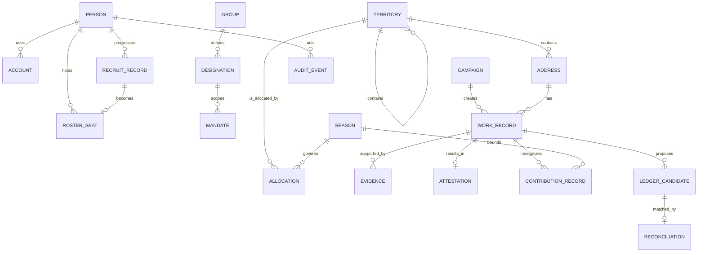

# The Commons Engine — Software Requirements Specification

> **Plain-language summary.** This specification defines the proposed operating system for Kimosabe Commons, PBC: a consent-first roster, territory, campaign, evidence, seasonal, and ledger-reconciliation service. It is built to run one measured operating season without requiring the founder to act as human middleware. It is **not** a token system, money-moving service, insurer, adjuster, claims handler, custodian, or General Ledger.

## 1. Purpose and scope

### 1.1 Purpose
The Commons Engine is the proposed software used by **Kimosabe Commons, PBC** (a proposed Delaware public benefit corporation) to operate recruiting and roster operations, promotion and campaign production, territory stewardship, and attestation and verification. Its design serves the chartered public benefit: **Increasing the number of verified, address-anchored, lawfully organized participants who can convert a documented community Need into a documented, evidenced Done — measured as verified stakeholder activations, evidenced completions, and retained participation per territory per season.**

The system records accountable work: a person under an active Group and Designation acts within a Territory and Season; Need becomes Done through reviewed evidence; and value effects become external General Ledger candidates.

### 1.2 In scope
- Consent-based recruiting, screening, onboarding, training, roster placement, retention, and offboarding.
- Nested territory registry, allocation, capacity, renewal, conflict disclosure, and dispute record.
- Campaign planning, approved content, consented audiences, events, operational work, attribution, and learning.
- Need-to-Done work records, evidence, independent verification, process attestation, delivery, correction, and revocation.
- Season configuration, cool-down controls, disputes, reset, non-transferable contribution records, reporting, ledger candidates, reconciliation, administrative controls, and swappable integrations.

### 1.3 Out of scope and hard boundaries
The system shall not issue tokens, require wallets, perform insurance/policyholder/claims handling, store public-chain personal operational data, custody money, initiate payments, offer securities, keep regulated financial data in marketing systems, or present legally complete accounting. RRCA is independent Customer Zero; its licences, revenue, assets, liabilities, and goodwill are outside scope. A DBA is not a separate legal entity.

### 1.4 System boundary and success condition
Private records cover identity, territory, relationship, campaign, evidence, and season. The external General Ledger is authoritative. Release 1 completes a loop: roster, territory, campaign, evidenced Done, verification, reconciliation, report, cool-down/dispute, reset.

## 2. Definitions and glossary delta

| Term | Definition for this specification |
|---|---|
| **Address** | A location or address-anchored unit. It is paired with People as a core primitive and resets to current-season Need at reset. |
| **Group** | Structural stakeholder category with management system, Primary Admin, ledger accounts, and rule set. |
| **Designation** | Functional role within a Group; may be territory-restricted and time-limited. **G/D** denotes a Designation with planned Group graduation. |
| **Territory** | Allocatable geographic hierarchy: State → County → ZIP Code → Carrier Route, or approved overlay. |
| **Season** | Versioned operating cycle with phase gates, rulebook, eligibility snapshot, and retained history. |
| **Need / Done** | Canonical current-state pair. Done is an evidenced completion, not a promise or mere task closure. |
| **Due Today** | Acknowledge, act, document a dependency, or set the next committed step; it does not mean physical work finishes today. |
| **Attestation** | A signed statement of Kimosabe Commons process review, with scope and limitations. It is not a certification of licence, insurance, legal compliance, coverage, or work quality. |
| **Ledger candidate** | A proposed, reviewable accounting or memorandum entry sent to an external General Ledger for reconciliation. It is not a payment instruction. |
| **Contribution record** | A non-transferable, evidence-linked, season-bound recognition record. It is not a token, cash balance, investment, or automatic representation right. |
| **Correlation ID** | Identifier that joins a workflow’s events, notifications, task creation, ledger candidates, and audit trail. |

**Glossary delta.** This SRS treats “ClaimBuddy” solely as a named independent verification Designation; it does not create an insurance-claim, adjustment, coverage, or policyholder workflow. “Credit” is avoided as a balance or currency term; the system uses “seasonal contribution record.”

## 3. Actors, groups, and designations

| Actor | Plain role | Primary system purpose | Authority boundary |
|---|---|---|---|
| Public Visitor / Applicant | Prospective participant | Learn, consent, apply, recover access | No privileged operations |
| Licensed Contractor; Crew Member; Independent Sales Representative | Field stakeholder | Maintain verified role, roster, work, evidence | Only assigned territory and role scope |
| Recruiter; Campaign Producer; Captain | Operating Designations | Build roster and execute campaigns | Cannot self-approve restricted decisions |
| Territory Steward | Allocation Designation | Steward territory seats and renewals | Recusal and policy rules apply |
| Verifier / ClaimBuddy | Independent verification Designation | Review evidence and issue process outcomes | Cannot verify own work |
| Sponsor; Civic Partner | External stakeholder | Receive permitted reports and attestations | No access to restricted person records |
| Company Admin; Administrator | Control role | Configure policy, roles, integrations, incident controls | Privileged actions audited; no implicit authority |
| Kimosabe Commons Administrator | Proposed entity control role | Own operational configuration and benefit reporting | Founder remains current sole decision authority until changed in recorded governance |
| Company Agent | Bounded AI assistant | Draft, summarize, triage, retrieve permitted records | No binding decision, payment, identity verification, approval, or unreviewed mutation authority |

**Authority construction.** Consequential actions record actor, entity/Group, Designation/permission, agreement, object/state, evidence, value ownership, ledger effect, and review or dispute route. Groups carry structural rules; Designations grant bounded, term-limited functions.

## 4. Functional requirements

Each requirement is independently designed. Evidence disposition appears in the evidence link: **ADOPT** or **ADAPT** indicates a transferred operating principle, **REJECT** or **DEFER** identifies a guardrail, and **DECIDED** identifies an explicit product decision where external evidence does not determine the result.

### IDENT

#### FR-IDENT-01 — Consent-grounded account
- **Statement:** The system shall create an account only after the applicant accepts versioned privacy, communications, and program notices.
- **Rationale:** Consent and minimum disclosure are prerequisites for legitimate participation.
- **Evidence / decision:** EV-004.
- **Priority:** **P0**.
- **Acceptance criteria:** Given a new applicant, acceptance timestamps, notice versions, and purposes are stored before account activation.

#### FR-IDENT-02 — Verified-person record
- **Statement:** The system shall maintain one person record with legal-name fields held only where verification requires them and a preferred display name.
- **Rationale:** A person, not a wallet, is the authority anchor.
- **Evidence / decision:** EV-006.
- **Priority:** **P0**.
- **Acceptance criteria:** A verifier can distinguish pending, verified, failed, and expired identity states without exposing provider artifacts to ordinary users.

#### FR-IDENT-03 — Assurance levels
- **Statement:** The system shall record identity assurance level, verification method, reviewer, decision date, expiry, and evidence reference.
- **Rationale:** Action rights must be proportionate to verified eligibility.
- **Evidence / decision:** EV-009.
- **Priority:** **P0**.
- **Acceptance criteria:** A protected action requiring a level cannot be completed by an account below that level.

#### FR-IDENT-04 — Duplicate review
- **Statement:** The system shall flag probable duplicate people, contact points, or eligibility records for a human review queue.
- **Rationale:** Duplicate detection is necessary but must remain appealable.
- **Evidence / decision:** EV-006.
- **Priority:** **P0**.
- **Acceptance criteria:** A flag does not automatically merge or disable either record; the reviewer decision is logged.

#### FR-IDENT-05 — Credential scope
- **Statement:** The system shall store credential status, jurisdiction, issuer, expiry, and verification reference without asserting professional licensure.
- **Rationale:** The Commons verifies process records, not professional qualifications.
- **Evidence / decision:** EV-016.
- **Priority:** **P0**.
- **Acceptance criteria:** A public view shows only an approved status label and never the underlying credential image or identifier.

#### FR-IDENT-06 — Account recovery
- **Statement:** The system shall provide accessible recovery through verified contact methods and assisted support without wallet dependency.
- **Rationale:** Wallet-first onboarding is expressly rejected.
- **Evidence / decision:** EV-010.
- **Priority:** **P0**.
- **Acceptance criteria:** A user can recover access with approved assisted verification and all recovery actions appear in the audit log.

#### FR-IDENT-07 — Access withdrawal
- **Statement:** The system shall suspend, close, export, or delete an account under authorized policy while preserving legally required audit records.
- **Rationale:** Consent-based participation requires an exit path.
- **Evidence / decision:** EV-004.
- **Priority:** **P1**.
- **Acceptance criteria:** A completed request revokes sessions and notifications, creates an export or deletion case, and records the retention basis.

### RECRUIT

#### FR-RECRUIT-01 — Lead intake
- **Statement:** The system shall capture a consented prospect, source, territory interest, referral relationship, and communication preference.
- **Rationale:** The primary gap is an end-to-end recruiting funnel.
- **Evidence / decision:** EV-002.
- **Priority:** **P0**.
- **Acceptance criteria:** A prospect cannot be contacted until a lawful contact basis and channel preference are recorded.

#### FR-RECRUIT-02 — Pipeline stages
- **Statement:** The system shall move prospects through configurable stages: prospect, lead, applicant, screening, onboarding, placed, retained, offboarded.
- **Rationale:** Human onboarding cannot be inferred from a membership address.
- **Evidence / decision:** EV-002.
- **Priority:** **P0**.
- **Acceptance criteria:** Stage change records actor, time, reason, required checklist items, and next owner.

#### FR-RECRUIT-03 — Roster seat request
- **Statement:** The system shall let an authorized recruiter submit a roster-seat request naming group, designation, territory, season, and supporting evidence.
- **Rationale:** A role is a scoped operating commitment, not a generic membership badge.
- **Evidence / decision:** EV-006.
- **Priority:** **P0**.
- **Acceptance criteria:** Submission is blocked when the target season, designation, or territory is inactive.

#### FR-RECRUIT-04 — Screening checklist
- **Statement:** The system shall apply a role-specific, versioned screening checklist with completion, exception, and reviewer fields.
- **Rationale:** Recruiting must be repeatable and auditable.
- **Evidence / decision:** EV-002.
- **Priority:** **P0**.
- **Acceptance criteria:** A placement cannot be approved until mandatory checklist items are complete or an authorized exception is recorded.

#### FR-RECRUIT-05 — Reference workflow
- **Statement:** The system shall track a reference request, consent, response status, restricted notes, and reviewer decision.
- **Rationale:** Reference checks are one of the stated roster functions.
- **Evidence / decision:** EV-001.
- **Priority:** **P0**.
- **Acceptance criteria:** Restricted notes are visible only to assigned reviewers and an access event is logged.

#### FR-RECRUIT-06 — Training and acknowledgements
- **Statement:** The system shall assign onboarding materials, record accessible completion, and retain signed acknowledgements by version.
- **Rationale:** Role authority needs evidence of preparation and accepted rules.
- **Evidence / decision:** EV-009.
- **Priority:** **P0**.
- **Acceptance criteria:** A required training gate prevents placement until completion or authorized accommodation is recorded.

#### FR-RECRUIT-07 — Roster view
- **Statement:** The system shall provide a territory-and-season roster showing active status, designation, term, verification status, and availability.
- **Rationale:** Stewards need a legible operating roster.
- **Evidence / decision:** EV-001.
- **Priority:** **P0**.
- **Acceptance criteria:** The roster excludes restricted contact and verification details for viewers without a need to know.

#### FR-RECRUIT-08 — Retention and reactivation
- **Statement:** The system shall create follow-up tasks for inactive members and support reactivation with current-season checks.
- **Rationale:** Retained participation is a chartered measure.
- **Evidence / decision:** EV-017.
- **Priority:** **P1**.
- **Acceptance criteria:** Reactivation requires renewed terms where the prior acceptance has expired.

### TERRITORY

#### FR-TERRITORY-01 — Nested registry
- **Statement:** The system shall register State, County, ZIP Code, Carrier Route, and approved overlay territories with stable identifiers and parent links.
- **Rationale:** Territories nest and are allocatable.
- **Evidence / decision:** EV-001.
- **Priority:** **P0**.
- **Acceptance criteria:** A child territory cannot reference a missing or cyclic parent.

#### FR-TERRITORY-02 — Boundary versioning
- **Statement:** The system shall version territory boundaries, source, effective period, and reviewer without overwriting prior assignments.
- **Rationale:** Allocation decisions need historical geographic context.
- **Evidence / decision:** EV-006.
- **Priority:** **P0**.
- **Acceptance criteria:** A boundary update creates a new version and identifies allocations requiring review.

#### FR-TERRITORY-03 — Allocation request
- **Statement:** The system shall accept a territory allocation request with requesting Group or Designation, term, season, purpose, and conflict disclosure.
- **Rationale:** Territory authority must be explicit and time-bounded.
- **Evidence / decision:** EV-006.
- **Priority:** **P0**.
- **Acceptance criteria:** The request is rejected if its term overlaps an exclusive allocation without an authorized exception.

#### FR-TERRITORY-04 — Allocation decision
- **Statement:** The system shall route allocation decisions to authorized Territory Stewards with required reasons, conditions, and effective dates.
- **Rationale:** Visibility and appealability prevent invisible control of a territory.
- **Evidence / decision:** EV-011.
- **Priority:** **P0**.
- **Acceptance criteria:** Approval, denial, and conditional approval each publish the authorized reason to the requester and create an audit event.

#### FR-TERRITORY-05 — Seat capacity
- **Statement:** The system shall enforce configurable seat capacity and designation rules for each territory and season.
- **Rationale:** A territory roster must reflect planned operating capacity.
- **Evidence / decision:** EV-007.
- **Priority:** **P0**.
- **Acceptance criteria:** A new seat cannot be placed when capacity is full unless a steward records a policy exception.

#### FR-TERRITORY-06 — Conflict and recusal
- **Statement:** The system shall require conflict disclosure and permit recusal when an allocator has a material relationship to a request.
- **Rationale:** Territory disputes need impartial review.
- **Evidence / decision:** EV-009.
- **Priority:** **P0**.
- **Acceptance criteria:** A recused actor cannot approve, deny, or edit the affected decision.

#### FR-TERRITORY-07 — Territory history
- **Statement:** The system shall display allocation history, expiration, renewal status, and recorded dispute outcome to authorized users.
- **Rationale:** History must survive the seasonal reset.
- **Evidence / decision:** EV-017.
- **Priority:** **P1**.
- **Acceptance criteria:** An expired allocation remains visible as historical and cannot authorize a new action.

### CAMPAIGN

#### FR-CAMPAIGN-01 — Campaign brief
- **Statement:** The system shall create a campaign brief with objective, territory, audience, season, owner, channels, budget envelope, and success measures.
- **Rationale:** Campaign operations are absent from the evaluated landscape.
- **Evidence / decision:** EV-003.
- **Priority:** **P0**.
- **Acceptance criteria:** A campaign cannot activate until an owner, territory, objective, and approved status are present.

#### FR-CAMPAIGN-02 — Audience and consent
- **Statement:** The system shall build audiences from consented contacts and permitted attributes, with exclusions and suppression lists applied.
- **Rationale:** Attribution cannot justify unwanted outreach.
- **Evidence / decision:** EV-004.
- **Priority:** **P0**.
- **Acceptance criteria:** A suppressed contact is excluded from export and send previews.

#### FR-CAMPAIGN-03 — Creative version control
- **Statement:** The system shall retain content versions, approvals, reviewer comments, rights status, and publication channels.
- **Rationale:** Promotion needs an accountable approval trail.
- **Evidence / decision:** EV-011.
- **Priority:** **P0**.
- **Acceptance criteria:** Only an approved content version can be scheduled for a channel.

#### FR-CAMPAIGN-04 — Local events
- **Statement:** The system shall plan campaign events with territory, accessibility notes, host, capacity, invitation status, and follow-up tasks.
- **Rationale:** Meetings and outreach require operational coordination.
- **Evidence / decision:** EV-009.
- **Priority:** **P0**.
- **Acceptance criteria:** An event cancellation notifies accepted invitees through their preferred permitted channel.

#### FR-CAMPAIGN-05 — Attribution
- **Statement:** The system shall record consented source and campaign touchpoints for recruitment and activation outcomes using minimal fields.
- **Rationale:** The product must learn which promotion investments work.
- **Evidence / decision:** EV-004.
- **Priority:** **P0**.
- **Acceptance criteria:** A report can aggregate outcomes by source without exposing person-level history to unauthorized users.

#### FR-CAMPAIGN-06 — Campaign work queue
- **Statement:** The system shall generate assignments and checklists for campaign producers, recruiters, and territory staff.
- **Rationale:** A plan without owned work does not operate.
- **Evidence / decision:** EV-007.
- **Priority:** **P0**.
- **Acceptance criteria:** Each assignment has an owner, due state, dependency state, and completion evidence field.

#### FR-CAMPAIGN-07 — Post-campaign learning
- **Statement:** The system shall close a campaign with actual outcomes, lessons, retention rule, and approved aggregate publication decision.
- **Rationale:** Accountability includes learning, not only launch.
- **Evidence / decision:** EV-009.
- **Priority:** **P1**.
- **Acceptance criteria:** Closeout flags missing results and creates a follow-up task for the campaign owner.

### ATTEST

#### FR-ATTEST-01 — Work record
- **Statement:** The system shall represent a Need, requested work, owner, territory, due state, dependencies, and defined completion evidence.
- **Rationale:** Need to Done is the canonical operating trip.
- **Evidence / decision:** EV-001.
- **Priority:** **P0**.
- **Acceptance criteria:** A work record cannot enter Done without the configured evidence checklist or a documented exception.

#### FR-ATTEST-02 — Evidence submission
- **Statement:** The system shall accept evidence references, metadata, submitter attestation, capture time, and integrity status without public exposure by default.
- **Rationale:** Evidenced completion is a chartered measure.
- **Evidence / decision:** EV-007.
- **Priority:** **P0**.
- **Acceptance criteria:** Submitted evidence is immutable in the audit log; replacement produces a new version and preserves the old reference.

#### FR-ATTEST-03 — Independent verification
- **Statement:** The system shall assign an independent Verifier or ClaimBuddy when the work type requires review and enforce conflict checks.
- **Rationale:** Doer and checker separation is an adopted accountability pattern.
- **Evidence / decision:** EV-007.
- **Priority:** **P0**.
- **Acceptance criteria:** A person who performed work cannot verify that same record unless an authorized emergency exception is logged.

#### FR-ATTEST-04 — Verification decision
- **Statement:** The system shall record verified, insufficient, rejected, or returned-for-information outcomes with reason and evidence gaps.
- **Rationale:** A sponsor needs a clear process result, not an unsupported certification.
- **Evidence / decision:** EV-009.
- **Priority:** **P0**.
- **Acceptance criteria:** A rejected or insufficient decision exposes a correction path and deadline to the submitter.

#### FR-ATTEST-05 — Process attestation
- **Statement:** The system shall issue a signed, versioned process attestation stating what was reviewed, by whom, when, and material limitations.
- **Rationale:** Kimosabe Commons attests to its process, not licensure or compliance.
- **Evidence / decision:** EV-001.
- **Priority:** **P0**.
- **Acceptance criteria:** The generated attestation excludes claims of insurance, legal compliance, professional certification, or coverage.

#### FR-ATTEST-06 — Sponsor delivery
- **Statement:** The system shall deliver a sponsor-approved attestation through an access-controlled link with view and download events.
- **Rationale:** Institutions need a traceable delivery record.
- **Evidence / decision:** EV-009.
- **Priority:** **P1**.
- **Acceptance criteria:** A recipient receives only the redacted version authorized for that sponsor package.

#### FR-ATTEST-07 — Correction and revocation
- **Statement:** The system shall support correction, supersession, and revocation of an attestation with notice to recorded recipients.
- **Rationale:** Process records remain accountable when facts change.
- **Evidence / decision:** EV-007.
- **Priority:** **P0**.
- **Acceptance criteria:** Revocation changes the status on every active delivery link and records a reason and authorizer.

### SEASON

#### FR-SEASON-01 — Season configuration
- **Statement:** The system shall configure a named season, territory scope, pre-season, active season, cool-down, dispute, and reset dates.
- **Rationale:** The operating calendar is a core domain control.
- **Evidence / decision:** EV-017.
- **Priority:** **P0**.
- **Acceptance criteria:** Only one season configuration can be active for a territory and date unless a documented overlap rule exists.

#### FR-SEASON-02 — Activation gate
- **Statement:** The system shall activate a season only after roster, territory, rulebook, benefit measures, and administrator approvals are recorded.
- **Rationale:** The first loop must be measured and governed before launch.
- **Evidence / decision:** EV-009.
- **Priority:** **P0**.
- **Acceptance criteria:** Activation publishes the applicable rules version and creates operational tasks for active owners.

#### FR-SEASON-03 — Stateful calendar controls
- **Statement:** The system shall enforce phase-specific action rules rather than relying on calendar reminders alone.
- **Rationale:** New work must stop at cool-down.
- **Evidence / decision:** EV-017.
- **Priority:** **P0**.
- **Acceptance criteria:** During cool-down, a new work record is rejected while permitted collection and closeout tasks remain available.

#### FR-SEASON-04 — Seasonal contribution record
- **Statement:** The system shall create non-transferable, season-bound contribution records linked to work evidence, formula version, and verification state.
- **Rationale:** Contribution recognition must not become a token or transferable capital.
- **Evidence / decision:** EV-005.
- **Priority:** **P0**.
- **Acceptance criteria:** The record exposes no transfer, sale, wallet, or cash-redemption function.

#### FR-SEASON-05 — Eligibility snapshot
- **Statement:** The system shall preserve an eligibility and designation snapshot used for season decisions and later audit.
- **Rationale:** Later role changes cannot silently rewrite prior eligibility.
- **Evidence / decision:** EV-005.
- **Priority:** **P0**.
- **Acceptance criteria:** A report for a closed season uses the snapshot, not current profile fields.

#### FR-SEASON-06 — Renewal workflow
- **Statement:** The system shall prompt allocation, role, consent, and baseline renewal before a new season begins.
- **Rationale:** Roles, seats, and baselines renew at reset.
- **Evidence / decision:** EV-017.
- **Priority:** **P0**.
- **Acceptance criteria:** A prior-season allocation cannot be carried into a new season without an explicit renewal decision.

#### FR-SEASON-07 — Reset
- **Statement:** The system shall reset every address to Need at the season boundary while preserving immutable prior-season history.
- **Rationale:** Reset is a fundamental product rule.
- **Evidence / decision:** EV-017.
- **Priority:** **P0**.
- **Acceptance criteria:** After reset, each address has a current Need baseline and closed-season Done history remains queryable.

### LEDGER

#### FR-LEDGER-01 — Candidate generation
- **Statement:** The system shall generate a ledger candidate from an approved value event, never a money-transfer instruction.
- **Rationale:** The platform produces candidates and reconciliation queues only.
- **Evidence / decision:** EV-013.
- **Priority:** **P0**.
- **Acceptance criteria:** A candidate includes source event, proposed accounts, amount or non-financial value marker, authority, and status.

#### FR-LEDGER-02 — Chart-of-accounts mapping
- **Statement:** The system shall map candidates to externally governed General Ledger v2 account classes and program dimensions.
- **Rationale:** The canonical chart must remain outside operational improvisation.
- **Evidence / decision:** EV-001.
- **Priority:** **P0**.
- **Acceptance criteria:** Only authorized finance users can change a mapping and mapping versions are retained.

#### FR-LEDGER-03 — Reconciliation queue
- **Statement:** The system shall present candidates as pending, exported, matched, exception, reversed, or closed against an external ledger reference.
- **Rationale:** Operational events need controlled accounting handoff.
- **Evidence / decision:** EV-009.
- **Priority:** **P0**.
- **Acceptance criteria:** A candidate cannot be marked matched without an external reference and authorized reconciler.

#### FR-LEDGER-04 — Approval segregation
- **Statement:** The system shall enforce separate preparation and finance-review roles for material ledger candidates.
- **Rationale:** Dual authority is adopted from fiscal-host separation.
- **Evidence / decision:** EV-009.
- **Priority:** **P0**.
- **Acceptance criteria:** The same user cannot prepare and approve a material candidate unless a recorded emergency policy exception applies.

#### FR-LEDGER-05 — No custody boundary
- **Statement:** The system shall not store payment credentials, bank instructions, hosted balances, or execute disbursements.
- **Rationale:** No-money-movement is a non-negotiable boundary.
- **Evidence / decision:** EV-013.
- **Priority:** **P0**.
- **Acceptance criteria:** Security tests confirm there is no payment initiation endpoint or persistence field for account credentials.

#### FR-LEDGER-06 — Reversal linkage
- **Statement:** The system shall create a linked reversal or correction candidate rather than mutating an exported candidate.
- **Rationale:** Accounting traceability requires an append-only correction path.
- **Evidence / decision:** EV-007.
- **Priority:** **P0**.
- **Acceptance criteria:** A reversal identifies the original candidate, rationale, authority, and external status.

#### FR-LEDGER-07 — Ledger export
- **Statement:** The system shall export approved candidate batches through a swappable connector with record counts and error receipts.
- **Rationale:** The external General Ledger is authoritative.
- **Evidence / decision:** EV-009.
- **Priority:** **P0**.
- **Acceptance criteria:** A failed export remains retryable without duplicate export after idempotency validation.

### REPORT

#### FR-REPORT-01 — Benefit dashboard
- **Statement:** The system shall report verified stakeholder activations, evidenced completions, and retained participation per territory per season.
- **Rationale:** These are the chartered public-benefit measures.
- **Evidence / decision:** EV-001.
- **Priority:** **P0**.
- **Acceptance criteria:** Dashboard filters state the season, territory, inclusion rule, data freshness, and suppression rule.

#### FR-REPORT-02 — Metric provenance
- **Statement:** The system shall show each aggregate metric definition, query version, source events, and approval status.
- **Rationale:** Public accountability requires legible measurement.
- **Evidence / decision:** EV-009.
- **Priority:** **P0**.
- **Acceptance criteria:** A reader can open a metric definition without receiving restricted underlying records.

#### FR-REPORT-03 — Territory reporting
- **Statement:** The system shall compare territories using normalized denominators only where the denominator source and limitation are stated.
- **Rationale:** Territory reports must not imply unsupported performance conclusions.
- **Evidence / decision:** EV-004.
- **Priority:** **P1**.
- **Acceptance criteria:** A report blocks publication when a required source or limitation statement is missing.

#### FR-REPORT-04 — Roster health
- **Statement:** The system shall report recruitment funnel stage, verification backlog, training completion, capacity, and retention by authorized scope.
- **Rationale:** Operating teams need early signals before the season fails.
- **Evidence / decision:** EV-002.
- **Priority:** **P0**.
- **Acceptance criteria:** Managers see no person-level data beyond their assigned territory and function.

#### FR-REPORT-05 — Attestation report
- **Statement:** The system shall report attestation volume, verification outcomes, correction rate, dispute status, and evidence completeness.
- **Rationale:** The process assurance service requires its own quality measure.
- **Evidence / decision:** EV-007.
- **Priority:** **P0**.
- **Acceptance criteria:** A report distinguishes verified from merely submitted work.

#### FR-REPORT-06 — Export and correction
- **Statement:** The system shall provide authorized exports and a documented correction request path for reportable personal information.
- **Rationale:** Data accountability includes correction and portability.
- **Evidence / decision:** EV-004.
- **Priority:** **P1**.
- **Acceptance criteria:** An export request records scope, approver, data classification, delivery expiry, and audit event.

### ADMIN

#### FR-ADMIN-01 — Policy versioning
- **Statement:** The system shall version rulebooks, checklists, formulas, notices, and approval policies with effective dates and owners.
- **Rationale:** Consequential rules must be reviewable by the version in force.
- **Evidence / decision:** EV-008.
- **Priority:** **P0**.
- **Acceptance criteria:** An action records the policy version used; retired versions remain readable to authorized auditors.

#### FR-ADMIN-02 — Privileged administration
- **Statement:** The system shall require step-up authentication and server-side authorization for privileged changes.
- **Rationale:** Least-privilege authority is an adopted pattern.
- **Evidence / decision:** EV-008.
- **Priority:** **P0**.
- **Acceptance criteria:** A privileged API call without the required role or step-up state is denied and logged.

#### FR-ADMIN-03 — Delegated mandates
- **Statement:** The system shall record appointment, scope, territory, term, disclosure, recall, and expiry for delegated authority.
- **Rationale:** Delegation requires human legitimacy controls beyond addresses.
- **Evidence / decision:** EV-010.
- **Priority:** **P1**.
- **Acceptance criteria:** Expired mandates cannot authorize approval or access without renewal.

#### FR-ADMIN-04 — Decision record
- **Statement:** The system shall classify decisions as advisory, delegated, administrative, or binding and record notice, rationale, and outcome.
- **Rationale:** Signal must be separated from binding authority.
- **Evidence / decision:** EV-010.
- **Priority:** **P0**.
- **Acceptance criteria:** A decision page displays its authority class and cannot generate a ledger candidate when marked advisory.

#### FR-ADMIN-05 — Audit search
- **Statement:** The system shall let authorized auditors search immutable consequential-action logs by actor, object, authority, date, and correlation ID.
- **Rationale:** Every material action needs an inspectable account.
- **Evidence / decision:** EV-008.
- **Priority:** **P0**.
- **Acceptance criteria:** A result reconstructs prior and new state without exposing restricted evidence by default.

#### FR-ADMIN-06 — Emergency pause
- **Statement:** The system shall allow a narrowly authorized emergency pause of specified mutations with time limit, reason, and review task.
- **Rationale:** Automation and permissions require a recoverable safety stop.
- **Evidence / decision:** EV-008.
- **Priority:** **P0**.
- **Acceptance criteria:** A pause is visible to affected operators and automatically expires or requires recorded renewal.

#### FR-ADMIN-07 — Data administration
- **Statement:** The system shall provide controlled retention holds, classification changes, and legal-review flags without implying legal advice.
- **Rationale:** Sensitive records need governed lifecycle controls.
- **Evidence / decision:** EV-004.
- **Priority:** **P1**.
- **Acceptance criteria:** A hold prevents scheduled deletion and records its authority and review date.

### NOTIFY

#### FR-NOTIFY-01 — Preference center
- **Statement:** The system shall let people manage channel, topic, language, and frequency preferences subject to required operational notices.
- **Rationale:** Recruiting and campaigns must be consent-aware.
- **Evidence / decision:** EV-004.
- **Priority:** **P0**.
- **Acceptance criteria:** A changed preference applies to future sends and preserves the consent history.

#### FR-NOTIFY-02 — Operational notices
- **Statement:** The system shall notify assigned actors of approvals, evidence requests, phase changes, disputes, and expiring terms.
- **Rationale:** Human workflow needs timely, accountable prompts.
- **Evidence / decision:** EV-010.
- **Priority:** **P0**.
- **Acceptance criteria:** Each notification stores trigger event, delivery result, recipient scope, and correlation ID.

#### FR-NOTIFY-03 — Task inbox
- **Statement:** The system shall provide a role-and-territory filtered inbox for tasks, due state, dependencies, and escalation.
- **Rationale:** Due Today means act, document dependency, or set next committed step.
- **Evidence / decision:** EV-001.
- **Priority:** **P0**.
- **Acceptance criteria:** A task can be completed only with the configured resolution or a documented blocked state.

#### FR-NOTIFY-04 — Escalation
- **Statement:** The system shall escalate overdue or blocked high-risk tasks to the designated supervisor without exposing restricted data.
- **Rationale:** Unowned exceptions should not silently age out.
- **Evidence / decision:** EV-007.
- **Priority:** **P0**.
- **Acceptance criteria:** Escalation creates a new task and does not alter the original assignee history.

#### FR-NOTIFY-05 — Accessibility and delivery fallback
- **Statement:** The system shall offer accessible in-product notices and permitted fallback channels when external delivery fails.
- **Rationale:** Participation cannot depend on one notification channel.
- **Evidence / decision:** EV-009.
- **Priority:** **P1**.
- **Acceptance criteria:** A failed delivery is recorded and users can retrieve the notice in the product.

#### FR-NOTIFY-06 — No unauthorized outreach
- **Statement:** The system shall prevent campaign sends, referrals, and sponsor notices to recipients lacking the required contact basis.
- **Rationale:** Consent is a control, not a reporting field.
- **Evidence / decision:** EV-004.
- **Priority:** **P0**.
- **Acceptance criteria:** Pre-send validation reports suppressed recipients and blocks the send until resolved.

### INTEGRATE

#### FR-INTEGRATE-01 — Adapter contract
- **Statement:** The system shall integrate external services through versioned adapters and canonical internal events, not vendor-specific core records.
- **Rationale:** Each external service must be swappable.
- **Evidence / decision:** EV-009.
- **Priority:** **P0**.
- **Acceptance criteria:** A connector can be disabled without corrupting the source workflow or audit history.

#### FR-INTEGRATE-02 — Email and notification
- **Statement:** The system shall connect to an email or notification provider only for consented delivery and delivery-status callbacks.
- **Rationale:** External channels support, but do not own, communications history.
- **Evidence / decision:** EV-003.
- **Priority:** **P0**.
- **Acceptance criteria:** Provider callback failures are queued, idempotent, and visible to administrators.

#### FR-INTEGRATE-03 — E-signature
- **Statement:** The system shall request and retrieve e-signature envelopes for approved agreements while storing a signed-document reference and status.
- **Rationale:** Agreements define the authority under which actions occur.
- **Evidence / decision:** EV-001.
- **Priority:** **P0**.
- **Acceptance criteria:** An agreement-dependent placement is blocked until a completed envelope status is verified.

#### FR-INTEGRATE-04 — Identity provider
- **Statement:** The system shall use a qualified identity-verification provider through minimal-data requests and retain only approved result fields.
- **Rationale:** Verification should not create an unnecessary identity data store.
- **Evidence / decision:** EV-006.
- **Priority:** **P0**.
- **Acceptance criteria:** The connector redacts provider artifacts from application logs and supports a provider change plan.

#### FR-INTEGRATE-05 — CRM synchronization
- **Statement:** The system shall synchronize only consented, mapped recruiting data with a CRM and maintain field-level ownership rules.
- **Rationale:** The Commons Engine remains the operations system of record for its domain.
- **Evidence / decision:** EV-002.
- **Priority:** **P1**.
- **Acceptance criteria:** A conflict is placed in a reconciliation queue rather than silently overwriting the canonical record.

#### FR-INTEGRATE-06 — Calendar
- **Statement:** The system shall publish and ingest authorized event availability through a calendar adapter with limited scopes.
- **Rationale:** Campaign and event coordination require interoperable schedules.
- **Evidence / decision:** EV-003.
- **Priority:** **P1**.
- **Acceptance criteria:** Revoked calendar authorization stops sync and produces an administrator notice.

#### FR-INTEGRATE-07 — Payments reference only
- **Statement:** The system may store a hosted third-party payment reference and status but shall never custody funds or initiate payment.
- **Rationale:** Payment activity is outside the platform boundary.
- **Evidence / decision:** EV-013.
- **Priority:** **P0**.
- **Acceptance criteria:** No payment form, routing number, card data, balance, or transfer API is available in the product.

## 5. Non-functional requirements

The following measurable requirements implement the engagement quality targets (EV-015). External-provider outage does not excuse observable degradation, clear status, retry, or recovery behavior.

| ID | Quality | Measurable target | Verification method |
|---|---|---|---|

| **NFR-A11Y-01** | Accessibility | All public pages and core flows shall conform to WCAG 2.2 AA, be keyboard-complete, and honor reduced-motion preferences. | Automated scanning plus manual keyboard, screen-reader, zoom, contrast, and motion review before release. |

| **NFR-PERF-01** | Performance | Public pages shall meet LCP under 2.0 seconds on a representative 4G mobile profile. | Synthetic performance testing with recorded device, network profile, and release artifact. |

| **NFR-PERF-02** | Performance | Read-path APIs shall achieve p95 latency under 400 ms under the approved first-season load profile, excluding approved external-provider latency. | Load test and production telemetry review by release. |

| **NFR-AUTH-01** | Authorization | Every mutation shall enforce server-side authorization, deny by default, and evaluate current scope, mandate, and season state. | Negative API authorization tests for each mutation and periodic permission review. |

| **NFR-AUTH-02** | Authorization | Privileged actions shall be step-up authenticated and produce an immutable audit event. | Automated end-to-end test plus sampled audit-log review. |

| **NFR-PRIV-01** | Privacy | The service shall collect the minimum data needed for stated purpose and retain consent records; it shall not store policyholder, claim, or regulated financial data in marketing systems. | Data inventory review, schema linting, connector contract review, and release sign-off. |

| **NFR-PRIV-02** | Privacy | Restricted data shall be encrypted in transit and at rest, protected by least-privilege access, and excluded from ordinary logs and analytics. | Configuration inspection, access review, log sampling, and penetration test. |

| **NFR-REL-01** | Reliability | Season 1 availability target is 99.5% monthly, with documented backup, restore, incident, and no-irreversible-automation procedures. | Monthly SLO calculation and successful restore drill before season activation. |

| **NFR-AUDIT-01** | Auditability | Every consequential action shall retain actor, entity, group, role, authority, object, evidence, ledger effect, and correlation context. | Event-schema contract test and trace reconstruction exercise. |

| **NFR-I18N-01** | Internationalization | U.S. English is first; interface copy, notices, templates, and status labels shall be externalized for later locale work. | Build-time localization key audit and pseudolocale smoke test. |

| **NFR-COMP-01** | Compliance posture | The product shall not move money, offer securities, perform insurance functions, or enable binding regulated activity without named provider and counsel-approved workflow. | Architecture review, API inventory, and release compliance checklist. |

| **NFR-LOWBW-01** | Low bandwidth | Core roster, task, and evidence-capture flows shall remain usable on low-bandwidth mobile connections through progressive loading and resumable uploads. | Throttled-network test with an interrupted upload and recovery scenario. |

| **NFR-DRES-01** | Data residency | The deployment shall document data regions, subprocessors, cross-border transfers, and a migration plan before production data is loaded. | Vendor register and architecture approval before go-live. |

## 6. Data, events, and ledger effects

### 6.1 Canonical data model
Canonical planes are private identity/territory/relationship, operating and decision, and external-ledger reconciliation. Public reports are controlled derivatives. RRCA data and founder IP require a written agreement.

| Entity | Key attributes | Classification / retention |
|---|---|---|
| Person and Account | identifiers, contact channels, consent, assurance state, preferred name | Restricted; purpose-limited; delete/anonymize after approved schedule subject to audit/legal hold |
| Group, Designation, Mandate | type, parent Group, authority scope, term, policy version, disclosure | Internal; retain term plus audit schedule |
| Territory and Allocation | hierarchy, boundary version, capacity, term, decision, dispute status | Internal; allocation history retained permanently for season audit |
| Recruit Record and Roster Seat | source, stage, checklist, training, placement, retention state | Confidential; lifecycle schedule and consent basis govern |
| Campaign, Content, Event | objective, audience rule, owner, approval, channels, outcomes | Internal; retain approved record and aggregate learning per schedule |
| Address and Work Record | Need/Done state, territory, owner, dependency, task evidence reference | Confidential; season history retained; raw evidence per schedule |
| Evidence and Attestation | object reference, submitter, verifier, integrity, limitation, delivery status | Restricted; retain attestation/audit record; evidence retention by purpose and hold |
| Season and Contribution Record | dates, rulebook, eligibility snapshot, formula, state | Internal; seasonal historical record retained for benefit reporting |
| Ledger Candidate and Reconciliation | source event, mapping, external reference, status, reversal link | Confidential; retain under accounting policy, external ledger authoritative |
| Decision, Audit Event, Notification | authority class, states, actor, recipient, correlation ID | Internal/Restricted by payload; audit events retained as policy requires |

### 6.2 Relationships

### 6.3 Data handling rules
**Public**: approved aggregate benefit metrics, published territory availability, approved campaign information, and redacted process attestations. **Internal**: policies, roster status, campaign plans, allocations, ledger-candidate summaries, and audit metadata. **Confidential**: recruiting records, contact details, restricted reports, accounting references. **Restricted**: identity-provider artifacts, evidence files, reference notes, verification material, authentication secrets, and any data whose disclosure can harm a person.

Retention is object-, purpose-, and hold-based; deletion is logged without erasing audit references. Marketing, recruiting, campaign, and reporting systems are **prohibited** from storing policyholder/claim files, loss details, regulated financial data, bank/card data, or payment instructions in notes, attachments, analytics, exports, or logs.

### 6.4 Standard event envelope
Every consequential event contains `event_id`, `event_name`, `schema_version`, actor/authentication, authority (entity, Group, Designation, permission, mandate), territory/season, object/version, prior/new state, evidence references, ledger effect, time, correlation, and causation IDs. Sensitive payloads are restricted references, not broad-stream copies.

### 6.5 Event catalogue
| Event | Trigger / minimum payload | Consumers | Produces |
|---|---|---|---|
| `identity.verification.decided` | provider/human decision; person, assurance, result, expiry | access control, roster | task/metric |
| `recruit.stage.changed` | pipeline transition; recruit record, reason, owner | recruiter inbox, reporting | task/notification/metric |
| `roster.seat.requested` | role request; person, designation, territory, season | steward review | task/notification |
| `roster.seat.placed` | approved placement; seat, mandate, policy | roster, reporting | notification/metric |
| `territory.allocation.decided` | decision; territory, requester, term, reason | roster, dispute service | task/notification/metric |
| `campaign.activated` | approved brief; campaign, audience rule, owner | task service, reports | task/metric |
| `content.approved` | version approval; content, channel, reviewer | publishing adapter | notification |
| `event.scheduled` | event, territory, host, calendar reference | calendar, invite service | task/notification |
| `work.created` | Need/work specification; address, owner, season | work inbox | task/metric |
| `evidence.submitted` | evidence refs, work, submitter | verifier queue | task/notification |
| `verification.decided` | outcome, verifier, reasons, gaps | attestation, reporting | task/notification/metric |
| `attestation.issued` | attestation version, scope, limitations | sponsor delivery | notification/metric |
| `season.phase.changed` | season, old/new phase, effective time | controls, inbox | task/notification/metric |
| `dispute.opened` | object, claimant, basis, deadline | dispute queue | task/notification |
| `ledger.candidate.created` | source event, mapping, candidate ID | finance queue | ledger candidate/metric |
| `ledger.reconciliation.changed` | candidate, external reference, status | reports, closeout | task/metric |
| `policy.changed` | policy version, authorizer, effective date | controls, audit | notification |
| `integration.delivery.failed` | adapter, operation, retry state | admin inbox | task/notification |

### 6.6 Ledger effects
Verified value events may propose mappings to 1000 Assets, 2000 Liabilities, 3000 Owner’s Equity, 4000 Revenue, 5000 Cost of Goods Sold, 6000 Operating Expenses, 7000 Other Income/Expense, or 9000 Memorandum. Account 9000 is a non-auditable pre-revenue model placeholder, never cash or audited fact. Candidates remain operational records; the external General Ledger determines accounting completion.

## 7. Interfaces and integrations

| System class | Required exchange | Boundary and swap rule |
|---|---|---|
| Email / notification provider | permitted message, template reference, delivery status | Provider has no authority over preferences; adapter is replaceable (FR-INTEGRATE-01/02). |
| E-signature provider | agreement envelope, status, signed-document reference | The Engine stores approved reference/status; legal terms remain in signed agreement. |
| Identity verification provider | minimum verification request/result | Provider artifacts are restricted; output is assurance state, not a public credential. |
| External General Ledger / accounting export | approved candidates, mappings, external references, errors | External ledger is authoritative; no payment initiation. |
| CRM | consented recruit/contact mapping and conflict queue | Field ownership is explicit; internal canonical operations records are not overwritten silently. |
| Calendar | event availability and schedule references | Least-privilege scopes; revocation stops sync. |
| Hosted payment provider | hosted URL/reference/status only | Third party handles payment; no custody, payment form, card/bank data, transfer initiation, or balance in the Engine. |
| Optional decision/publication adapter | exported approved aggregates or decision notices | Signal remains distinct from binding authority; no external platform becomes system of record. |

Integrations use scoped service accounts, secret rotation, versioned schemas, retries/dead letters, idempotency, monitoring, export, and termination/migration procedures. Selection is not an endorsement or partnership claim.

## 8. Roles and permissions

The following is an API-level summary. The separate Role & Permission Matrix will supply endpoint-by-endpoint policy; it cannot loosen the requirements here. Every request includes authenticated actor, active entity/Group, Designation/mandate, territory and season scope. Server-side policy evaluates all mutations.

| Role class | API-level allow | Explicit denial / constraint |
|---|---|---|
| Applicant / Field stakeholder | own profile, assigned onboarding, submit work/evidence, view assigned roster elements | no placement approval, verification of own work, territory allocation, ledger approval |
| Recruiter / Campaign Producer | permitted recruits, campaigns, assignments in scope | no identity assurance decision, restricted note export, self-approval |
| Territory Steward | allocation request/decision within mandate, capacity review, dispute participation | recused conflicts; no financial reconciliation |
| Verifier / ClaimBuddy | evidence review and process outcome in scope | no self-verification; no professional certification |
| Sponsor / Civic Partner | approved reports and delivered attestations | no raw roster, evidence, contact, or finance data |
| Finance reviewer | mapping, candidate review, export/reconcile state | no payments/custody; segregation from preparer for material candidates |
| Company Admin / Administrator | policy, role, integration, incident administration | step-up authentication; audit; no automatic legal authority outside recorded mandate |
| Company Agent | draft, retrieve, classify, propose tasks under allowed data scope | cannot make binding decisions, approve, verify identity/evidence, alter rules, export restricted data, or execute payment/ledger mutations |
| Auditor | read-only audit, policy, reconciliation, authorized report access | no mutation or unrestricted evidence access |

## 9. Failure, dispute, and exception behavior

**Missing evidence.** Missing, illegible, expired, contradictory, or out-of-scope evidence is `insufficient`, not Done. The system creates a deadline-bound correction task. An authorized exception requires limitation, reason, authority, and review date; evidence gaps never silently become completed or verified records.

**Seasonal cool-down and disputes.** At December 1 cool-down, new work stops; collection, evidence, verification, reconciliation, correction, and dispute actions continue. A December–February dispute must meet the published deadline and state object, basis, remedy, evidence, and conflict disclosure. An independent reviewer preserves contested state and sends notices. At automatic close, any unextended dispute becomes `closed-unresolved` or `closed-decision`, with no silent allocation change. Reset preserves pending disputes while beginning a new Need baseline.

**Operational and integration failure.** Failed provider calls retry idempotently; dead letters create admin tasks. Outage never approves an identity, agreement, notice, or ledger event. Stale results are marked. Emergency pause blocks named mutations only. High-risk exceptions require human authority, reason, expiry, and review.

## 10. Assumption tests and open questions

### 10.1 Assumption tests
| ID | Assumption / hypothesis | Test and decision gate |
|---|---|---|
| **RISK-01** | A first county can complete consented verification without unacceptable abandonment. | Usability pilot with assisted and self-service paths; compare completion, support load, and accessibility issues before expansion. |
| **RISK-02** | The selected identity provider can supply the needed assurance without retaining excess personal data. | Vendor privacy, data-residency, API, accessibility, and deletion test; approve only after data map review. |
| **RISK-03** | Territory boundaries and seat capacity can be administered without persistent allocation conflict. | Run a pre-season allocation tabletop exercise with conflicts, recusal, and appeal cases. |
| **RISK-04** | Independent verification is feasible at operational cost and time. | Measure verifier queue age, returned evidence, correction rate, and dispute rate in the pilot. |
| **RISK-05** | The contribution formula can recognize work without becoming a cash-equivalent, token, or representation shortcut. | Counsel/policy review plus plain-language comprehension and fairness review; no conversion workflow in Release 1. |
| **RISK-06** | Ledger-candidate export can reconcile reliably with the chosen external accounting environment. | Rehearse full export, duplicate, correction, reversal, and close process using synthetic data. |
| **RISK-07** | Low-bandwidth and assisted onboarding are sufficient for the target territory. | Test on throttled mobile networks and with assistive technology users before activation. |
| **RISK-08** | Any optional governance adapter adds value beyond internal decision records. | Do not integrate until a documented use case, exit plan, data-export test, and authority model pass review. |

### 10.2 Open questions
1. Which exact identity assurance levels, credential types, and recertification periods are lawful and proportionate by Designation?
2. What territory-source authority and overlay-boundary governance will be adopted for the initial county?
3. What are the publication thresholds and suppression rules for small-cell benefit reporting?
4. What retention schedule, lawful deletion process, and legal-hold policy will counsel approve for evidence and recruiting records?
5. What external General Ledger implementation and import schema will be selected for Season 1?
6. Which agreements and service-level terms must precede sponsor attestation delivery?
7. What accommodation, translation, and assisted-service commitments are required in the pilot territory?
8. What dispute deadline and automatic-close dates will be published for the first season?

## 11. Decision records

### ADR-1 — Build the operating core; adopt patterns, not a DAO platform
**Decision.** Build the canonical identity, territory, recruiting, campaign, season, evidence, and ledger-candidate services. Adopt Decidim/Open Collective/Loomio/Colony/Aragon/Snapshot patterns only through original implementation or reviewed adapters.

**Consequences.** Avoids the documented CRM, territory, seasonal, and ledger gaps and preserves clean-room independence.

**Evidence.** EV-002, EV-003, EV-006, EV-014.

### ADR-2 — Relational system of record with append-only event log; no blockchain core
**Decision.** Use a relational database for canonical operational records and an immutable event/audit log. Do not place personal operational data on a public chain.

**Consequences.** Allows privacy controls, correction, deletion governance, rich relationships, and audit reconstruction without wallet dependence.

**Evidence.** EV-006, EV-008, EV-014.

### ADR-3 — Consent-first person identity, not wallet-first identity
**Decision.** Use verified person, purpose-limited contact, eligibility, territory, Group, and Designation records. A wallet is neither required nor sufficient.

**Consequences.** Supports real-world legitimacy, access recovery, anti-duplication review, and appeal.

**Evidence.** EV-006, EV-010.

### ADR-4 — No-money-movement boundary
**Decision.** Generate ledger candidates and reconciliation queues only. Reference hosted payments only; never custody, initiate, or approve disbursements.

**Consequences.** Separates operational control from accounting, custody, and financial regulation.

**Evidence.** EV-009, EV-013.

### ADR-5 — Bounded Company Agent
**Decision.** The Company Agent may retrieve permitted context, summarize, draft, classify, and propose tasks. It cannot bind, approve, verify, change rights, or execute ledger/payment actions.

**Consequences.** Human authority, explainability, and recovery are required for consequential actions.

**Evidence.** EV-008, EV-011.

### ADR-6 — Document residency before production data
**Decision.** Choose hosting and subprocessors only after a documented U.S. data-region, transfer, backup, and migration review. Architecture keeps provider adapters replaceable.

**Consequences.** Data location and exit capability are material to personal and institutional trust.

**Evidence.** EV-015.

### ADR-7 — Offline-aware, low-bandwidth operating flows
**Decision.** Prioritize responsive mobile forms, progressive loading, resumable evidence uploads, visible sync state, and assisted workflows over feature-heavy wallet interactions.

**Consequences.** Field, rural, accessibility, and continuity needs are product requirements, not afterthoughts.

**Evidence.** EV-009, EV-010.

### ADR-8 — Clean-room licensing and design boundary
**Decision.** Do not copy competitor code, interface expression, content, visual identity, or private behavior. Review MIT/AGPL/GPL terms before any direct reuse.

**Consequences.** The research authorizes learning from patterns, not derivative implementation.

**Evidence.** EV-014.

### ADR-9 — Seasonal records are non-transferable and separately governed
**Decision.** Represent contribution as explainable, evidence-backed seasonal recognition. Do not make it a token, cash substitute, automatic voting power, or transferable capital.

**Consequences.** Separates recognition from financialized or capital-weighted authority.

**Evidence.** EV-005, EV-007, EV-012.

## 12. Traceability matrix

### 12.1 Evidence ledger
| ID | Source / disposition | Claim carried into this SRS |
|---|---|---|

| **EV-001** | ENGAGEMENT-BRIEF.md §§2–5 — OBSERVED / founder-supplied operating context | Four programs, People-and-Addresses primitives, group/designation model, Need→Done, external General Ledger and seasonal clock. |

| **EV-002** | research/00-dao-platform-landscape.md §4 gap 1 — INFERRED | No reviewed platform supplies the consent-based recruiting funnel; build an independent CRM and roster workflow. |

| **EV-003** | research/00-dao-platform-landscape.md §4 gap 2 — INFERRED | No reviewed platform operates campaigns, creative, field activity, attribution, and post-campaign learning end to end. |

| **EV-004** | research/00-dao-platform-landscape.md §4 gap 3 — INFERRED | Attribution requires first-party events, consent, minimization, retention limits, scoped access, aggregate reporting, and correction. |

| **EV-005** | research/00-dao-platform-landscape.md §4 gap 4 — INFERRED | Seasonal contribution recognition needs published, bounded, evidence-backed, appealable non-transferable records. |

| **EV-006** | research/00-dao-platform-landscape.md §4 gap 5 — INFERRED | Real-world identity, designation, territory representation, recertification, and human appeal need an independent service. |

| **EV-007** | research/03-03-colony.md — ADOPT/ADAPT conclusions — INFERRED | Adopt scoped work, manager-worker-evaluator separation, milestone evidence, reconciliation visibility; use as a pattern library, not a dependency. |

| **EV-008** | research/01-01-aragon.md — ADOPT/ADAPT conclusions — INFERRED | Adopt independently designed least-privilege, function-scoped authority, approval stages, and auditable execution; reject hosted-platform dependence. |

| **EV-009** | research/06-06-public-benefit-adjacent.md — ADOPT/ADAPT conclusions — INFERRED | Adopt public accountability, dual approval, durable decision records, graduated participation, and bounded adapter architecture. |

| **EV-010** | research/05-05-snapshot-tally.md — ADOPT/ADAPT conclusions — INFERRED | Adopt low-friction signal, delegate visibility, lifecycle webhooks, export/read-path resilience; separate signal from binding authority. |

| **EV-011** | research/02-02-daohaus.md — ADOPT/ADAPT conclusions — INFERRED | Adopt visible review stages, contribution-versus-authority separation, scoped compartments, and bounded dispute paths; reject tokens and broad automation. |

| **EV-012** | research/04-04-daostack.md — ADOPT/ADAPT conclusions — DECIDED | Use typed workflows, policy constraints, visible lifecycle, and non-financial triage; reject dormant code and financialized attention. |

| **EV-013** | ENGAGEMENT-BRIEF.md §5; Project Manual §9 — DECIDED | The product creates ledger candidates and reconciliation queues, never money movement, custody, or legally complete accounting. |

| **EV-014** | research/00-dao-platform-landscape.md §§3, 6 — DECIDED | Implement patterns independently; do not reproduce UI, copy, source code, or protected identity; perform license review before reuse. |

| **EV-015** | 00-PROJECT-INSTRUCTION-MANUAL.md §9 — DECIDED | The manual fixes quality targets: WCAG 2.2 AA, performance, authorization, privacy, reliability, auditability, I18N, and compliance posture. |

| **EV-016** | ENGAGEMENT-BRIEF.md §§2, 6–7 — DECIDED | The proposed company attests to its own process and is not an insurer, adjuster, bank, fiduciary, law firm, or professional licensure certifier. |

| **EV-017** | ENGAGEMENT-BRIEF.md §4 — OBSERVED / founder-supplied operating context | Pre-season Jan–Feb; active season Mar–Nov; cool-down begins Dec 1; disputes Dec–Feb; reset preserves history and returns addresses to Need. |

### 12.2 Functional requirement traceability
| Domain | Requirement IDs | Evidence / explicit decision |
|---|---|---|

| **IDENT** | FR-IDENT-01, FR-IDENT-02, FR-IDENT-03, FR-IDENT-04, FR-IDENT-05, FR-IDENT-06, FR-IDENT-07 | EV-004, EV-006, EV-009, EV-010, EV-016 |

| **RECRUIT** | FR-RECRUIT-01, FR-RECRUIT-02, FR-RECRUIT-03, FR-RECRUIT-04, FR-RECRUIT-05, FR-RECRUIT-06, FR-RECRUIT-07, FR-RECRUIT-08 | EV-001, EV-002, EV-006, EV-009, EV-017 |

| **TERRITORY** | FR-TERRITORY-01, FR-TERRITORY-02, FR-TERRITORY-03, FR-TERRITORY-04, FR-TERRITORY-05, FR-TERRITORY-06, FR-TERRITORY-07 | EV-001, EV-006, EV-007, EV-009, EV-011, EV-017 |

| **CAMPAIGN** | FR-CAMPAIGN-01, FR-CAMPAIGN-02, FR-CAMPAIGN-03, FR-CAMPAIGN-04, FR-CAMPAIGN-05, FR-CAMPAIGN-06, FR-CAMPAIGN-07 | EV-003, EV-004, EV-007, EV-009, EV-011 |

| **ATTEST** | FR-ATTEST-01, FR-ATTEST-02, FR-ATTEST-03, FR-ATTEST-04, FR-ATTEST-05, FR-ATTEST-06, FR-ATTEST-07 | EV-001, EV-007, EV-009 |

| **SEASON** | FR-SEASON-01, FR-SEASON-02, FR-SEASON-03, FR-SEASON-04, FR-SEASON-05, FR-SEASON-06, FR-SEASON-07 | EV-005, EV-009, EV-017 |

| **LEDGER** | FR-LEDGER-01, FR-LEDGER-02, FR-LEDGER-03, FR-LEDGER-04, FR-LEDGER-05, FR-LEDGER-06, FR-LEDGER-07 | EV-001, EV-007, EV-009, EV-013 |

| **REPORT** | FR-REPORT-01, FR-REPORT-02, FR-REPORT-03, FR-REPORT-04, FR-REPORT-05, FR-REPORT-06 | EV-001, EV-002, EV-004, EV-007, EV-009 |

| **ADMIN** | FR-ADMIN-01, FR-ADMIN-02, FR-ADMIN-03, FR-ADMIN-04, FR-ADMIN-05, FR-ADMIN-06, FR-ADMIN-07 | EV-004, EV-008, EV-010 |

| **NOTIFY** | FR-NOTIFY-01, FR-NOTIFY-02, FR-NOTIFY-03, FR-NOTIFY-04, FR-NOTIFY-05, FR-NOTIFY-06 | EV-001, EV-004, EV-007, EV-009, EV-010 |

| **INTEGRATE** | FR-INTEGRATE-01, FR-INTEGRATE-02, FR-INTEGRATE-03, FR-INTEGRATE-04, FR-INTEGRATE-05, FR-INTEGRATE-06, FR-INTEGRATE-07 | EV-001, EV-002, EV-003, EV-006, EV-009, EV-013 |

### 12.3 Requirement-to-release disposition
All **P0** functional requirements are the minimum first-operating-season build. **P1** requirements may be included only if the first-season loop remains demonstrably complete without them; they become mandatory for a scale decision. **P2** and **P3** are absent from this baseline unless added by a versioned change decision.

### Claim boundary
- **Founder intention / proposed design:** Kimosabe Commons, PBC, The Commons Engine, the operating model, and all future-state governance are proposals for a founder decision.
- **Model output:** any future capacity, attribution, benefit, cost, or value calculation generated by this system is a model output, with inputs and limitations stated.
- **Verified fact:** research observations are limited to the cited research files and their labels; no platform, institution, regulator, customer, or provider endorsement is implied.

### Open questions (end-of-document)
The unanswered matters in Section 10.2 remain decision gates. This document is a technical proposal, not legal, accounting, insurance, securities, or professional advice.
